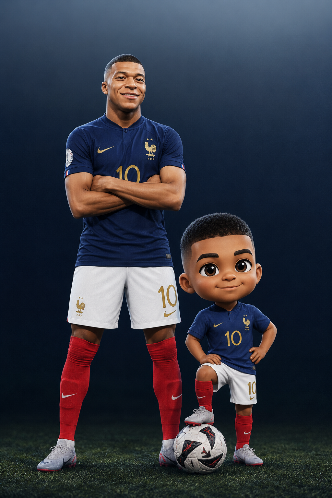
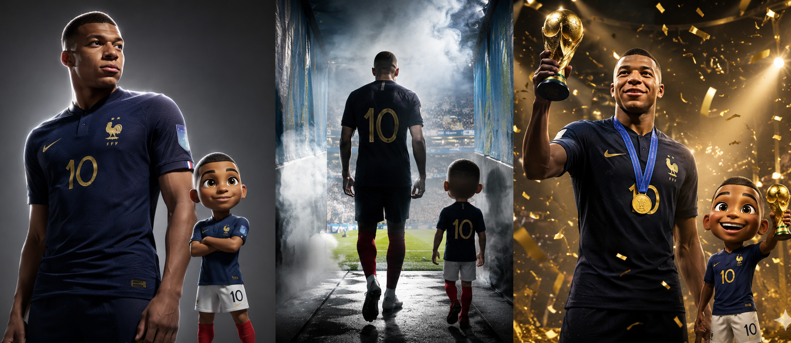
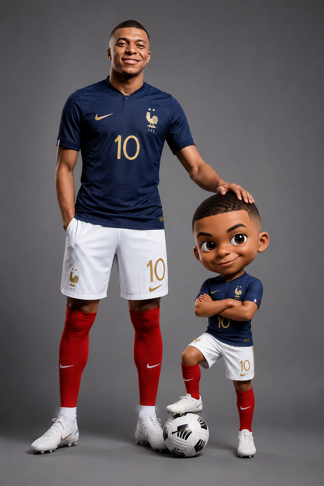
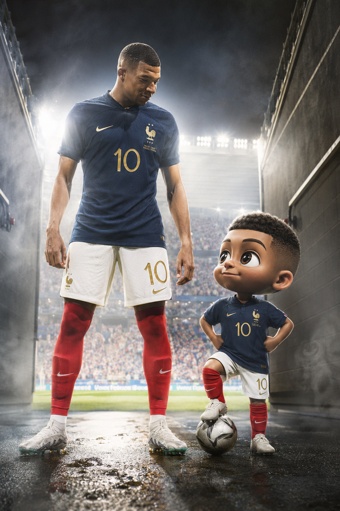
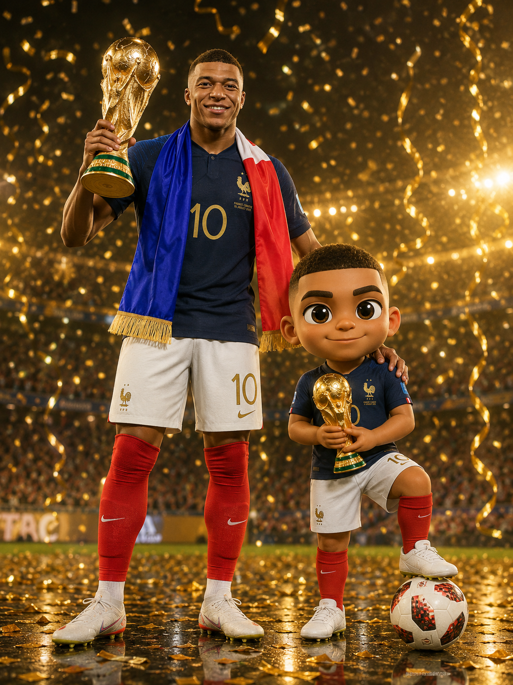
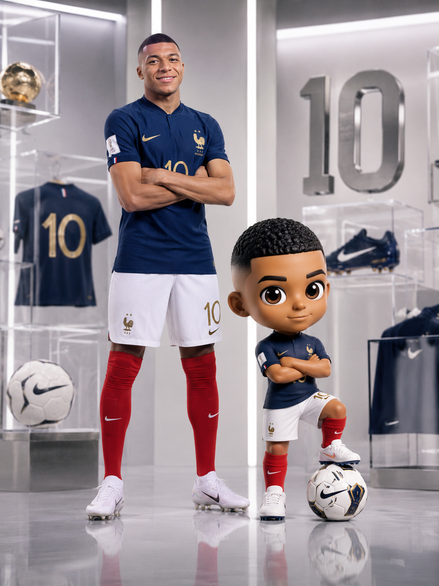

今天这组是「足球员与Q版分身」。写实职业球员穿法国国家队海军蓝10号球衣，身旁站着同款造型的Q版迷你形象——大头、大眼睛、短渐变发型，一大一小形成强烈反差。4种场景：棚拍海报、球场入场、冠军捧杯、潮玩公仔展示，照片级真实感与皮克斯3D风格融合在同一画面里。

提示词：
职业男足运动员的全身高级摄影棚肖像，身旁站着他风格化的Q版迷你形象。写实运动员拥有健硕体格，身穿法国国家队海军蓝球衣，号码10，白色短裤、红色球袜、白色足球鞋，整体造型干净利落。成年球员自信地微笑，一只手插在口袋里，另一只手自然搭在Q版角色的头上。Q版迷你形象拥有大头、大而生动的眼睛、短渐变发型，双臂交叉，一只脚踩在足球上，表情骄傲可爱。干净的灰色无缝摄影棚背景，柔和专业棚灯，轮廓光勾勒身体线条，真实皮肤纹理，高级运动品牌广告质感，照片级真实感与皮克斯风格3D角色结合，8K，杰作级质量。

建议收藏这组 Prompt。核心框架是「写实人物全身 + Q版大头分身同框 + 场景氛围」，棚拍/球场/庆典/展示空间都能套用，换运动项目也同样好出图。
Q版公仔系列会持续更新，下一期继续补不同运动员和风格。

#豆包 #GPTImage2 #千问 #生图提示词 #Prompt #Q版公仔 #足球员 #写实与卡通

