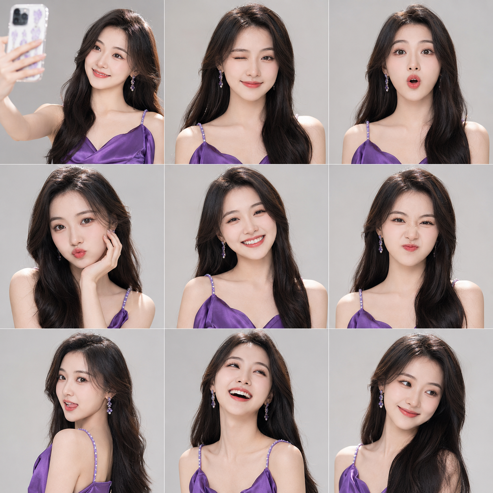
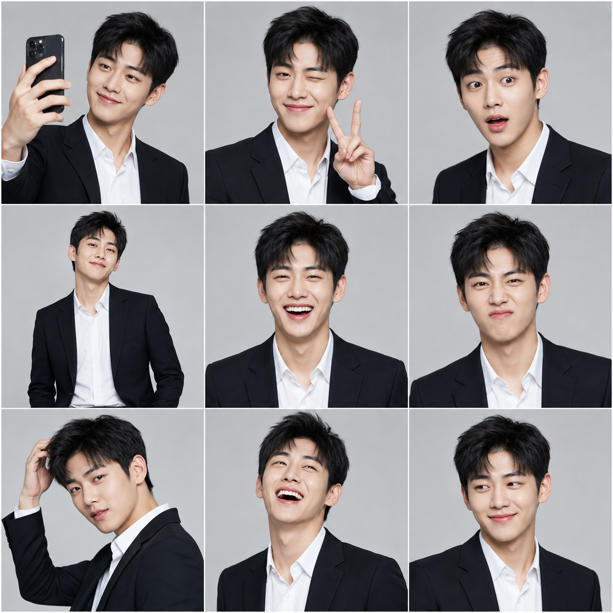
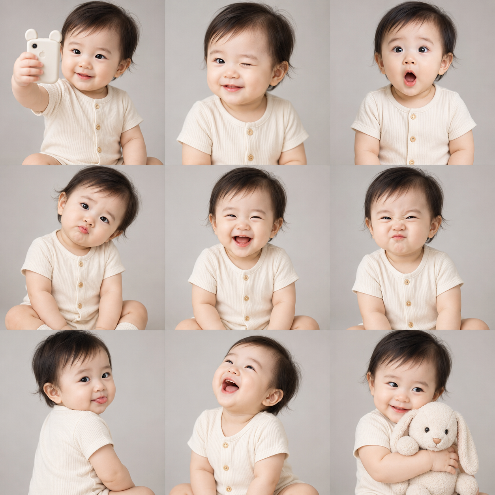

# 一张图出九种表情，这套九宫格写法直接封神

朋友圈头像、九宫格自拍合集、表情包分发，这些内容形式一直很受欢迎，但真人素材不够、九张图风格还要统一，普通人很难自己拍出来。用一段提示词，一次性生成一整张 3x3 九宫格拼贴大图，同一个人物、九种不同表情动作、影棚级质感，比单张单图更有信息量，也更有分享欲。

## 完整效果：紫裙女生版

杰作，最佳品质，照片级逼真，超高分辨率，色彩鲜艳，专业MV工作室摄影，3x3照片网格拼贴画。一组九张同一位人物的精美肖像照：一位24岁的年轻漂亮亚洲女生，五官自然清秀，面部干净，双眼皮，眼神真实灵动，健康自然肤色，干净自然肤质，长发浓密顺滑，带轻微卷度，整体气质甜美又有明星感，表情松弛，气质清爽亲和。她从头到尾自始至终只穿同一套固定造型：一袭优雅亮眼的紫色修身裙装，不更换任何服装款式或颜色，带轻奢感和舞台感，能够突出她的气质与身形。她的妆容精致自然，灵感来自韩国流行音乐视频：闪亮细腻的眼影、精致眼线、卷翘睫毛、自然高光、光泽感渐变唇妆，整体妆效甜美、上镜、精致但不过分夸张，充满韩系爱豆拍摄氛围。九个网格里必须是完全同一个人：同一张脸、同一个发型和发色、同一种身材体型、同一套紫色裙装，肤色和妆感保持统一，只允许表情、动作、头部角度、视线方向变化。每个网格单元格都捕捉到不同的富有魅力的表情和姿态：1.左上角，手拿手机对镜头外自拍，露出甜美亲切的笑容，像在和粉丝互动；2.顶部中心，俏皮眨眼，闭上一只眼睛，嘴角上扬，表情迷人可爱；3.右上角，做出惊讶的可爱表情，眼睛睁大，嘴巴张成O形，充满少女感；4.左中，嘟嘴撒娇，头微微歪向一侧，一只手轻托脸颊，展现可爱氛围；5.中间，正面露出灿烂明亮的笑容，眼睛笑成弯月，散发幸福和感染力；6.中间偏右，做一个调皮搞怪的皱鼻表情，灵动俏皮，很有镜头感；7.左下角，半转身回头看镜头，轻轻吐出一点舌尖，神态俏皮活泼；8.底部中心，仰头大笑，像抓拍到真实开心的一瞬间，笑容明媚自然；9.右下角，害羞温柔地微笑，目光看向一旁，营造出温柔清新的初恋感。完美无瑕、明亮动感的影棚灯光，营造高预算音乐录影带拍摄效果。柔光箱打造干净基础光，柔和主光加强面部层次、皮肤光泽和发丝高光，让紫色裙装更显高级。背景为干净无缝的纯色浅灰色影棚背景，简约高级，衬托紫色裙子的视觉吸引力。使用高端人像镜头拍摄，等效焦距85mm f/1.2，浅景深，柔美细腻的散景，让主体更加突出。整体色彩丰富饱满，紫色裙装成为视觉焦点，整体氛围甜美、精致、优雅、充满明星感和时尚大片气质。避免 AI 美女脸、网红感、过度精修、塑料皮肤、暗沉肤色、明显痘印、明显皱纹、斑点、面部变形。

---

## 九格拆解

这套写法的关键不是"画质好"，而是用一段话精确控制九个格子各自的动作和情绪，避免九张图变成同一个表情的复制粘贴：

- 自拍互动：手持手机自拍，制造"这是真实生活抓拍"的代入感
- 眨眼俏皮：打破"精修写真"的距离感
- 惊讶可爱：睁大眼、嘴巴微张，增加画面的活泼层次
- 嘟嘴撒娇：托腮小动作，展示可爱的另一面
- 正面大笑：整组图的情绪最高点，放在正中心
- 皱鼻搞怪：细节化的小动作，让人物更立体
- 回头吐舌：动态感镜头，避免九宫格全是正面呆板照
- 仰头大笑：真实抓拍感的高光时刻
- 侧脸微笑：收尾用温柔感，留一点余味

九个格子按"互动 - 情绪起伏 - 收尾"的节奏排布，这也是让九宫格看起来不像流水线出图的核心思路。**服装只能写一套固定造型**，不要用"A 或 B"这种二选一表述，不然模型很容易在后几格悄悄换了人换了衣服。

## 怎么用这张图

- 直接裁切单格，就是九张风格统一的头像候选
- 整图不裁，发朋友圈或小红书当作"表情包合集"，天然自带话题性
- 换成不同人物设定，同一套结构可以复用成系列内容

## 彩蛋：男生版 & 宝宝版

同一套结构，换个人物设定就是完全不同的内容。这两版提示词篇幅比较长，正文放不下，感兴趣的话关注后私信我获取完整版。

---

存下这套写法，下次想做九宫格合集直接套用就行；关注我们，后面会持续更新更多人物设定和场景版本，评论区告诉我你想看哪种风格。

#GPTImage2 #千问 #豆包 #生图提示词 #Prompt #九宫格表情包 #女生九宫格
