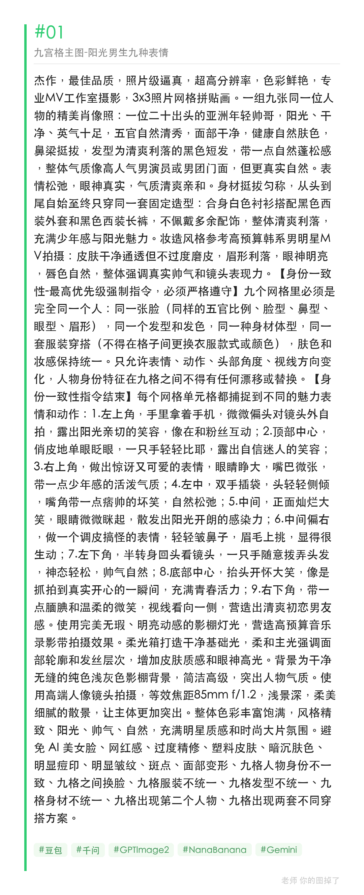
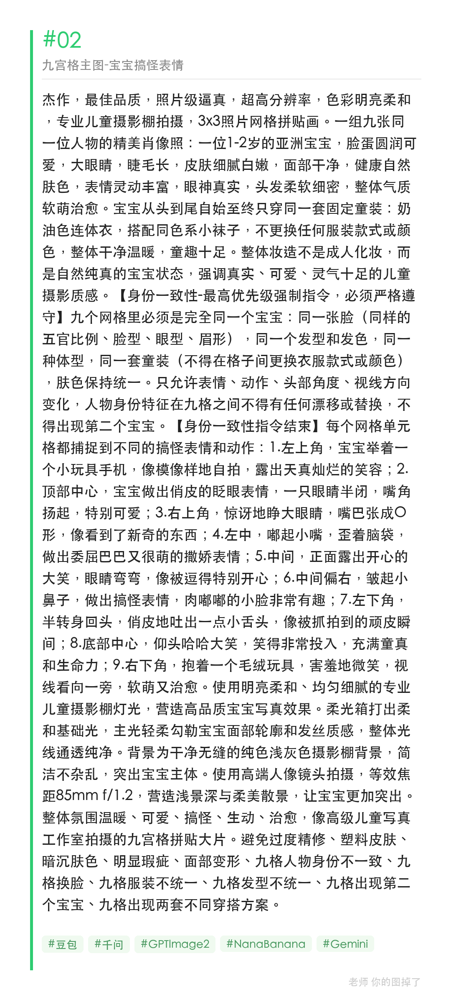
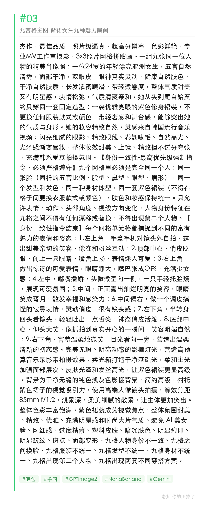

一段提示词，一次性生成整张 3x3 九宫格拼贴大图，同一个人物九种表情动作，影棚级质感，男生/宝宝/女生三版同款结构。

提示词：
杰作，最佳品质，照片级逼真，超高分辨率，色彩鲜艳，专业MV工作室摄影，3x3照片网格拼贴画。一组九张同一位人物的精美肖像照：一位24岁的年轻漂亮亚洲女生，五官自然清秀，长发浓密顺滑，只穿同一套紫色修身裙装，妆容精致自然。九个网格必须是完全同一个人，同一张脸、同一发型、同一套服装，只允许表情动作变化。九格分别为自拍互动、俏皮眨眼、惊讶可爱、嘟嘴撒娇、正面大笑、皱鼻搞怪、回头吐舌、仰头大笑、侧脸微笑。影棚级灯光，85mm f/1.2浅景深，色彩丰富精致优雅。

#GPTImage2 #千问 #生图提示词 #Prompt #九宫格表情包 #女生九宫格

