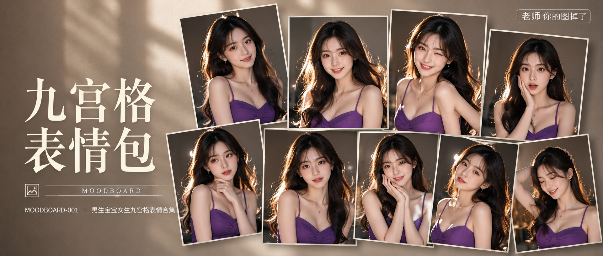

# MOODBOARD-001-男生宝宝女生九宫格表情合集 封面

## 封面提示词

同一位24岁年轻漂亮亚洲女生的九宫格拼贴构图，身穿紫色修身裙装，长发顺滑带轻微卷度，九张照片错落堆叠排布，非规整对齐网格，部分照片带轻微旋转角度和层叠遮挡关系，营造随性又有层次感的拼贴墙效果，每张照片都是不同表情和动作特写，五官自然清秀，面部干净，健康自然肤色，眼神真实灵动，全部照片人物身份、发型、紫色裙装完全一致，只有表情动作不同，专业影棚级人像质感，侧逆光打亮轮廓，皮肤光泽细腻，轮廓清晰上镜，电影感光影，高清锐利，色彩层次丰富，紫色裙装在画面中形成统一视觉焦点，视觉冲击力强，构图有张力，色调统一精致，2.35:1 电影横构图。【文字排版-必须完整保留，不得省略或简化任何一项】画面左侧垂直居中偏下叠加文字排版：超大号衬线字体米白色主文案「九宫格表情包」，主文案正下方一条细横线左端带🖼图标横线中央有透明英文水印 MOODBOARD，横线下方等宽白色字体副文案「MOODBOARD-001 ｜ 男生宝宝女生九宫格表情合集」；右上角浅色半透明圆角底衬配小号文字「老师 你的图掉了」（署名文字，必须出现，不可省略）；无整体蒙层，文字直接压图。【文字排版结束】避免 AI 美女脸、网红感、过度精修、塑料皮肤、暗沉肤色、明显痘印、明显皱纹、斑点、面部变形、九格人物身份不一致、九格换脸、九格服装不统一。

## 封面图片

