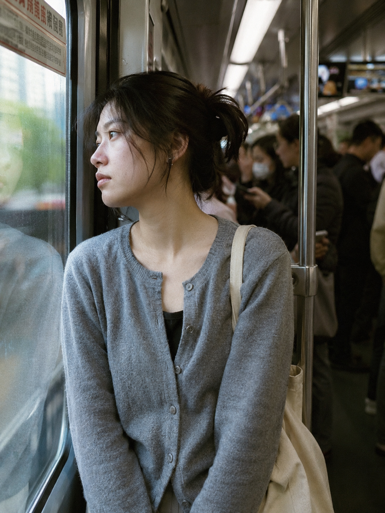
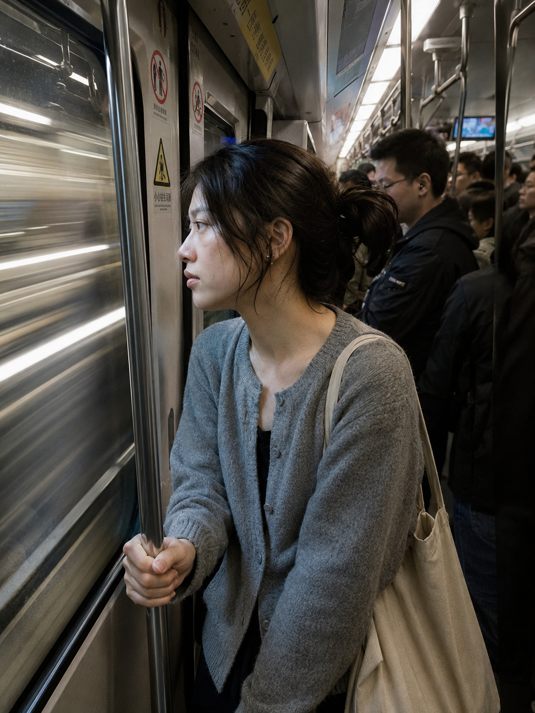
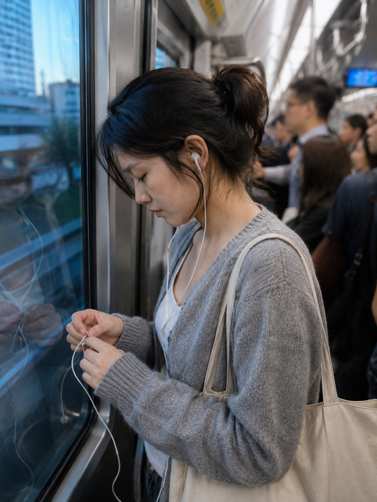

# TRANSIT-001 | 地铁车厢靠门站着望窗外

---

## title: "GPT Image 2 生图提示词｜地铁通勤系列 TRANSIT-001：地铁车厢靠门站着望窗外"  
author: "老师 你的图掉了"

这是「公共出行」Prompt 库的第一期，先从最日常的地铁通勤开始。

本期画面是「地铁车厢靠门站着望窗外」。它适合生成清晨上班路上那种安静、真实、有一点走神的生活照片。

这组 Prompt 的重点不是拍得很精致，而是把地铁车厢、玻璃倒影、冷色城市光和通勤状态拍得像手机里随手留下的一张照片。

场景说明

清晨地铁里，一个 24 岁亚洲女生站在车门旁，浅灰针织开衫、白色内搭和帆布包保持整组统一。她望向窗外，车窗玻璃有轻微倒影，周围乘客和灯光自然虚化，画面保留真实通勤里的拥挤、冷光和一点出神。

提示词 1

男友第一人称视角，24岁亚洲女生站在地铁车厢靠门位置望向窗外，玻璃里有轻微倒影，清晨通勤人群虚化在背景，浅灰针织开衫和帆布包，35mm iPhone 随手抓拍，真实皮肤纹理，生活感摄影，避免 AI 美女脸、写真感、网红感、过度精修。

效果图 1

提示词 2

男友第一人称视角，24岁亚洲女生一只手扶着地铁门边立柱，侧脸看向车窗外流动的隧道灯光，早高峰车厢拥挤但安静，浅灰针织开衫和帆布包，24mm 广角带出真实地铁空间，iPhone 原相机抓拍，轻微运动模糊，避免摆拍和商业广告感。

效果图 2

提示词 3

男友第一人称视角，24岁亚洲女生靠在地铁门旁低头整理耳机线，车窗玻璃映出城市清晨的冷色光，周围乘客自然虚化，浅灰针织开衫、白色内搭和帆布包，50mm 半身浅景深，真实通勤生活摄影，保留自然皮肤质感，避免网红感和过度精修。

效果图 3

使用建议

1. 想更真实：保留「iPhone 随手抓拍」「真实皮肤纹理」「通勤人群虚化」这些约束，不要把画面推成写真或广告。
2. 想加强镜头氛围：可以替换车窗外的光线，比如清晨冷光、雨天蓝灰光、夜晚隧道灯光，画面情绪会很不一样。

建议收藏这组 Prompt。后续只要替换交通工具、时间和光线，就可以继续延展出地铁、公交、列车、出租车等公共出行场景。

1. 想做连续组图：固定人物年龄、浅灰针织开衫和帆布包，只变化动作、站位和窗外环境，系列感会更稳定。

#GPTImage2 #生图提示词 #Prompt #公共出行 #地铁通勤 #真实女友感 #生活摄影 #男友视角

**地铁通勤系列 · 目录**  
上一期：公共出行系列入口  
下一期：TRANSIT-002｜早高峰地铁站出口人群中独自走  
这个系列会继续补齐地铁、公交、列车、骑行、出租车和渡口场景。
