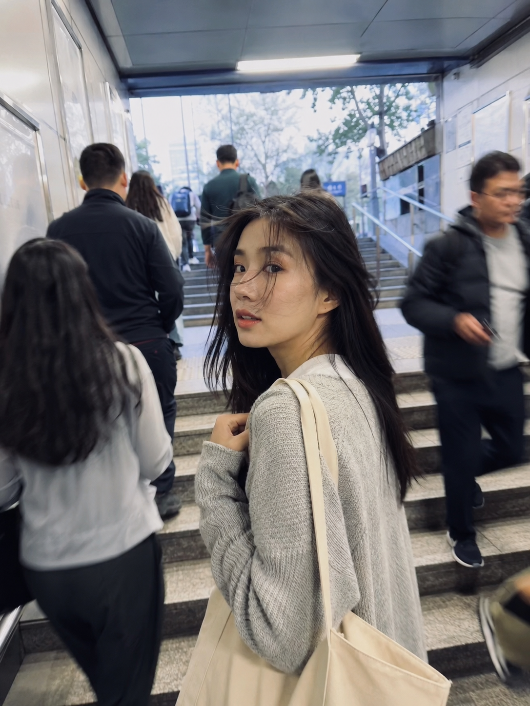
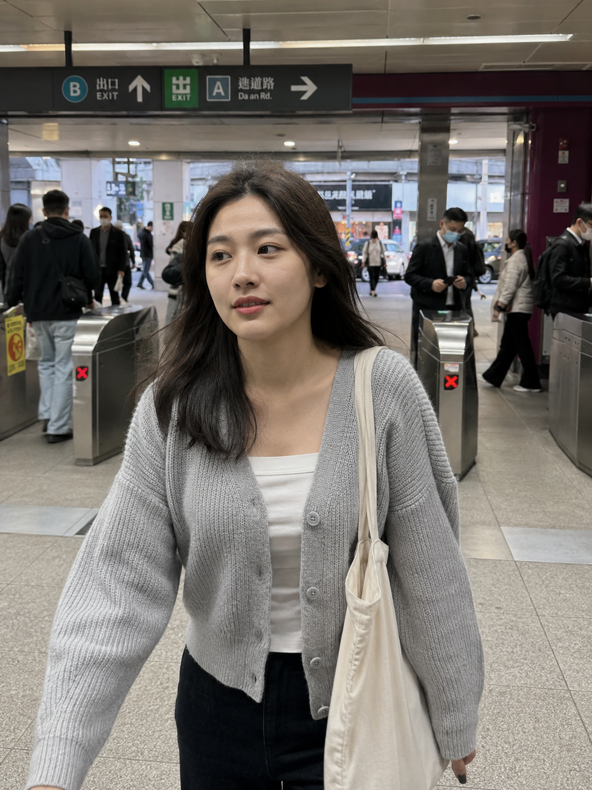
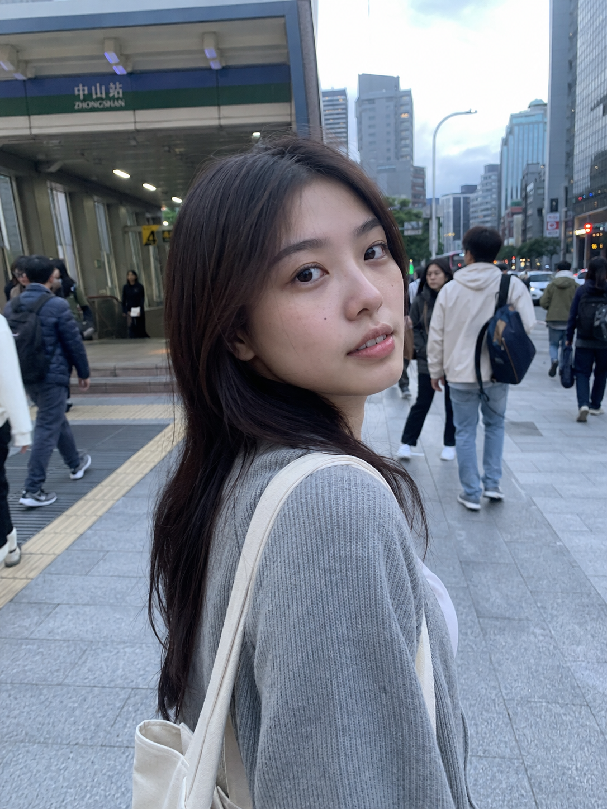

# TRANSIT-002 | 早高峰地铁站出口人群中独自走

---

## title: "GPT Image 2 生图提示词｜公共交通出行系列 TRANSIT-002：早高峰地铁站出口人群中独自走"  
author: "老师 你的图掉了"

这是「公共交通出行系列」的第 TRANSIT-002 期。

今天这组是「早高峰地铁站出口人群中独自走」，适合生成地铁通勤里那种刚从地下通道走出来、被人群和晨光包围的真实生活瞬间。

画面重点不是精修写真，而是男友视角里随手拍下的一秒：她在人群里自然往前走，表情有点困，又很真实。

这组 Prompt 可以收藏成地铁通勤场景模板，后续只需要替换出口、天气、人群密度和光线，就能继续延展同系列画面。

场景说明

早高峰的地铁站出口，人群从闸机和楼梯方向涌出来。一个 24 岁亚洲女生穿浅灰针织开衫、白色内搭，背着帆布包，独自穿过人流走向地面，清晨冷色光从出口照进来，画面有一点拥挤，但情绪很安静。

提示词 1

男友第一人称视角，24岁亚洲女生从早高峰地铁站闸机口独自走出来，身后通勤人群自然虚化，浅灰针织开衫、白色内搭和帆布包，清晨冷色灯光混合出口自然光，35mm iPhone 随手抓拍，真实皮肤纹理，生活感摄影，避免 AI 美女脸、写真感、网红感、过度精修。

效果图 1  
[配图1：见文末图片 img1.png]

提示词 2

男友第一人称视角，24岁亚洲女生走在地铁站出口楼梯的人群中，侧身扶着帆布包带，头发被清晨风轻轻吹起，浅灰针织开衫和白色内搭，24mm 广角带出真实地铁出口空间和通勤人流，iPhone 原相机抓拍，轻微运动模糊，避免摆拍和商业广告感。

效果图 2  
[配图2：见文末图片 img2.png]

提示词 3

男友第一人称视角，24岁亚洲女生刚走出地铁站出口回头看向镜头，背景是早高峰人群、地铁标识和城市清晨街道，浅灰针织开衫、白色内搭、帆布包，50mm 半身浅景深，真实通勤生活摄影，自然表情和皮肤质感，避免网红感和过度精修。

效果图 3  
[配图3：见文末图片 img3.png]

使用建议

1. 想让画面更真实，保留「早高峰人群」「地铁站出口」「iPhone 随手抓拍」这些关键词，不要把人物写得太完美。
2. 想加强镜头氛围，可以替换光线为雨天冷光、地下通道白光、清晨逆光，画面会更有通勤情绪。
3. 想控制细节，固定浅灰针织开衫、白色内搭和帆布包，让同系列图片看起来像同一个人的连续生活片段。

建议收藏这组 Prompt。后续继续补齐地铁、公交、列车、骑行和夜间出行场景。

#GPTImage2 #生图提示词 #Prompt #公共交通出行系列 #地铁通勤系列 #早高峰 #男友视角 #生活摄影

**地铁通勤系列 · 目录**  
上一期：TRANSIT-001｜地铁车厢靠门站着望窗外  
本期：TRANSIT-002｜早高峰地铁站出口人群中独自走  
下一期：TRANSIT-003｜地铁座位上戴耳机低头看手机

