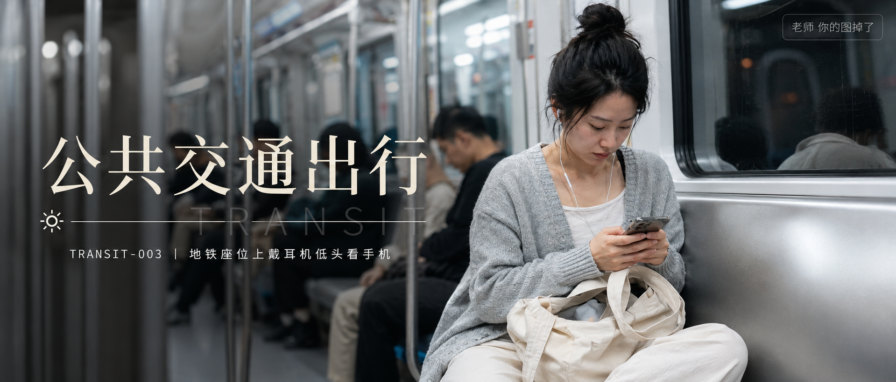
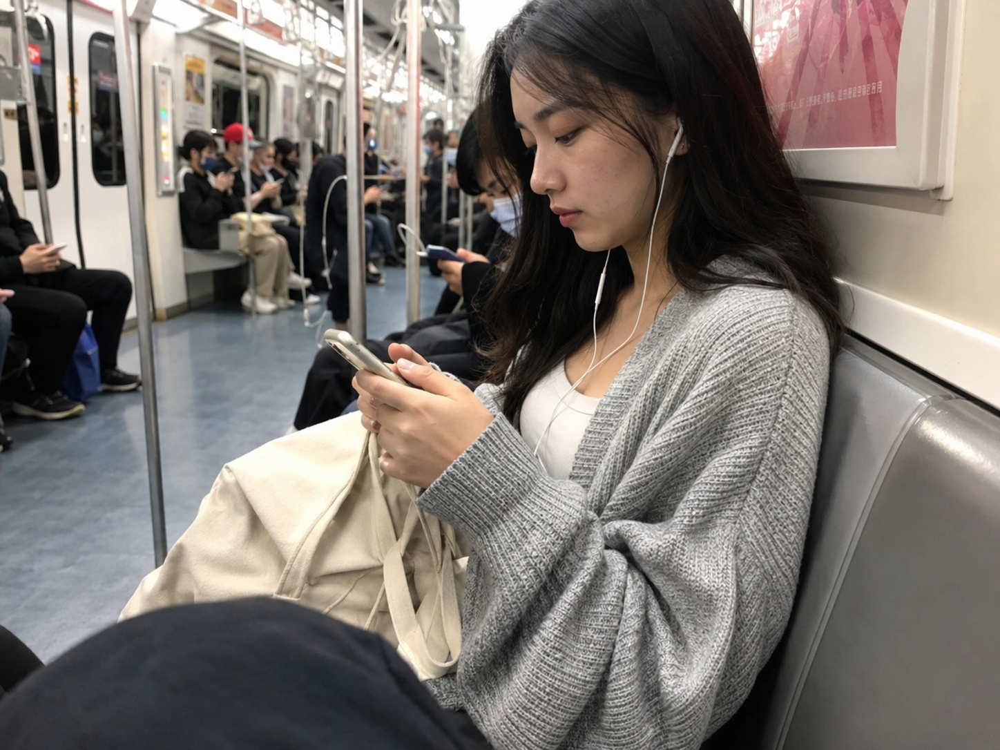
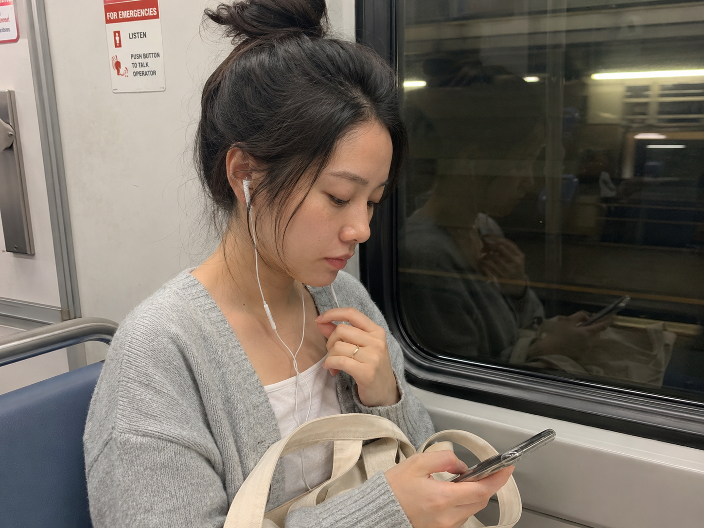
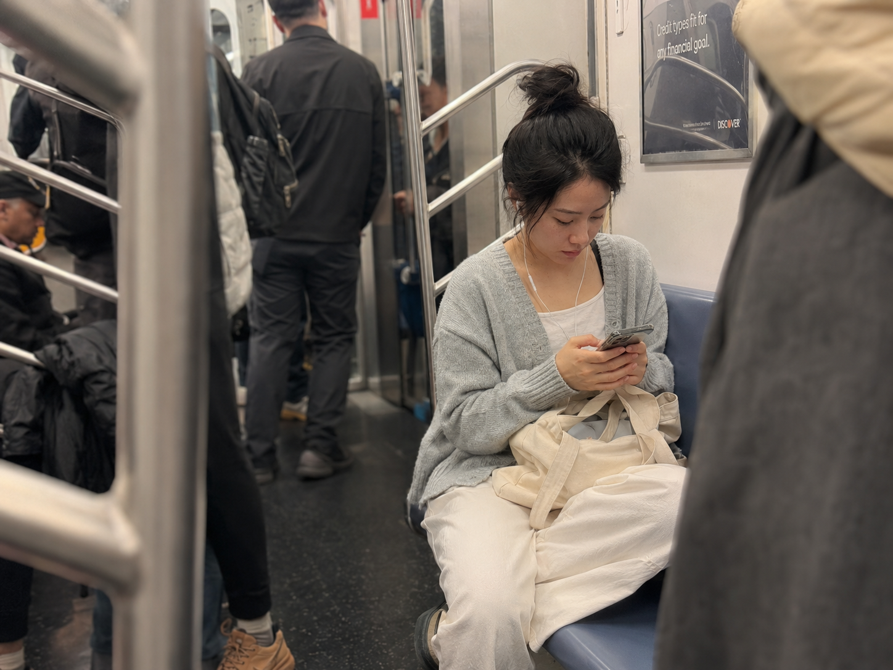

# TRANSIT-003 | 地铁座位上戴耳机低头看手机

---

## title: "GPT Image2 提示词｜地铁通勤系列 TRANSIT-003：地铁座位上戴耳机低头看手机"  
author: "老师 你的图掉了"

这是「公共交通出行系列」的第 TRANSIT-003 期。

今天这组是「地铁座位上戴耳机低头看手机」，适合生成清晨通勤路上那种安静、疲惫、但很真实的生活抓拍。

画面重点不是摆拍感，而是地铁车厢里的冷色灯光、耳机线、手机屏幕和身边人流带来的日常感。提示词可以直接复制到 GPT Image 2 使用，也可以替换成公交、高铁、候车室等类似场景。

场景说明

这期围绕早高峰地铁座位上的一个安静瞬间：24 岁亚洲女生穿浅灰针织开衫和白色内搭，戴着耳机低头看手机，帆布包放在膝边，周围乘客和车窗倒影自然虚化，整体是 iPhone 随手拍下来的真实通勤感。

提示词 1

男友第一人称视角，24岁亚洲女生坐在地铁座位上戴着白色有线耳机低头看手机，浅灰针织开衫、白色内搭和帆布包放在膝边，清晨地铁车厢冷色灯光，周围乘客自然虚化，35mm iPhone 随手抓拍，真实皮肤纹理，生活感摄影，避免 AI 美女脸、写真感、网红感、过度精修。

效果图 1  
[配图1：见文末图片 img1.png]

提示词 2

男友第一人称视角，24岁亚洲女生坐在地铁靠边座位上，一只手轻扶耳机线一只手刷手机，车窗玻璃映出隧道灯光和模糊倒影，浅灰针织开衫、白色内搭、帆布包，50mm 半身浅景深，真实通勤生活摄影，自然疲惫表情，避免摆拍和商业广告感。

效果图 2  
[配图2：见文末图片 img2.png]

提示词 3

男友第一人称视角，24岁亚洲女生坐在地铁座位角落低头回复消息，耳机线垂在白色内搭前，帆布包靠在腿边，早高峰车厢里手扶杆和乘客腿部虚化成前景，24mm 广角带出真实地铁空间，iPhone 原相机抓拍，轻微运动模糊，避免网红感和过度精修。

效果图 3  
[配图3：见文末图片 img3.png]

使用建议

1. 想更真实：保留地铁冷色灯光、耳机线、手机和帆布包这些生活细节，不要把画面修得太像商业写真。
2. 想换氛围：可以把清晨地铁改成夜晚末班车、雨天地铁出口或公交靠窗座位，人物设定和服装保持一致。
3. 想做系列：固定“24岁亚洲女生 + 浅灰针织开衫 + 通勤交通工具 + iPhone 抓拍”，后续只替换座位、车窗、站台和光线。

建议收藏这组 Prompt。这个系列会继续补齐地铁、公交、列车、出租车和渡轮等公共出行场景。

#GPTImage2 #生图提示词 #Prompt #公共交通出行系列 #地铁通勤系列 #地铁通勤 #真实女友感 #生活摄影 #男友视角

**地铁通勤系列 · 目录**  
上一期：TRANSIT-002｜早高峰地铁站出口人群中独自走  
下一期：TRANSIT-004｜地铁门关闭瞬间玻璃上的倒影  
继续关注这个系列，后面会补完整套公共交通出行 Prompt。

