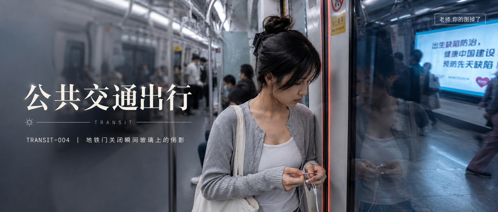
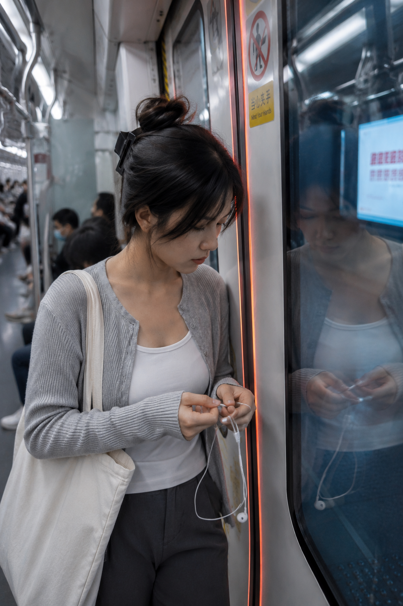
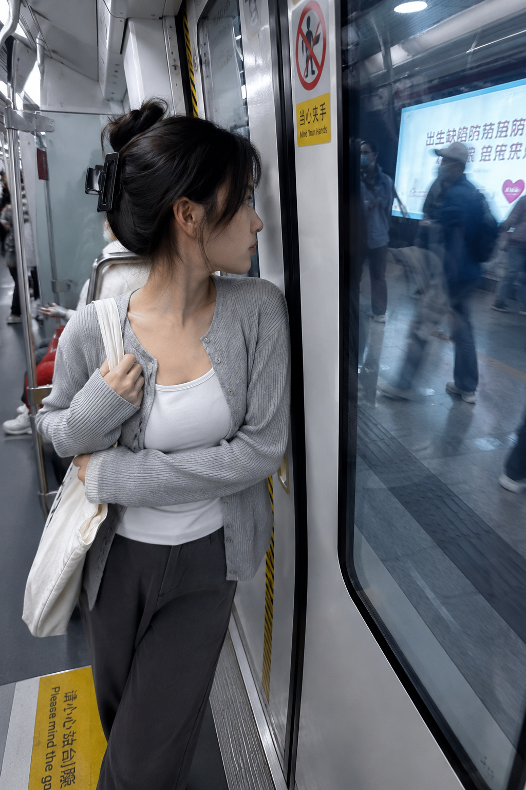
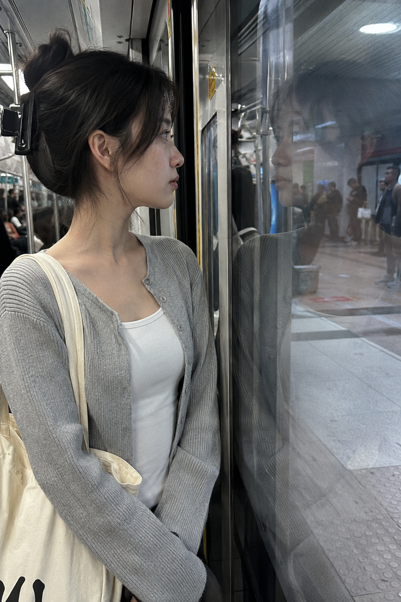

# TRANSIT-004 | 地铁门关闭瞬间玻璃上的倒影

---

## author: "老师 你的图掉了"

这是「公共交通出行系列」第 TRANSIT-004 期。

今天这组是「地铁门关闭瞬间玻璃上的倒影」。适合生成清晨通勤、地铁车门、玻璃反射和真实生活抓拍感的画面。

这一期的重点不是摆拍，而是车门快要合上那一秒：人、倒影、站台灯光和车厢冷色光叠在一起，会更像真实通勤路上随手拍到的照片。

这组 Prompt 可以直接复制使用，也可以保留人物设定，只替换城市、站台、时间和光线，继续延伸同系列画面。

提示词主要按 GPT Image 2 的中文自然语言写法整理，也可以在豆包、千问及其他生图工具里尝试。不同工具出图会有差异，可以微调画幅、镜头和细节。

场景说明

清晨的地铁车厢里，女生站在即将关闭的车门前。玻璃门把她的侧脸、站台灯箱和身后车厢重叠在一起，画面有一点冷色、安静和赶早班车的真实感。

提示词 1

男友第一人称视角，24岁亚洲女生站在即将关闭的地铁门前，玻璃门上清楚映出她的侧脸倒影，清晨车厢冷色灯光和站台人影虚化，浅灰针织开衫、白色内搭和帆布包，35mm iPhone 随手抓拍，真实皮肤纹理，生活感摄影，避免 AI 美女脸、写真感、网红感、过度精修。

效果图 1  
[配图1：见下方图片 img1.png]

提示词 2

男友第一人称视角，24岁亚洲女生在地铁门关闭瞬间微微后退，手扶帆布包带，玻璃上叠着她的倒影和站台灯箱，浅灰针织开衫、白色内搭，24mm 广角带出真实地铁门、黄色安全线和通勤人流，iPhone 原相机抓拍，轻微运动模糊，避免摆拍和商业广告感。

效果图 2  
[配图2：见下方图片 img2.png]

提示词 3

男友第一人称视角，24岁亚洲女生靠近地铁门玻璃低头整理耳机线，车门缝隙的提示灯刚亮起，玻璃反射出她安静的表情和车厢扶手，浅灰针织开衫、白色内搭、帆布包，50mm 半身浅景深，真实通勤生活摄影，自然皮肤质感，避免网红感和过度精修。

效果图 3  
[配图3：见下方图片 img3.png]

使用建议

1. 想更真实：保留 iPhone 随手抓拍、自然皮肤纹理和轻微运动模糊，不要把画面做成商业写真。
2. 想加强镜头氛围：把「玻璃倒影」「站台灯箱」「车厢冷色光」写清楚，地铁门这类反射场景会更稳定。
3. 想控制细节：固定浅灰针织开衫、白色内搭和帆布包，只替换地铁站、车厢拥挤程度和时间光线。

建议收藏这组 Prompt。感兴趣的朋友们，欢迎收藏、关注，也可以在评论区留言你喜欢的系列或话题，我会继续补公共交通出行里的地铁、公交、列车和城市骑行场景。

#GPTImage2 #生图提示词 #Prompt #公共交通出行系列 #地铁通勤系列 #地铁门倒影

**地铁通勤系列 · 目录**  
上一期：TRANSIT-003｜地铁座位上戴耳机低头看手机  
本期：TRANSIT-004｜地铁门关闭瞬间玻璃上的倒影  
下一期：TRANSIT-005｜夜晚空荡荡地铁车厢独自坐着

