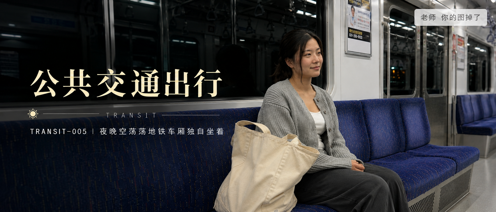
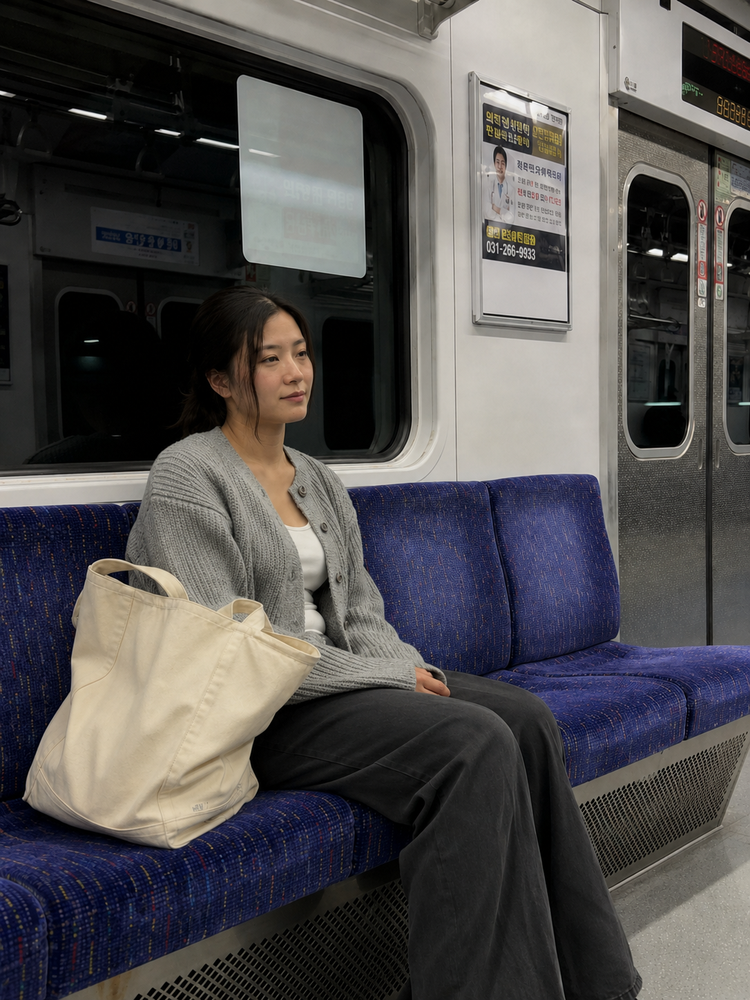
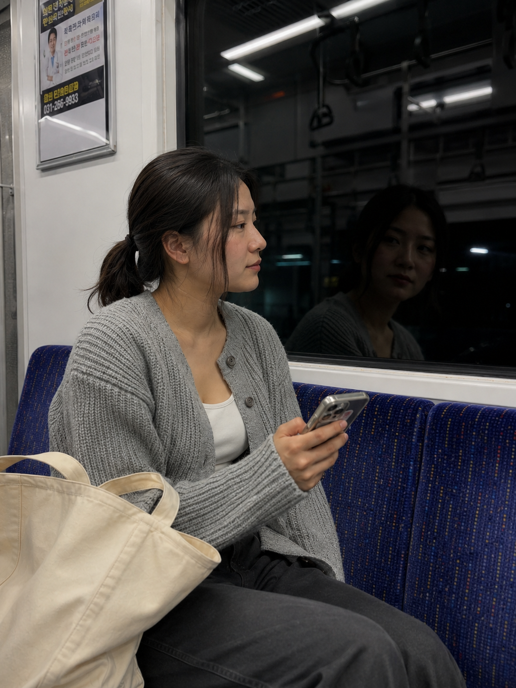
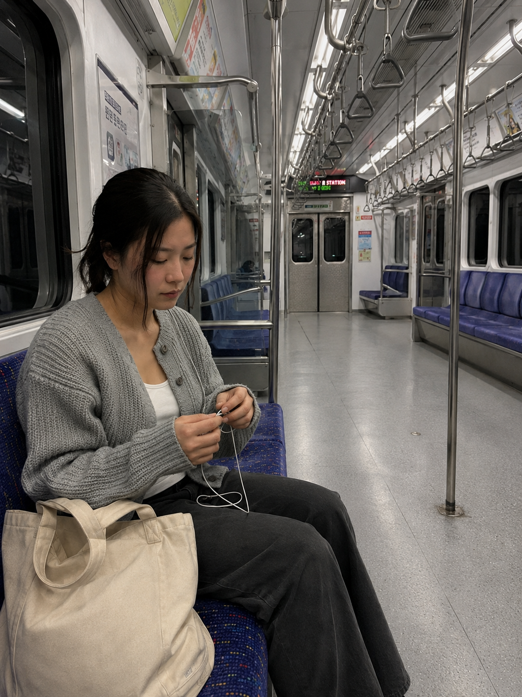

# TRANSIT-005 | 夜晚空荡荡地铁车厢独自坐着

---

author: "老师 你的图掉了"  
topics:

- GPT Image 2
- 豆包
- 千问
- 生图提示词
- Prompt

---

这是「公共交通出行系列」第 TRANSIT-005 期。

今天这组是「夜晚空荡荡地铁车厢独自坐着」。适合生成末班地铁、空车厢、冷白顶灯、车窗倒影和真实通勤疲惫感的画面。

这一期的重点不是热闹的人流，而是夜晚车厢突然安静下来的那一刻：空座位、黑色车窗、冷色灯光和一个人坐着的状态，会更像真实生活里随手拍到的照片。

这组 Prompt 可以直接复制使用，也可以保留人物设定，只替换地铁线路、车厢光线、窗外环境和人物动作，继续延伸同系列画面。

提示词主要按 GPT Image 2 的中文自然语言写法整理，也可以在豆包、千问及其他支持中文自然语言提示词的生图工具上尝试。不同工具出图会有差异，可以微调画幅、镜头、风格和细节。

场景说明

夜晚的地铁车厢几乎空了，女生独自坐在长椅上，身边只有帆布包和手机。冷白顶灯照在车窗倒影里，画面有一点末班车的疲惫、安静和真实通勤感。

提示词 1

男友第一人称视角，24岁亚洲女生夜晚独自坐在空荡荡的地铁车厢长椅上，身旁放着帆布包，浅灰针织开衫、白色内搭，车厢顶灯偏冷，窗外是黑色隧道和零星反光，35mm iPhone 随手抓拍，真实皮肤纹理，安静疲惫的通勤感，避免 AI 美女脸、写真感、网红感、过度精修。

效果图 1  
[配图1：见下方图片 img1.png]

提示词 2

男友第一人称视角，24岁亚洲女生坐在夜晚地铁车厢靠窗座位，侧脸望向漆黑车窗里的倒影，手里握着手机，浅灰针织开衫、白色内搭和帆布包，50mm 半身浅景深，冷白顶灯和车窗反射形成安静氛围，真实生活摄影，避免摆拍和商业广告感。

效果图 2  
[配图2：见下方图片 img2.png]

提示词 3

男友第一人称视角，24岁亚洲女生坐在几乎空无一人的末班地铁里低头整理耳机线，车厢扶手、空座位和远处车门形成纵深，浅灰针织开衫、白色内搭、帆布包靠在腿边，24mm 广角带出夜晚空车厢空间，iPhone 原相机抓拍，轻微噪点，避免网红感和过度精修。

效果图 3  
[配图3：见下方图片 img3.png]

使用建议

1. 想更真实：保留 iPhone 随手抓拍、自然皮肤纹理、轻微噪点和夜晚地铁的冷白顶灯，不要把人物修成写真照。
2. 想加强镜头氛围：把「空座位」「黑色车窗倒影」「末班车冷光」写清楚，夜晚车厢会更稳定。
3. 想控制细节：固定浅灰针织开衫、白色内搭和帆布包，只替换坐姿、车厢远近和窗外反光。

建议收藏这组 Prompt。感兴趣的朋友们，欢迎收藏、关注，也可以在评论区留言你喜欢的系列或话题，我会继续补公共交通出行里的地铁、公交、列车和城市骑行场景。

#GPTImage2 #豆包 #千问 #生图提示词 #Prompt #公共交通出行系列 #地铁通勤系列 #末班地铁 #空车厢

**地铁通勤系列 · 目录**  
上一期：TRANSIT-004｜地铁门关闭瞬间玻璃上的倒影  
本期：TRANSIT-005｜夜晚空荡荡地铁车厢独自坐着  
下一期：TRANSIT-006｜公交车窗边雨天看窗外街道

[封面图：见下方图片 cover.png]

