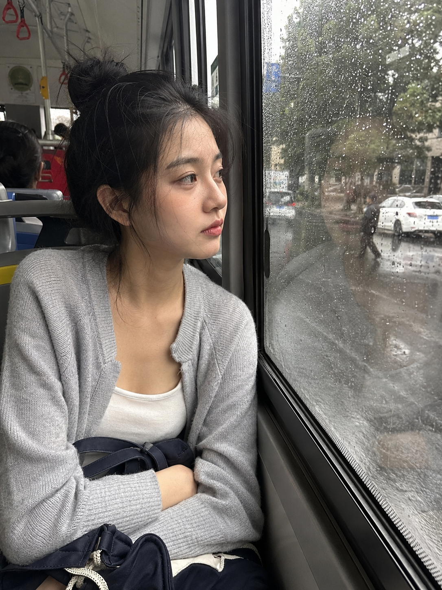
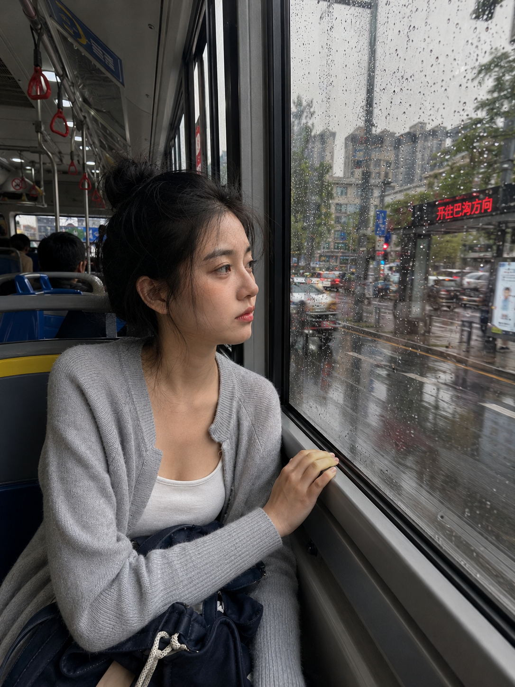
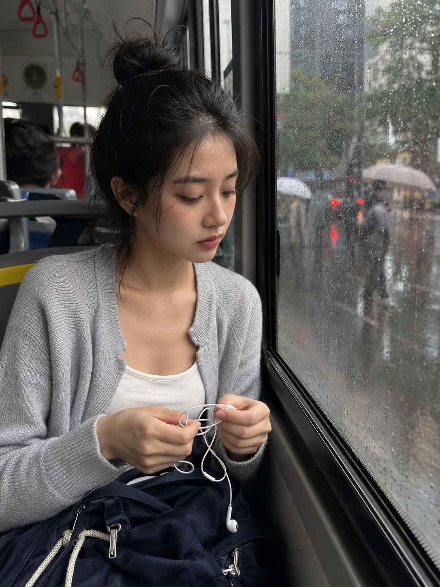
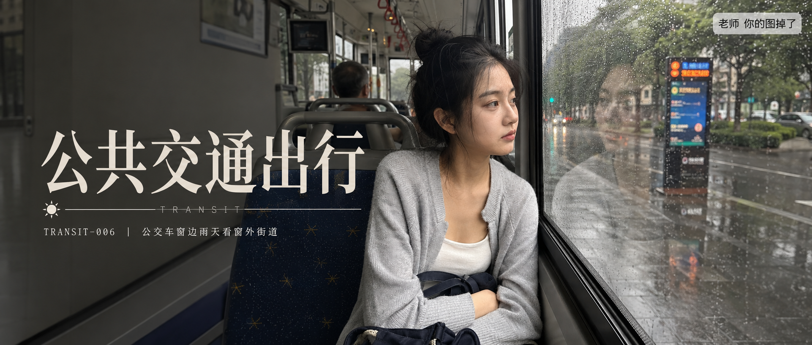

# TRANSIT-006 | 公交车窗边雨天看窗外街道

---

title: "GPT Image 2 生图提示词｜公共交通出行 TRANSIT-006：公交车窗边雨天看窗外街道"  
author: "老师 你的图掉了"  
topics:

- GPT Image 2
- 豆包
- 千问
- 生图提示词
- Prompt

---

这是「公共交通出行系列」第 TRANSIT-006 期。

今天这组是「公交车窗边雨天看窗外街道」，适合生成雨天公交、车窗倒影、湿润街道和安静通勤感的生活照片。

提示词主要按 GPT Image 2 的中文自然语言写法整理，也可以在豆包、千问及其他支持中文提示词的生图工具上尝试。不同工具出图会有差异，可以按效果微调画幅、镜头和细节。

这期的人物设定会保持自然好看，但不走网红脸和写真感，更像真实生活里随手拍到的一个雨天片段。

场景说明

画面发生在雨天的公交车厢里。女生坐在靠窗座位，看着窗外被雨水打湿的街道，车窗上的雨滴、倒影和车内冷暖混合光线，会让照片有更强的真实通勤氛围。

提示词 1

男友第一人称视角，24岁亚洲女生坐在雨天公交车窗边望向窗外街道，窗玻璃上有雨滴和模糊倒影，浅灰针织开衫、白色内搭、深蓝帆布包放在膝边，午后阴天自然散射光，35mm iPhone 随手抓拍，真实皮肤纹理，清爽耐看的自然长相，避免 AI 美女脸、写真感、网红感、过度精修。

效果图 1  
[配图1：见下方图片 img1.png]

提示词 2

男友第一人称视角，24岁亚洲女生坐在公交车靠窗座位，一只手轻扶窗边扶手，侧脸看向被雨水打湿的街道和车站灯牌，浅灰针织开衫、白色内搭、深蓝帆布包，24mm 广角带出真实公交车厢、座椅和窗外雨景，iPhone 原相机抓拍，轻微车身晃动模糊，自然好看但不网红，避免摆拍和商业广告感。

效果图 2  
[配图2：见下方图片 img2.png]

提示词 3

男友第一人称视角，24岁亚洲女生坐在公交车窗边低头整理耳机线，窗外雨天街道反光和行人伞影虚化成背景，浅灰针织开衫、白色内搭、深蓝帆布包靠在腿边，50mm 半身浅景深，真实公交通勤生活摄影，生活化表情和自然皮肤质感，五官清秀耐看，避免网红感、浓妆和过度精修。

效果图 3  
[配图3：见下方图片 img3.png]

使用建议

1. 想更真实：保留 iPhone 原相机、公交车厢、雨滴玻璃、自然皮肤纹理，不要把人物修成商业写真感。
2. 想增强镜头氛围：可以在 35mm、24mm 广角、50mm 半身浅景深之间切换，让车窗雨景、座椅和街道反光的比重不同。
3. 想控制细节：如果出图太网红，可以继续强调「清爽耐看的自然长相」「生活化表情」「避免浓妆、网红感和过度精修」。

感兴趣的朋友们，欢迎收藏、关注，也可以在评论区留言你喜欢的系列或话题，我会继续补更多同类型场景。

#GPTImage2 #豆包 #千问 #生图提示词 #Prompt #公共交通出行系列 #公交车窗系列 #公交雨天 #真实生活摄影

**公交车窗系列 · 目录**  
上一期：地铁通勤系列 TRANSIT-005｜夜晚空荡荡地铁车厢独自坐着  
下一期：TRANSIT-007｜公交车前排靠窗发呆等红灯  
系列入口：公共交通出行系列会继续补地铁、公交、列车、骑行、出租车和渡口等日常移动场景。

