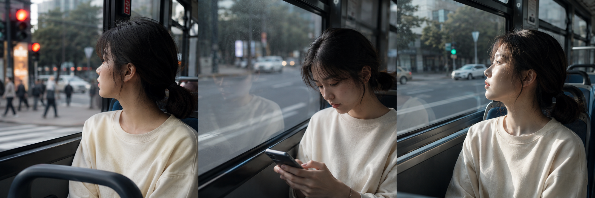
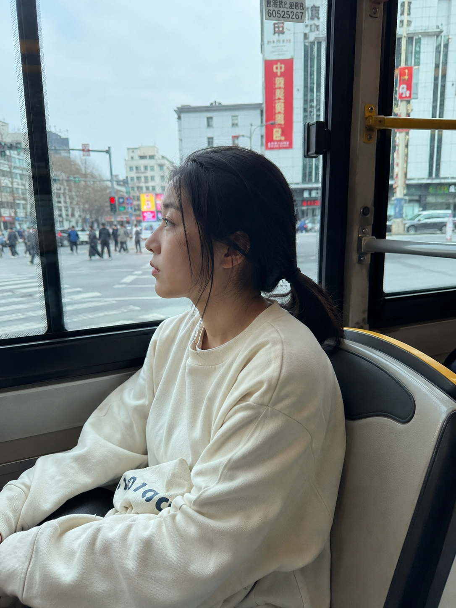
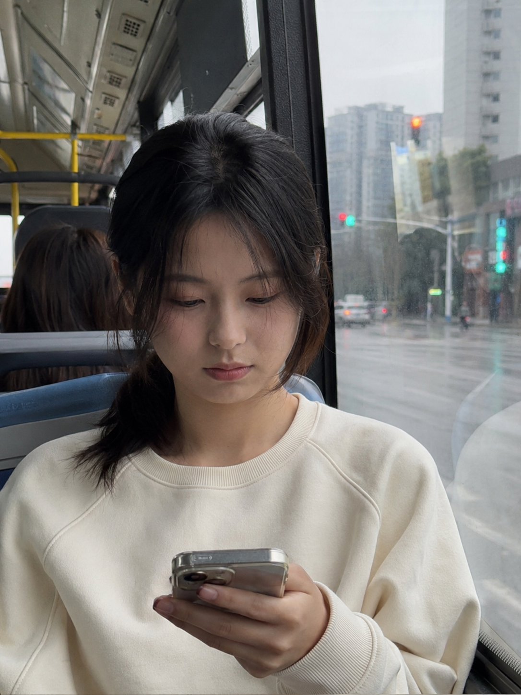
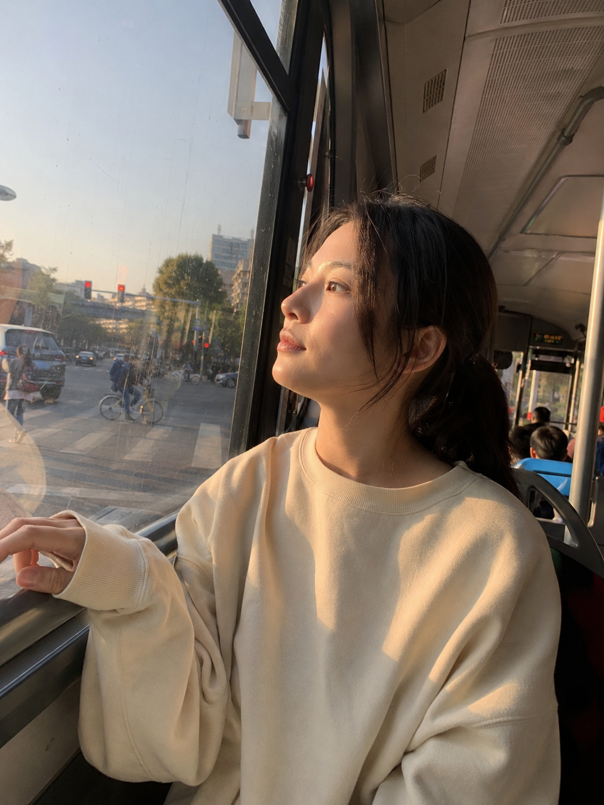

今天这组是「公交车前排靠窗发呆等红灯」。

通勤路上有一种状态很难描述——不是真的在看什么，就是对着窗外发呆，红灯、行人、灯箱招牌依次掠过，脑子是空的。这种瞬间用 AI 提示词可以精确还原：把当时的光线、动作、情绪描述清楚，模型就能生成那个感觉。

核心提示词框架是「男友第一人称视角 + 公交车前排靠窗 + 神情放空发呆/低头看手机/等绿灯 + 窗外路口虚化 + 阴天冷光/斜后方阳光 + iPhone 随手抓拍生活感」，三张图只改光线和动作，其余人物服装保持统一，组图更像同一人的手机相册。

提示词：
男友第一人称视角，24岁亚洲女生坐在公交车前排靠窗位置，侧脸朝向车窗望向外面等红灯的城市路口，神情放空略带倦意，窗外行人和灯箱招牌浅度虚化，阴天冷光透过玻璃均匀打在侧脸，低马尾微乱发丝贴着脸颊，奶油色宽松卫衣搭配深色裤子，帆布包放在腿上，五官自然清秀，面部干净，健康自然肤色，干净自然肤质，表情松弛，眼神真实，35mm iPhone 随手抓拍，真实公交车座椅和车窗框入画，避免 AI 美女脸、网红感、过度精修、塑料皮肤、暗沉肤色、明显痘印、明显皱纹、斑点、面部变形

建议收藏这组 Prompt。可以替换的维度：光线（阴天冷光→黄昏暖调→夜晚路灯）、动作（发呆→低头看手机→靠窗枕玻璃）、焦段（35mm/50mm/24mm）。

#GPTImage2 #千问 #生图提示词 #Prompt #公共交通出行 #通勤日常

