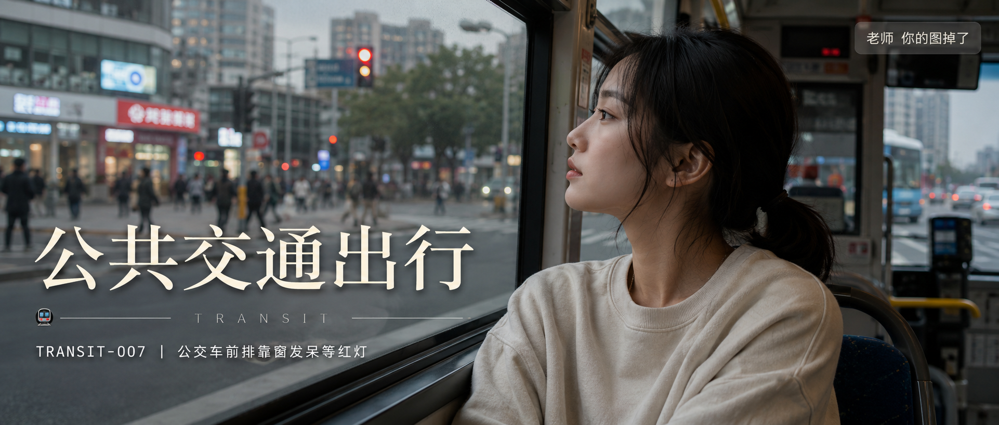

# TRANSIT-007-公交车前排靠窗发呆等红灯 封面

## 封面提示词

24岁亚洲女生坐在公交车前排靠窗位置望向窗外红灯路口，阴天散射光透过车窗打在侧脸，低马尾微乱发丝，奶油色宽松卫衣，窗外行人和灯箱招牌浅度虚化，五官自然清秀，面部干净，健康自然肤色，干净自然肤质，轮廓清晰，真实 iPhone 生活感摄影，2.35:1 电影横构图。画面左侧垂直居中偏下叠加文字排版：超大号衬线字体米白色主文案「公共交通出行」，主文案正下方一条细横线左端带🚇图标横线中央有透明英文水印 TRANSIT，横线下方等宽白色字体副文案「TRANSIT-007 ｜ 公交车前排靠窗发呆等红灯」；右上角浅色半透明圆角底衬配小号文字「老师 你的图掉了」；无整体蒙层，文字直接压图。

## 封面图片

