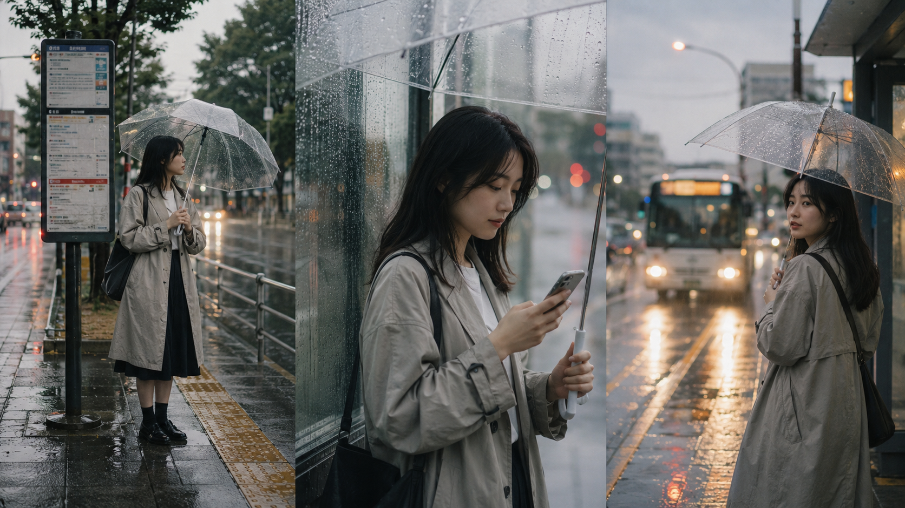
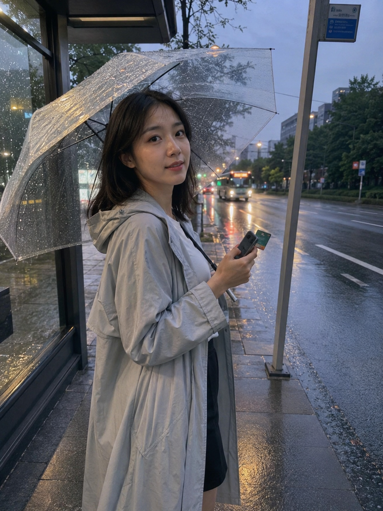
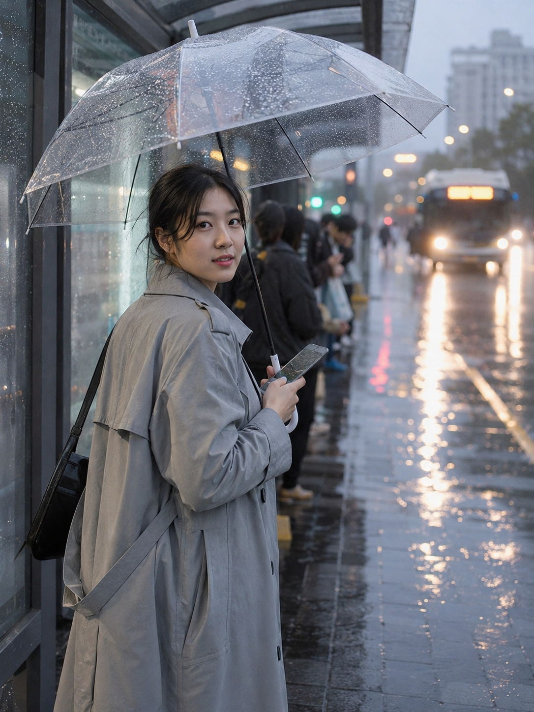
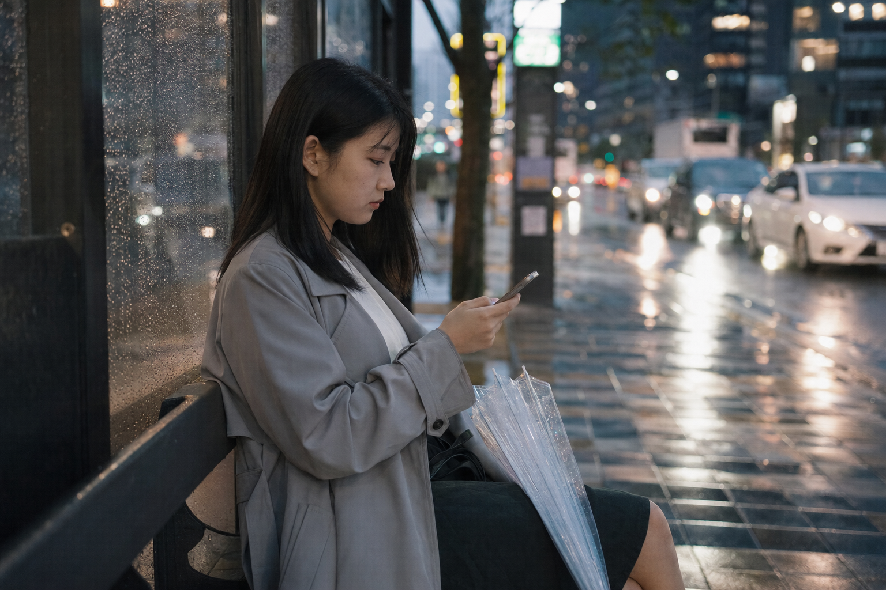

# 同事以为我在雨天拍大片，其实是豆包生成

图友们大家好，今天这一期是「公交站台雨中撑伞等车」。

这一组适合做雨天通勤、公交站台、城市生活感写真。重点不是摆拍大片，而是那种等车时被朋友顺手拍到的真实瞬间：雨伞、水光、站牌、车灯和一点点发呆的情绪。

提示词主要按中文自然语言写法整理，你可以直接复制到豆包，也可以在千问、GPT Image 2 或其他支持中文提示词的生图工具里尝试。生成人物照片时，也可以先上传或参考你自己的照片，再结合下面的提示词生成，会更容易保留本人五官和气质。

先放一张三列布局的大图，适合收藏成灵感参考：左边是撑伞等车的全身氛围，中间是靠近镜头的半身瞬间，右边是车灯驶近时的雨夜街景。

## 第一张：雨伞下的等车瞬间

适用场景：想生成一张雨天公交站台氛围图，人物自然站在站牌旁边，适合朋友圈、小红书封面或通勤感头像。

提示词：

男友第一人称视角，25岁亚洲女生雨天站在城市公交站台旁撑透明雨伞等车，浅灰色防水风衣、白色内搭、深色半身裙，黑色自然中长发，手里拿着手机和公交卡，站牌、候车亭玻璃、湿润路面和远处公交车灯形成背景，傍晚阴雨天自然冷光，iPhone 原相机随手抓拍，五官自然清秀，面部干净，健康自然肤色，表情松弛，真实通勤生活感，避免 AI 美女脸、网红感、过度精修、塑料皮肤、暗沉肤色、明显痘印、明显皱纹、斑点、面部变形。

这条的关键是「透明伞 + 站牌 + 湿润路面」。透明伞能保留脸部光线，湿地反光会让画面更像真实雨天。

## 第二张：车灯靠近时回头看镜头

适用场景：想要更有故事感的通勤照片，适合生成“快上车前被拍到”的自然回头瞬间。

提示词：

雨天城市公交站台抓拍，25岁亚洲女生撑透明雨伞站在候车亭边，公交车车灯从远处靠近，她听到报站声后微微回头看向镜头，浅灰色风衣被雨光映出柔和轮廓，手里握着手机，背景有模糊车灯、雨滴玻璃、站台广告牌和排队乘客虚影，35mm 街头生活摄影，健康自然肤色，干净自然肤质，眼神真实，画面温和耐看，避免商业写真感、摆拍感、网红滤镜、过度磨皮和面部变形。

这条更适合做“故事感”封面。重点是把动作写成一个具体瞬间：听到报站声、回头、车灯靠近。

## 第三张：雨停前的候车亭侧影

适用场景：想生成安静一点、电影感更强的雨天通勤图，可以用这条做公众号配图或氛围图。

提示词：

傍晚雨停前的城市公交站台，25岁亚洲女生坐在候车亭长椅一侧，透明雨伞收起靠在腿边，低头看手机上的公交到站时间，浅灰色风衣、白色内搭、深色半身裙，湿润地面倒映路灯和车流，玻璃候车亭上有细小雨滴，50mm 半身浅景深，富士胶片直出质感，表情安静自然，五官自然清秀，健康自然肤色，轻微皮肤纹理，避免 AI 美女脸、写真感、网红感、过度精修、塑料皮肤和面部变形。

如果想把这条改成自己的通勤照，可以替换城市、衣服颜色和时间，比如“清晨上班前”“夜晚下班后”“雨后天桥下”等。

## 使用建议

1. 想更像本人：生成时可以参考自己的照片，再保留“透明雨伞、公交站台、湿润路面、自然抓拍”这些结构。
2. 想更真实：不要把皮肤写得太完美，保留“健康自然肤色、轻微皮肤纹理、iPhone 原相机随手抓拍”即可。
3. 想换工具：豆包、千问、GPT Image 2 都可以试，出图不稳时优先微调画幅、镜头距离和雨天光线。

建议收藏这组 Prompt。后面还会继续补公共交通出行场景，如果你想看地铁、火车、高铁、出租车或渡轮主题，也可以在评论区留言。

## 往期回顾

- [TRANSIT-007-公交车前排靠窗发呆等红灯](../TRANSIT-007-公交车前排靠窗发呆等红灯/TRANSIT-007-公交车前排靠窗发呆等红灯.md)
- [TRANSIT-006-公交车窗边雨天看窗外街道](../TRANSIT-006-公交车窗边雨天看窗外街道/TRANSIT-006-公交车窗边雨天看窗外街道.md)
- [TRANSIT-005-夜晚空荡荡地铁车厢独自坐着](../TRANSIT-005-夜晚空荡荡地铁车厢独自坐着/TRANSIT-005-夜晚空荡荡地铁车厢独自坐着.md)

#GPTImage2 #豆包 #千问 #生图提示词 #Prompt #公共交通出行系列 #公交站台雨中撑伞等车
