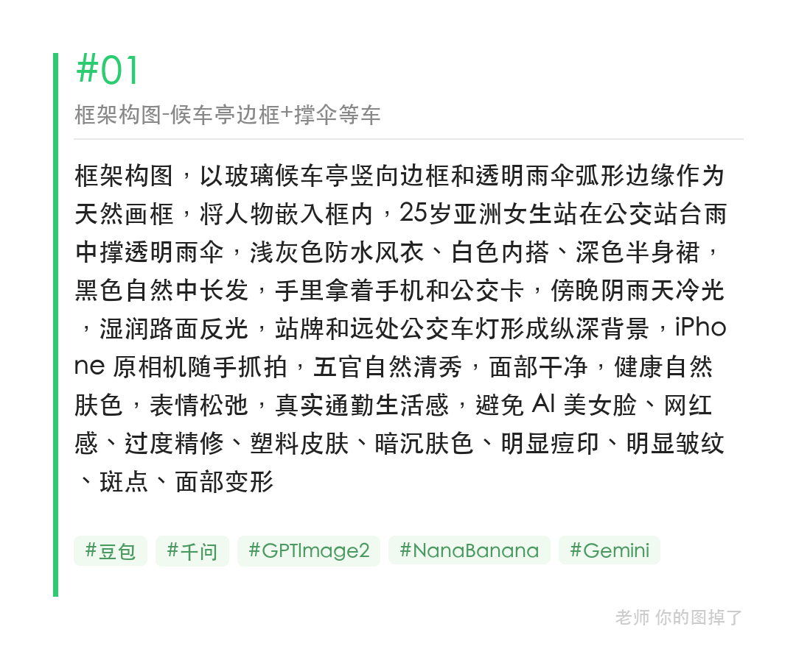
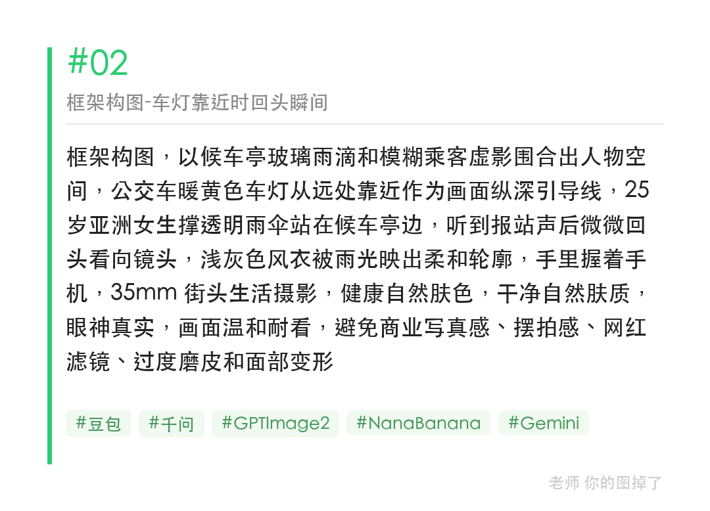
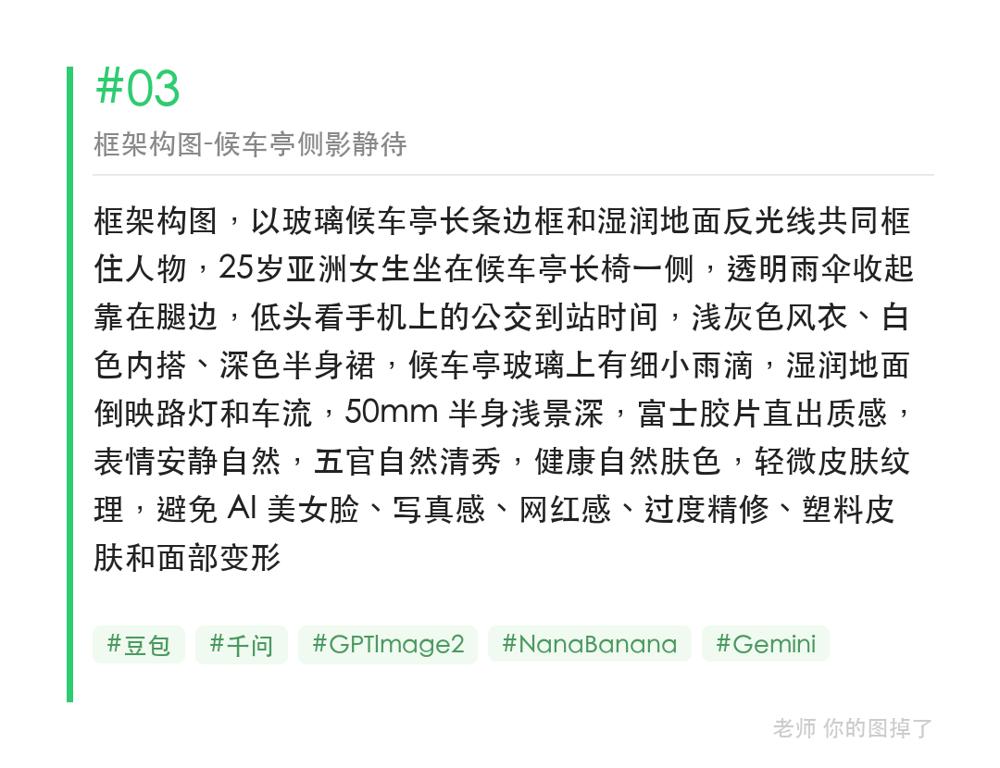

雨天公交站台等车，候车亭玻璃边框 + 透明雨伞弧线 + 地面反光，就是现成的框架构图。把这几个元素写进提示词，AI 出来的通勤照层次感会明显不同。

提示词（框架构图-候车亭边框版）：
框架构图，以玻璃候车亭竖向边框和透明雨伞弧形边缘作为天然画框，将人物嵌入框内，25岁亚洲女生站在公交站台雨中撑透明雨伞，浅灰色防水风衣、白色内搭，傍晚阴雨天冷光，湿润路面反光，站牌和远处公交车灯形成纵深背景，五官自然清秀，健康自然肤色，表情松弛，真实通勤生活感

#GPTImage2 #千问 #生图提示词 #Prompt #公共交通出行 #框架构图

