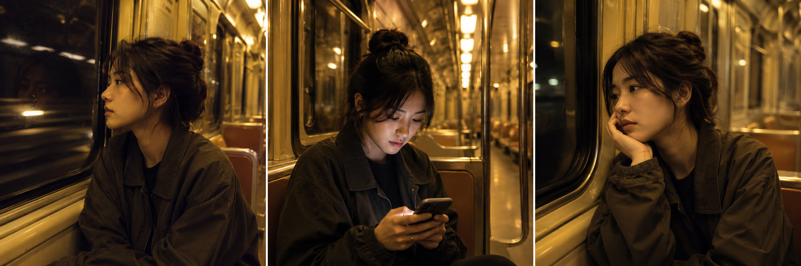
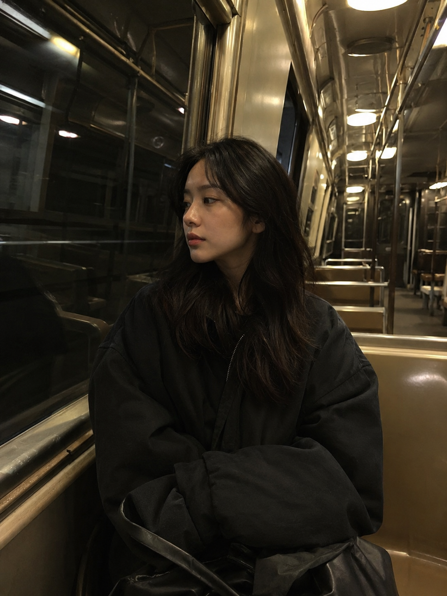
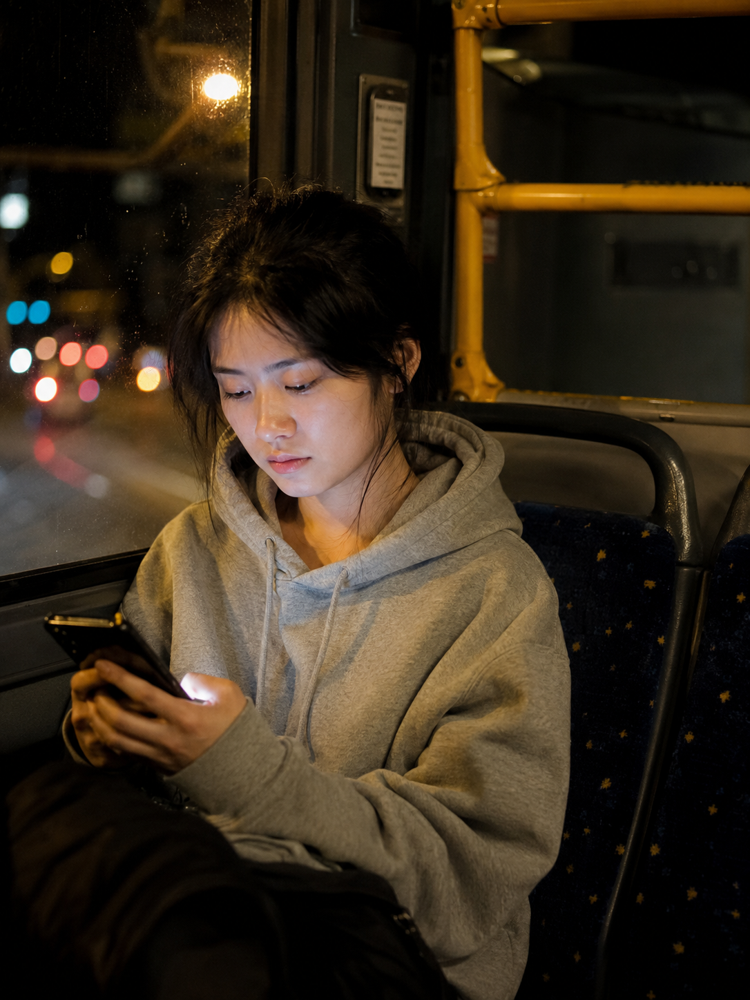
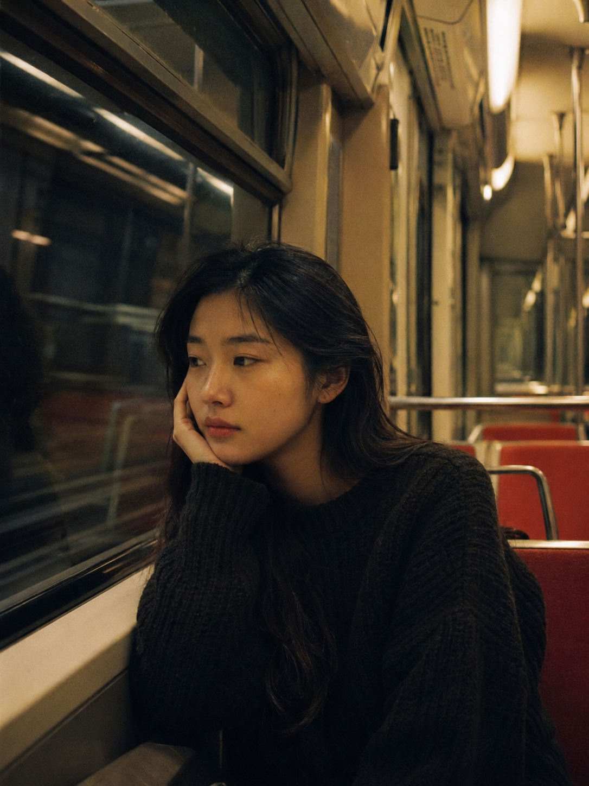

今天这组是「末班车空座位夜灯昏黄」。末班车快收班，车厢几乎空了，昏黄顶灯把每个座椅都镀上一层暖光，窗外是一片黑暗的隧道壁或夜晚路灯，一个人靠窗坐着，安静得只剩车轮的低鸣。这种独处感极强的通勤场景，用提示词完全可以生成。

提示词：
地铁车厢内，25岁亚洲女生独自坐在靠窗位置，侧身望向黑暗隧道，昏黄车厢灯光打在面部和座椅上，车厢座位几乎全空，宽松深色外套，头发自然垂落，五官自然清秀，表情平静微惆怅，健康自然肤色，干净自然肤质，iPhone 随手抓拍，真实生活感摄影，避免 AI 美女脸、网红感、过度精修、塑料皮肤、暗沉肤色、明显痘印、明显皱纹、面部变形。

建议收藏这组 Prompt。核心结构是「昏黄车厢灯光 + 空旷座位 + 独坐望窗」，把"靠窗"换成"低头看手机"或"托腮靠玻璃"就能延伸出三张不同瞬间，框架通用性很强。
这个系列会持续更新，下一期继续补公共交通出行场景。

#豆包 #GPTImage2 #千问 #生图提示词 #Prompt #公共交通出行 #末班车

