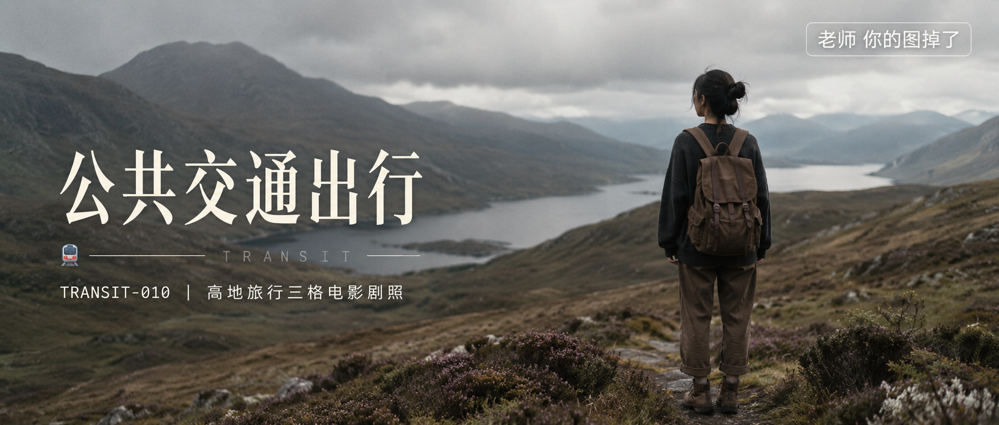
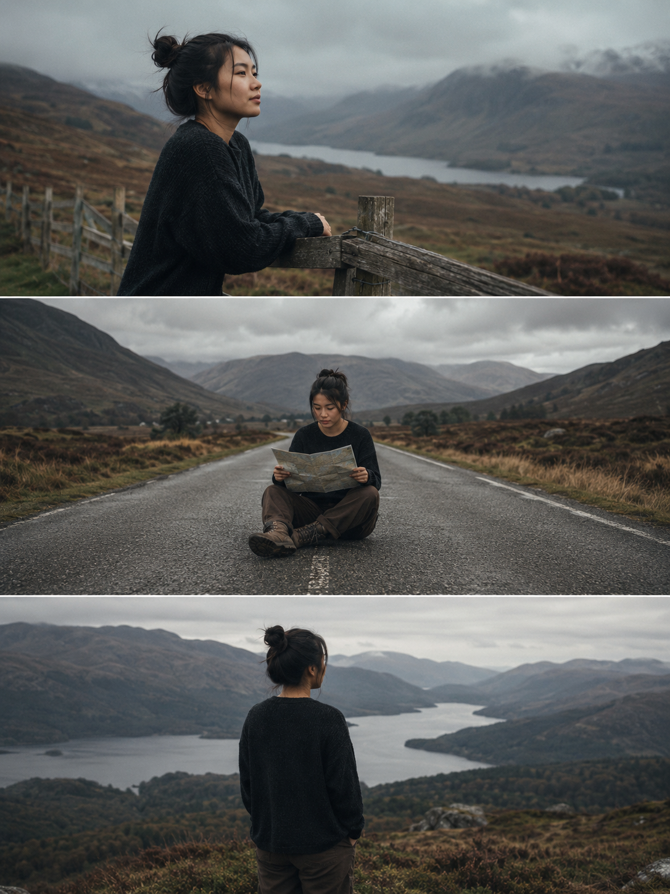
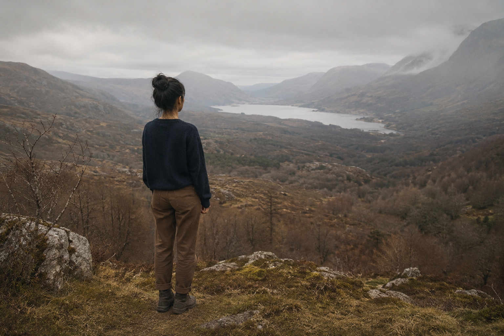
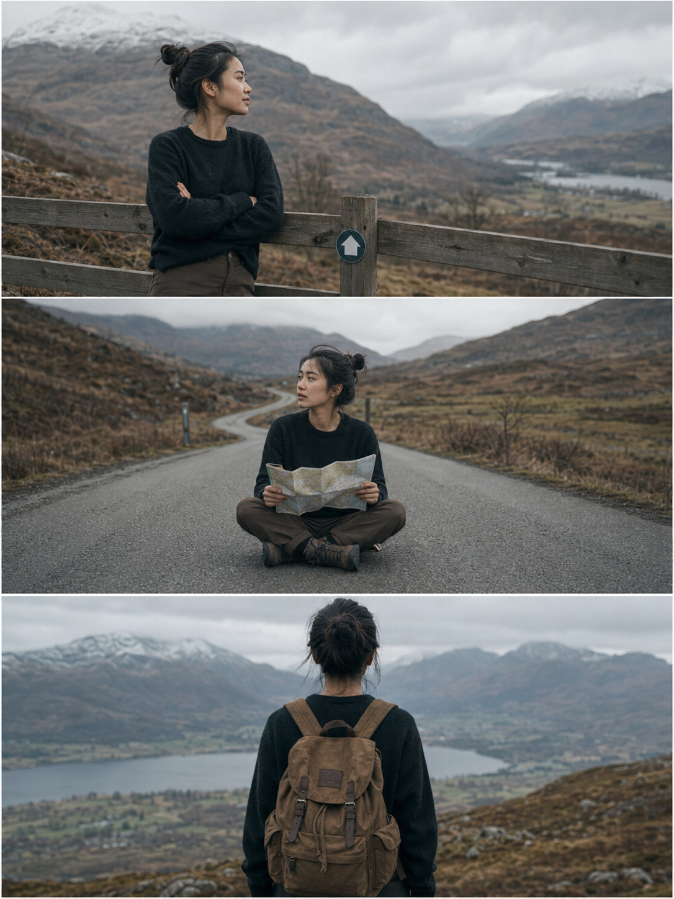

今天这组是「高地旅行三格电影剧照」。

为什么同样是旅行人物图，有些出来像截图，有些出来像电影？关键不在光线，不在人物，在构图结构——要不要在 Prompt 里指定「连续性三联画」。

普通写法只给 AI 一个场景，它默认生成完整均衡的单张图，信息量饱和、但看完就过。换成竖向三联画结构，AI 会在一张图里生成三个连续瞬间，有节奏感，有时间流动感，一看就有电影剧照的感觉。

这组用的是高地徒步旅行场景：第一格平静倚栏眺望，第二格迷茫坐地看地图，第三格释然背包出发——三格合在一起，就是一段完整的旅途故事。

核心写法：在 Prompt 最前面加一句「竖向三联画构图，三张横向画面依次从上到下排列，中间用细白色边框分隔，像一组连续的电影截图胶片」，然后逐格描述动作、机位和情绪，剩下的 AI 会搞定。

提示词：
竖向三联画构图，三张横向画面依次从上到下排列，中间用细白色边框分隔，像一组连续的电影截图胶片。整体风格真实、自然、安静，浅景深，胶片颗粒感，低饱和大地色调，多云阴天高地旅行纪录片氛围。主角是24岁亚洲女性旅行者，五官自然清秀，面部干净，气质清爽亲和，穿深色宽松毛衣、棕色长裤、登山靴，头发随意扎起。第一格：侧身倚木栅栏眺望远方，中景，平静；第二格：坐在空旷道路中央看纸质地图，全身，迷茫；第三格：背影站在高地眺望湖泊山谷，中景，释然。偏远高地，连绵丘陵、石楠花、灌木丛、远山、湖泊，多云薄雾，光线柔和，避免 AI 美女脸、网红感、过度精修、塑料皮肤。

建议收藏这套三联画结构。把「高地徒步」换成「城市通勤」「海边散步」「雨天咖啡馆」，改掉逐格动作描述，同样能用。

#GPTImage2 #千问 #生图提示词 #Prompt #公共交通出行 #旅行剧照

