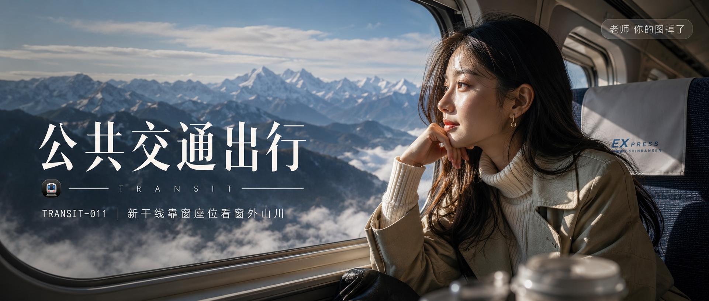

# TRANSIT-011-新干线靠窗座位看窗外山川 封面

## 封面提示词

24岁亚洲女生，充满活力的少女气质，坐在新干线靠窗座位，侧脸望向窗外连绵山川雪峰与薄雾云海，右手轻托下颌，长直发微卷自然垂落，戴小巧金色耳环，穿米白色高领针织衫外搭浅卡其色风衣，五官精致自然，面部立体清晰，皮肤光泽细腻，眼神有神灵动，妆感干净清透，轮廓清晰上镜，侧逆光打亮颧骨与发丝，富士胶片直出色调，电影感光影，高清锐利，色彩层次丰富，构图黄金比例，前景虚化背景，画面有张力，视觉冲击力强，2.35:1 电影横构图，避免 AI 美女脸、网红感、过度精修、塑料皮肤、暗沉肤色、明显痘印、明显皱纹、斑点、面部变形。【文字排版-必须完整保留，不得省略或简化任何一项】画面左侧垂直居中偏下叠加文字排版：超大号衬线字体米白色主文案「公共交通出行」，主文案正下方一条细横线左端带🚇横线中央有透明英文水印 TRANSIT，横线下方等宽白色字体副文案「TRANSIT-011 ｜ 新干线靠窗座位看窗外山川」；右上角浅色半透明圆角底衬配小号文字「老师 你的图掉了」（署名文字，必须出现，不可省略）；无整体蒙层，文字直接压图。【文字排版结束】

## 封面图片

