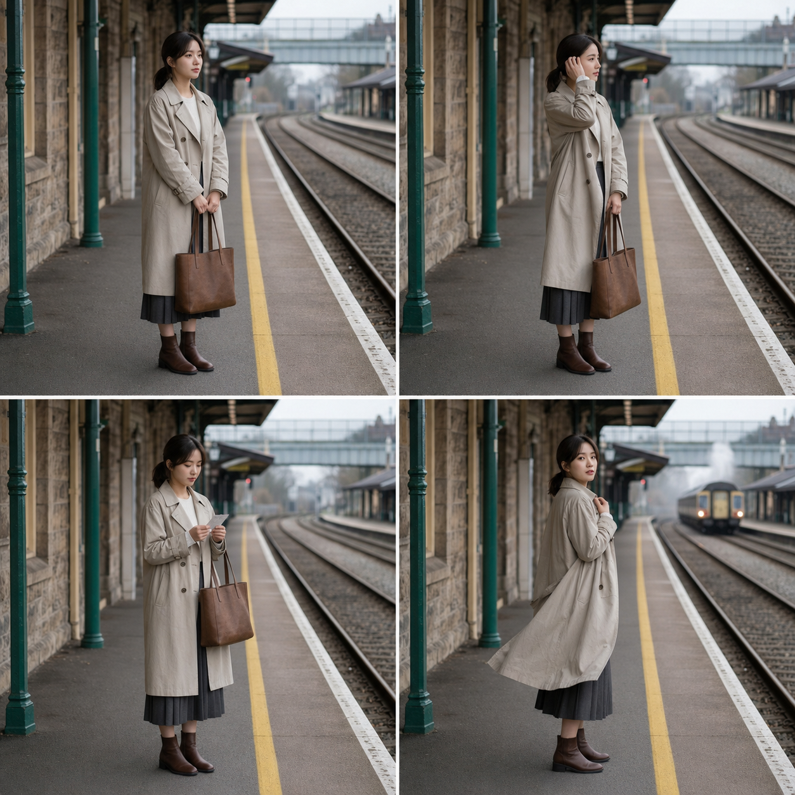
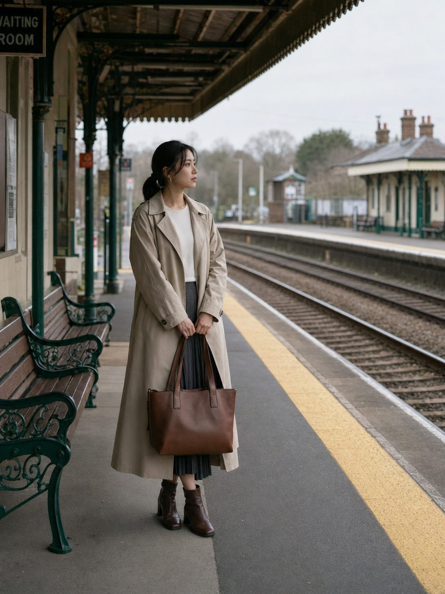
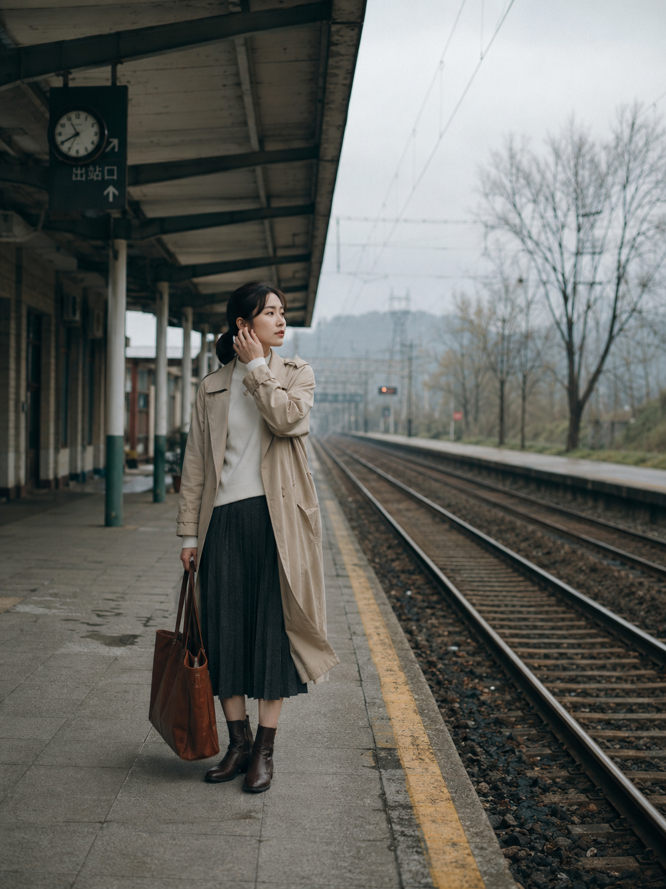
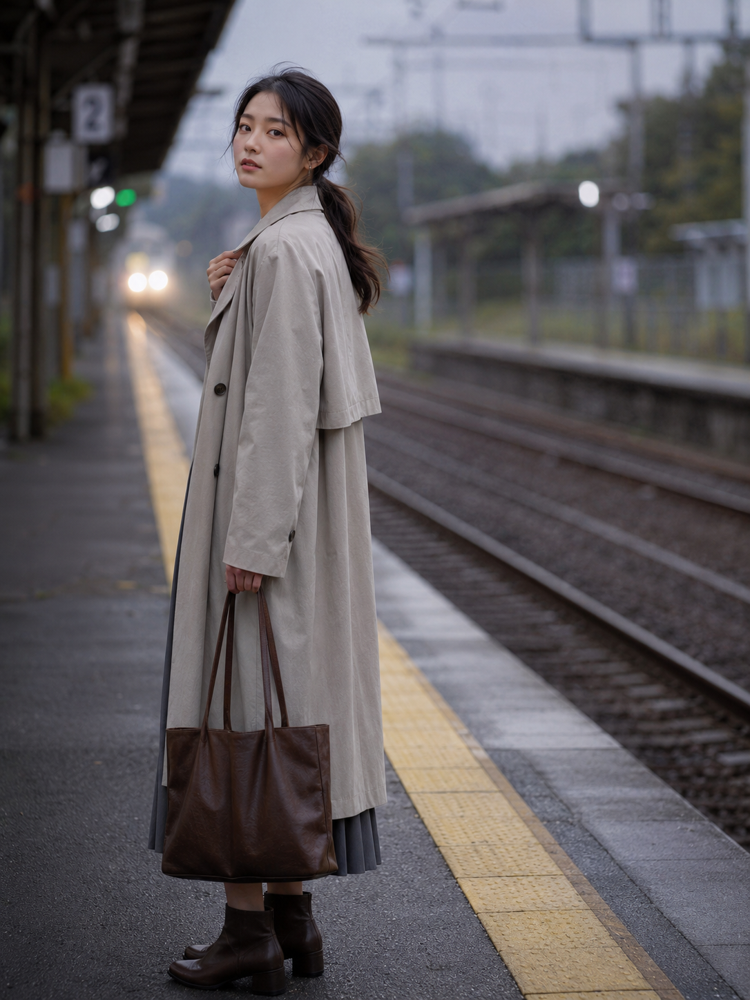

# 不用真去站台，AI 也能拍出独自候车的电影感瞬间

站在黄色安全线外等车，看起来只是一个很普通的动作，但它天然带着“还没出发”的故事感。轨道把视线引向远方，站姿留下停顿，列车是否到来又给画面增加了一点悬念。

这个动作好看的关键，不是把人站得笔直，而是保留轻微的重心变化：双脚一前一后、肩膀放松、手里有一个能安放动作的包。这样既能让身体线条自然，也能避免人物像在站军姿。

第一种写法适合安静、克制的候车画面。让人物双手握住包带，镜头保持平视，站台和轨道负责交代环境，人物只需要停在那里。

写实生活摄影，24岁亚洲女生独自站在老式火车站台黄色安全线外约半米处候车，身体微微侧向轨道，双手自然握住棕色皮质托特包提手，双脚一前一后形成轻微重心变化，低马尾，穿燕麦色长款风衣、白色针织上衣、深灰色百褶中长裙和棕色短靴，同组人物与穿搭保持一致；清晨阴天散射光，站台顶棚、长椅和远处轨道形成纵深，50mm镜头平视中景，浅景深，纪实电影感，五官自然清秀，面部干净，健康自然肤色，自然皮肤纹理，表情松弛，眼神真实，画面安静克制，避免越过黄线，避免脚部踩线，避免多余肢体、手指畸形、轨道结构错误，避免 AI 美女脸、网红感、过度精修、塑料皮肤、暗沉肤色、明显痘印、明显皱纹、斑点、面部变形

换成抬手别头发，画面会更像抓拍。低机位让黄线、铁轨和人物形成三层关系，风衣下摆的轻微风动也能削弱“摆拍感”。

写实生活摄影，同一位24岁亚洲女生独自站在老式火车站台黄色安全线外约半米处候车，左手轻轻把耳边碎发别到耳后，右手拎棕色皮质托特包，身体重心落在后脚，低马尾，穿燕麦色长款风衣、白色针织上衣、深灰色百褶中长裙和棕色短靴，同组人物与穿搭保持一致；清晨阴天散射光，空旷站台与平行铁轨向远处消失，35mm镜头低机位45度全身构图，较深景深，前景黄线清晰但人物没有踩线，纪实电影感，五官自然清秀，干净自然肤质，气质清爽亲和，轮廓清晰，皮肤光泽自然，风衣下摆有轻微风动，避免越过黄线，避免脚部踩线，避免多余肢体、手指畸形、轨道结构错误，避免 AI 美女脸、网红感、过度精修、塑料皮肤、暗沉肤色、明显痘印、明显皱纹、斑点、面部变形

如果想让故事性再强一点，可以把动作放到“列车快要进站”的瞬间。手压住领口、从肩后回眸，比直接看镜头更有过程感；长焦会把远处车灯压进背景，画面也更集中。

写实生活摄影，同一位24岁亚洲女生独自站在老式火车站台黄色安全线外约半米处候车，远处列车即将进站带起微风，她用一只手压住燕麦色风衣领口并从肩后回眸看向镜头，另一只手自然垂下拎棕色皮质托特包，低马尾，白色针织上衣、深灰色百褶中长裙和棕色短靴，同组人物与穿搭保持一致；清晨阴天散射光，列车灯光在远处形成柔和光斑，85mm镜头3/4侧脸半身近景，背景强压缩与浅景深，抓拍电影静帧感，五官自然清秀，面部干净，干净自然肤质，眼神真实，轮廓清晰，表情松弛，禁止眼睛半闭和嘴巴微张，避免越过黄线，避免多余肢体、手指畸形、轨道结构错误，避免 AI 美女脸、网红感、过度精修、塑料皮肤、暗沉肤色、明显痘印、明显皱纹、斑点、面部变形

同类动作还可以替换成：低头确认纸质车票、抬腕看时间、把包从一侧换到另一侧、听到广播后抬头、列车进站时后退半步。它们共同的特点是动作幅度小，但都有明确的原因。

生成时最容易出错的是脚部与黄线关系，以及手指和包带纠缠。提示词里把“站在线外约半米”“没有踩线”“一只手做动作、另一只手拎包”写清楚，比只写“站台候车”稳定得多。

候车动作真正打动人的，是安静站姿里那一点即将启程的期待感。

---

如果这组站台候车写法对你有用，可以先收藏；关注后续公共出行系列，也欢迎在评论区留下你想看的车站或通勤场景。

---

## 往期回顾

- TRANSIT-009 末班车空座位夜灯昏黄
- TRANSIT-010 高地旅行三格电影剧照
- TRANSIT-011 新干线靠窗座位看窗外山川

#GPTImage2 #千问 #豆包 #生图提示词 #Prompt #公共交通出行 #火车站台候车
