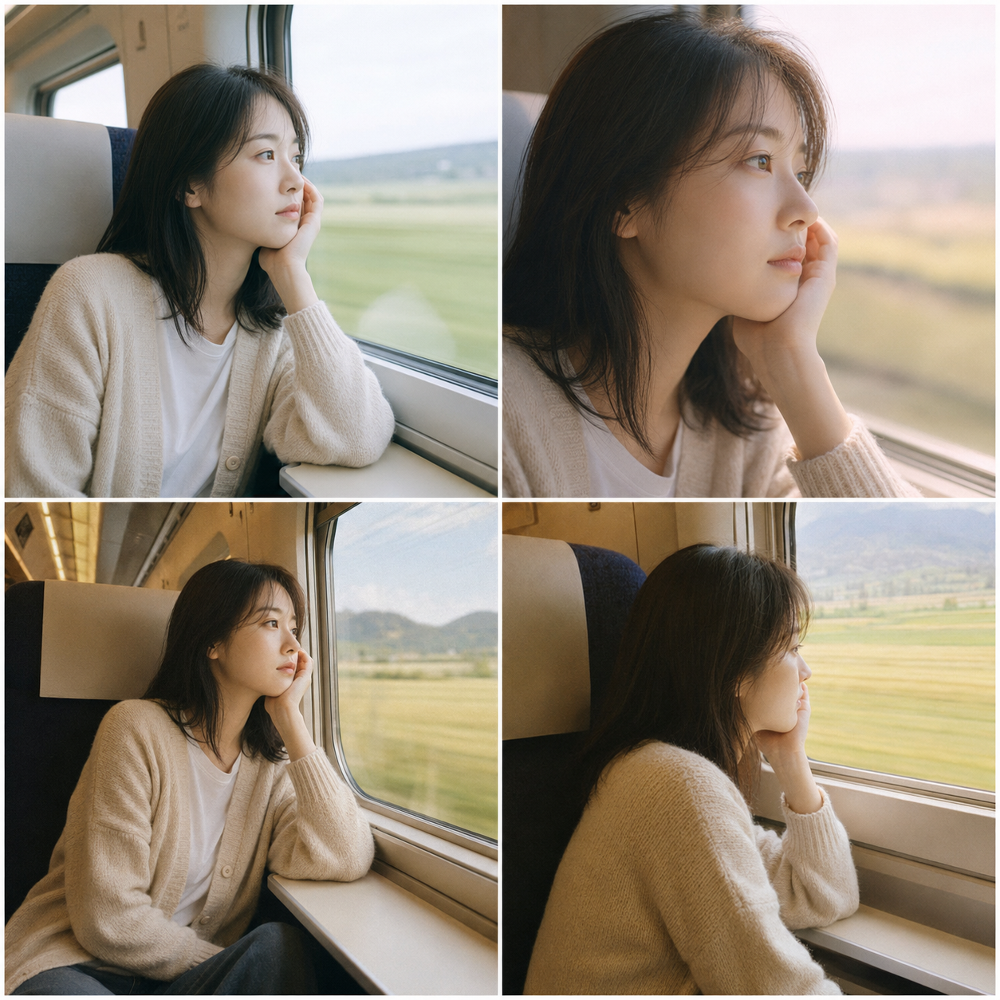
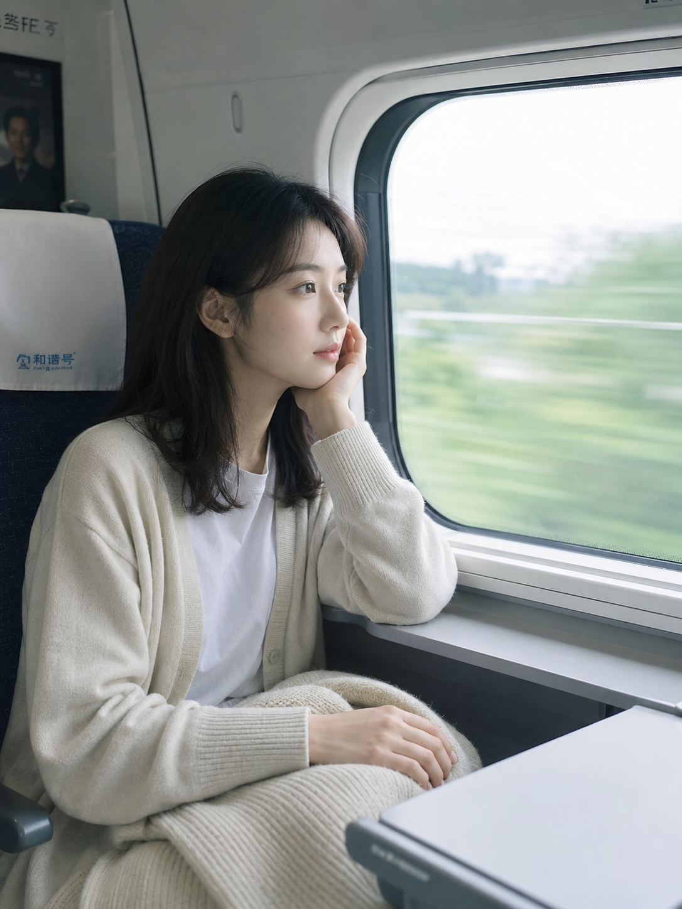
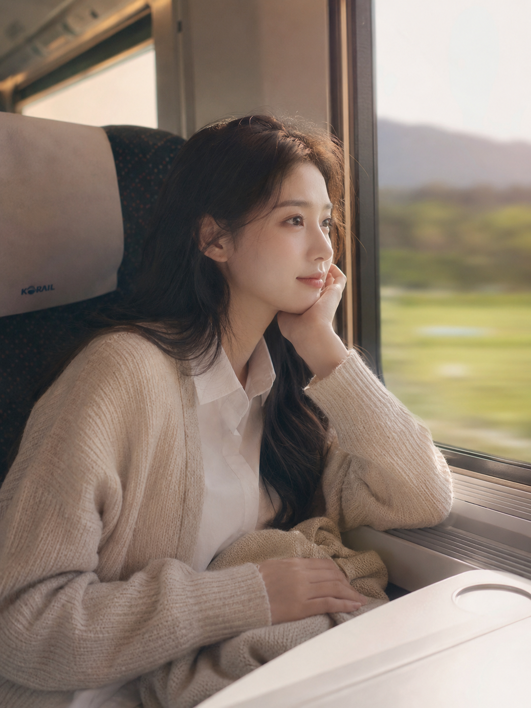
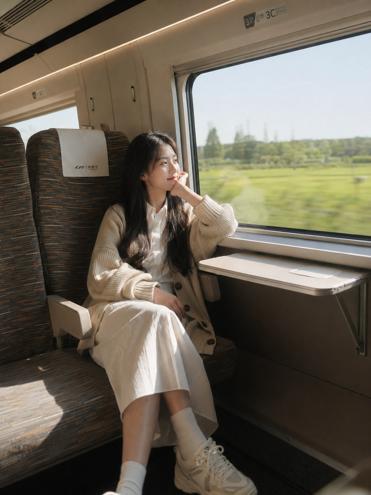

# 同一个托腮望窗动作，三种摄影风格差距有多大？

**Q：高铁靠窗托腮望向窗外，这个场景为什么百拍不腻？**

因为它几乎不需要摆拍——手肘搭在小桌板上，视线自然飘向窗外掠过的田野，整个人是松弛的。但同一个动作、同一套穿搭，只换一个摄影风格词，出来的画面质感能差出一个档次。今天固定人物、场景、动作，只换风格词，看三种写法各自的效果。

日系清透风

日系清新胶片摄影风格，24岁亚洲女生独自坐在高铁靠窗座位，单手托腮，手肘搭在小桌板上，视线望向窗外飞速掠过的绿色田野，另一只手轻搭在膝上的浅米色针织开衫，内搭白色棉质衬衫，头发自然披肩，皮肤白皙细腻，五官自然清秀，面部干净，健康自然肤色，干净自然肤质，表情松弛，眼神真实，气质清爽亲和，正午柔和自然光透过车窗洒在侧脸，色调偏冷白高光、低饱和度，50mm镜头平视中景，浅景深，画面干净安静，避免 AI 美女脸、网红感、过度精修、塑料皮肤、暗沉肤色、明显痘印、明显皱纹、斑点、面部变形

---

**Q：日系已经很干净了，韩系还能怎么不一样？**

差异主要在光线的"温度"和镜头的"距离感"。日系偏冷白、中景克制；韩系偏暖粉、近景更贴近皮肤质感，柔焦处理让画面多一层朦胧感，情绪更外露。

韩系写真摄影风格，同一位24岁亚洲女生独自坐在高铁靠窗座位，单手托腮，手肘搭在小桌板上，视线望向窗外飞速掠过的绿色田野，另一只手轻搭在膝上的浅米色针织开衫，内搭白色棉质衬衫，头发自然披肩，皮肤白皙透亮，五官自然清秀，面部干净，健康自然肤色，干净自然肤质，眼神有柔光感，气质清透温柔，午后柔光透过车窗形成朦胧光晕，色调偏暖粉与米白、高级柔焦质感，85mm镜头3/4侧脸近景，背景强压缩，浅景深，避免 AI 美女脸、网红感、过度精修、塑料皮肤、暗沉肤色、明显痘印、明显皱纹、斑点、面部变形

---

**Q：想要更有"生活感"、少一点精修感，该往哪个方向调？**

胶片直出是答案。保留自然皮肤纹理和轻微颗粒感，色调转向暖黄，机位也从近景拉到低角度全身，画面立刻从"写真"变成"抓拍"。

富士胶片直出摄影风格，同一位24岁亚洲女生独自坐在高铁靠窗座位，单手托腮，手肘搭在小桌板上，视线望向窗外飞速掠过的绿色田野，另一只手轻搭在膝上的浅米色针织开衫，内搭白色棉质衬衫，头发自然披肩，皮肤白皙自然，五官自然清秀，面部干净，健康自然肤色，自然皮肤纹理，表情松弛，眼神真实，正午自然光带轻微胶片颗粒感与暖黄色调，35mm镜头低角度侧前方全身构图，中等景深，车窗外田野呈现轻微动态模糊线条，纪实电影感，避免 AI 美女脸、网红感、过度精修、塑料皮肤、暗沉肤色、明显痘印、明显皱纹、斑点、面部变形

---

**Q：三种风格到底该怎么选？**

| 风格词 | 视觉效果 | 适合内容类型 |
| --- | --- | --- |
| 日系清新胶片 | 冷白高光、低饱和、克制干净 | 日常记录、治愈系文案配图 |
| 韩系写真 | 暖粉柔光、近景柔焦、情绪外露 | 写真集、朋友圈精修风 |
| 富士胶片直出 | 暖黄颗粒、纪实全身、生活感强 | 旅行日记、抓拍风内容 |

场景、人物、动作三者不变，只改风格词，就能让同一条 Prompt 覆盖三种完全不同的内容调性——想要哪种感觉，直接把风格词换掉就够了。

---

存下这三条写法，下次坐高铁想拍点素材，直接照抄风格词就能出片。喜欢哪种风格、还想看哪些场景的风格对比，评论区告诉我。

---

## 往期回顾

- TRANSIT-010 高地旅行三格电影剧照
- TRANSIT-011 新干线靠窗座位看窗外山川
- TRANSIT-012 火车站台候车独自站在黄线外

#GPTImage2 #千问 #豆包 #生图提示词 #Prompt #公共交通出行 #高铁写真
