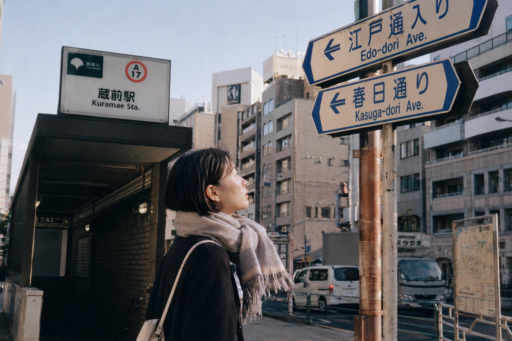
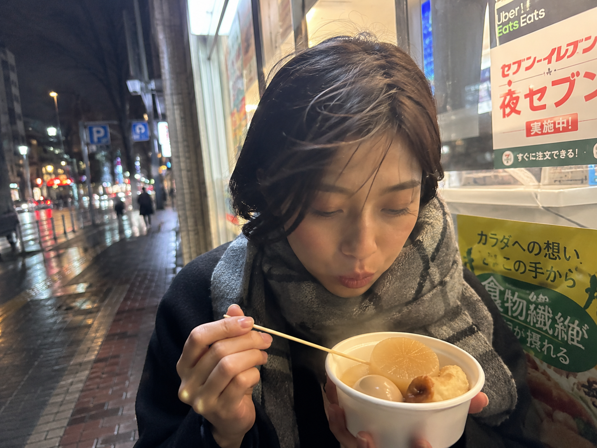
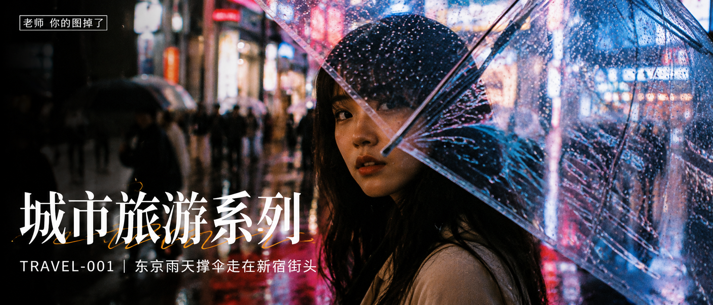
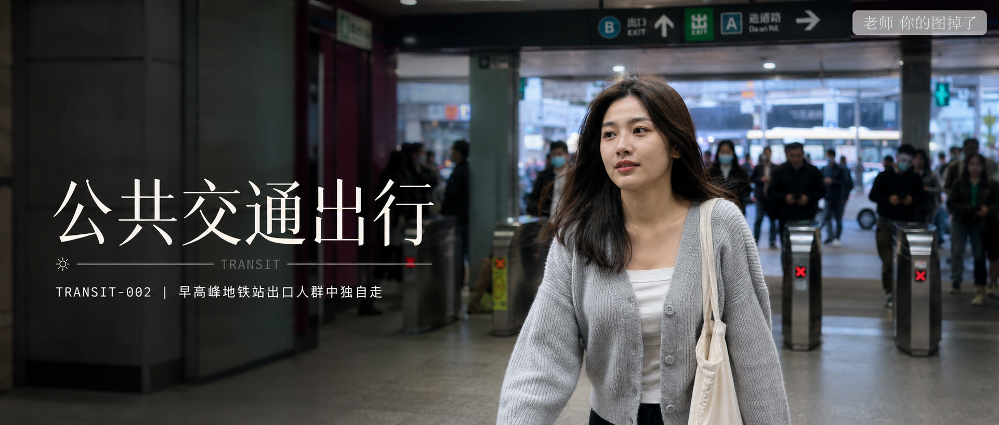

# GPT Image 2 生图提示词｜真实生活感 Prompt 合集：城市旅行、晨间女友、公共出行

图友们大家好，今天这一期是「真实生活感 Prompt 合集」。

这篇把最近已经发布的 3 个方向整理在一起：城市旅游、晨间女友、公共交通出行。每一组都保留原文链接、一个效果图和一条代表提示词，方便你按场景直接复制、收藏和二次改写。

这组提示词以 GPT Image 2 为主要测试模型，也可以在豆包、千问及其他支持中文自然语言提示词的生图工具上尝试。不同模型出图会有差异，可以从人物年龄、镜头距离、光线和场景细节开始微调。

## 合集目录

### 城市旅游系列

1. TRAVEL-005：居酒屋玻璃窗边独自小酌  
   mp.weixin.qq.com/s/vpF6aDphoVBR81Gq73xr3g
2. TRAVEL-004：地铁站出口抬头看路牌  
   mp.weixin.qq.com/s/Fq4vsT0mVtnMvvV3lcJMjA
3. TRAVEL-003：便利店门口吃关东煮  
   mp.weixin.qq.com/s/GfFqpmSbKlz5XQsdGUVtvQ
4. TRAVEL-002：涩谷路口等绿灯的背影  
   mp.weixin.qq.com/s/04wA3urH68cwvv_IWsmSzw
5. TRAVEL-001：新宿雨夜  
   mp.weixin.qq.com/s/J7mEdsmOzEdfWmTWuVIClg

### 晨间女友系列

1. MORNING-007：轻轻拉开被子  
   mp.weixin.qq.com/s/50FJPItq2NkvzG5kO--WSQ
2. MORNING-006：俯身叫你起床  
   mp.weixin.qq.com/s/OYc0kNIyawF2WIjWrVCM1A
3. MORNING-005：半睡半醒拉着被子  
   mp.weixin.qq.com/s/o4ocxMKjFyhr8Q_9aVx3hg
4. MORNING-004：趴在枕头边发呆  
   mp.weixin.qq.com/s/wM3fKdRMfZe-SYBu--qHmg
5. MORNING-003：揉眼睛看向镜头  
   mp.weixin.qq.com/s/eQrTxZ4qWN5lL5UoskJCIQ

### 公共交通出行系列

你给的发布列表里，公共交通出行系列目前能对应到 4 篇公众号链接，这里先按可访问原文收录。

1. TRANSIT-004：地铁门倒影  
   mp.weixin.qq.com/s/V0iLZHoUOhZqojAQDgTbBQ
2. TRANSIT-003：地铁座位上戴耳机低头看手机  
   mp.weixin.qq.com/s/Q0LYSHfeL97VeWOZZO8Ung
3. TRANSIT-002：早高峰地铁站出口人群中独自走  
   mp.weixin.qq.com/s/CwAoD8JUl2ySIraJayH9XQ
4. TRANSIT-001：地铁车厢靠门站着望窗外  
   mp.weixin.qq.com/s/oR04TuzbcmMMYPEXx-JOeg

## 城市旅游系列

### TRAVEL-005：居酒屋玻璃窗边独自小酌

25岁亚洲女生坐在东京居酒屋玻璃窗边独自小酌，深色短外套和米色围巾，桌上有梅酒杯、木筷和小菜，窗外彩色灯牌与街灯映在玻璃上，暖黄色店灯明亮干净，35mm胶片街头旅拍，真实旅行抓拍，避免写真感和网红感。

### TRAVEL-004：地铁站出口抬头看路牌

25岁亚洲女生从东京地铁站出口走上台阶，抬头看蓝白色路牌和出口编号，深色短外套和米色围巾，清晨灰蓝天光混合站口灯光，35mm胶片街头旅拍，真实生活抓拍，避免写真感和网红感。

### TRAVEL-003：便利店门口吃关东煮

25岁亚洲女生站在东京便利店门口捧着热气腾腾的关东煮纸碗，深色呢大衣和灰色围巾，夜晚橙黄色店招照亮侧脸，门口塑料雨棚下地面微湿，35mm胶片街头旅拍，真实生活感，避免写真感和网红感。

### TRAVEL-002：涩谷路口等绿灯的背影

亚洲女生站在涩谷十字路口等绿灯，背对镜头，黑色短发，深色外套，周围是密集等待的人群，霓虹广告牌在日暮光线中亮起，35mm胶片颗粒感，街头旅拍，真实皮肤质感，避免写真感和网红感。

### TRAVEL-001：新宿雨夜

亚洲女生撑透明雨伞走在新宿雨夜街头，背影视角，湿润路面反射霓虹灯光，人群模糊，35mm 胶片风格，自然旅拍，电影感构图，真实皮肤质感，避免写真感。

## 晨间女友系列

### MORNING-007：轻轻拉开被子

男友第一人称视角，24岁亚洲女生清晨轻轻拉开你身上的白色被子，一只手捏着被角靠近镜头，头发微乱，宽松浅色居家睡衣，未整理床铺和枕头占据前景，柔和窗光照进真实卧室，iPhone 原相机随手抓拍，真实皮肤纹理，避免 AI 美女脸、写真感、网红感、过度精修。

### MORNING-006：俯身叫你起床

男友第一人称视角，24岁亚洲女生清晨俯身靠近镜头叫你起床，一只手轻轻撑在枕头边，头发微乱，宽松浅色居家睡衣，未整理被褥占据前景，柔和窗光照进真实卧室，iPhone 随手抓拍，真实皮肤纹理，避免 AI 美女脸、写真感、网红感、过度精修。

### MORNING-005：半睡半醒拉着被子

男友第一人称视角，24岁亚洲女生清晨半睡半醒地侧躺在床上，一只手轻轻拉着白色被子看向镜头，头发微乱，宽松浅色居家睡衣，未整理的枕头和床单，柔和窗光照进真实卧室，iPhone 随手抓拍，真实皮肤纹理，避免 AI 美女脸、写真感、网红感、过度精修。

### MORNING-004：趴在枕头边发呆

男友第一人称视角，24岁亚洲女生清晨趴在枕头边发呆，脸贴近白色枕头，头发微乱，宽松浅色居家睡衣，未整理的被子和床单，柔和窗光照进真实卧室，iPhone 随手抓拍，真实皮肤纹理，避免 AI 美女脸、写真感、网红感、过度精修。

### MORNING-003：揉眼睛看向镜头

男友第一人称视角，24岁亚洲女生清晨坐在未整理的床边，一只手轻轻揉眼睛并看向镜头，头发微乱，宽松浅色居家 T 恤，柔和窗光照进真实卧室，iPhone 随手抓拍，真实皮肤纹理，避免 AI 美女脸、写真感、网红感、过度精修。

## 公共交通出行系列

### TRANSIT-004：地铁门倒影

男友第一人称视角，24岁亚洲女生站在即将关闭的地铁门前，玻璃门上清楚映出她的侧脸倒影，清晨车厢冷色灯光和站台人影虚化，浅灰针织开衫、白色内搭和帆布包，35mm iPhone 随手抓拍，真实皮肤纹理，生活感摄影，避免 AI 美女脸、写真感、网红感、过度精修。

### TRANSIT-003：地铁座位上戴耳机低头看手机

男友第一人称视角，24岁亚洲女生坐在地铁座位上戴着白色有线耳机低头看手机，浅灰针织开衫、白色内搭和帆布包放在膝边，清晨地铁车厢冷色灯光，周围乘客自然虚化，35mm iPhone 随手抓拍，真实皮肤纹理，生活感摄影，避免 AI 美女脸、写真感、网红感、过度精修。

### TRANSIT-002：早高峰地铁站出口人群中独自走

男友第一人称视角，24岁亚洲女生从早高峰地铁站闸机口独自走出来，身后通勤人群自然虚化，浅灰针织开衫、白色内搭和帆布包，清晨冷色灯光混合出口自然光，35mm iPhone 随手抓拍，真实皮肤纹理，生活感摄影，避免 AI 美女脸、写真感、网红感、过度精修。

### TRANSIT-001：地铁车厢靠门站着望窗外

男友第一人称视角，24岁亚洲女生站在地铁车厢靠门位置望向窗外，玻璃里有轻微倒影，清晨通勤人群虚化在背景，浅灰针织开衫和帆布包，35mm iPhone 随手抓拍，真实皮肤纹理，生活感摄影，避免 AI 美女脸、写真感、网红感、过度精修。

## 使用建议

1. 想做城市旅游照：保留「城市地点 + 自然动作 + 胶片抓拍 + 真实皮肤纹理」，再替换城市、街区和店铺类型。
2. 想做晨间女友感：固定「男友第一人称视角 + 清晨卧室 + 白色被褥 + 柔和窗光」，只换动作和镜头距离。
3. 想做公共交通通勤感：重点写清楚车厢、站台、玻璃倒影、人流虚化和冷色灯光，不要把画面做成商业写真。

建议收藏这篇合集。核心结构其实很简单：真实地点、自然动作、生活细节、明确镜头，再加上「避免 AI 美女脸、写真感、网红感、过度精修」，出图会更接近真实生活照片。

#GPTImage2 #豆包 #千问 #生图提示词 #Prompt #城市旅游系列 #晨间女友系列 #公共交通出行系列 #真实女友感 #生活摄影

