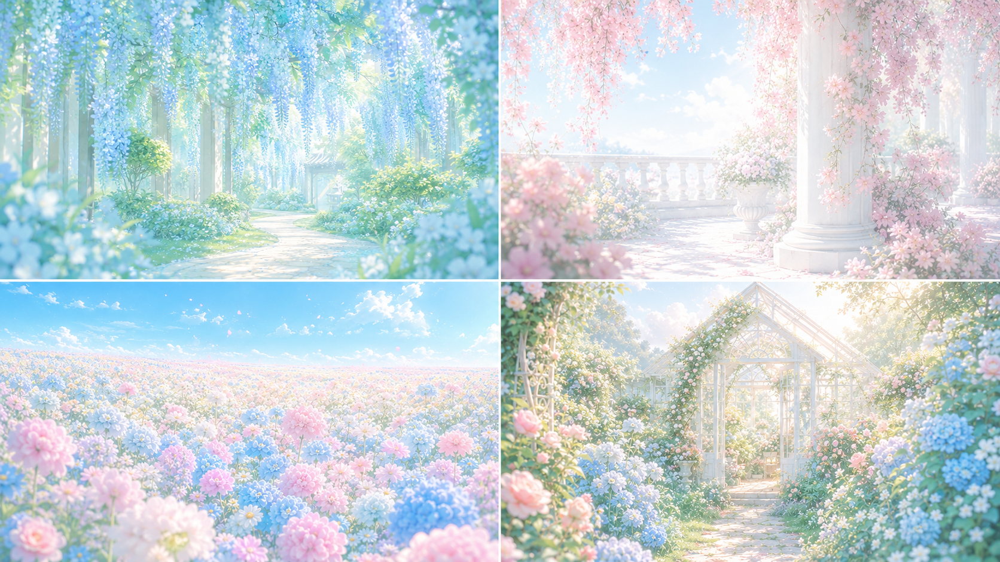
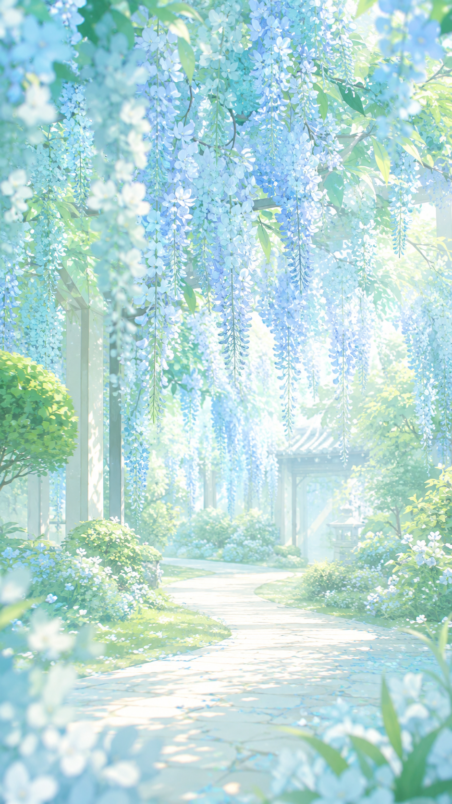
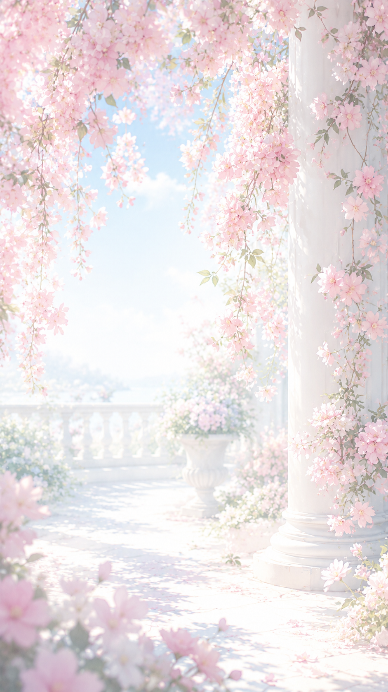
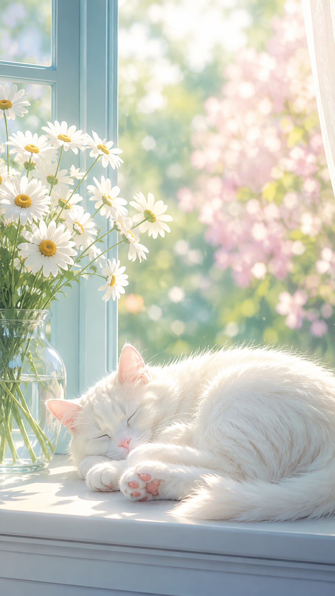
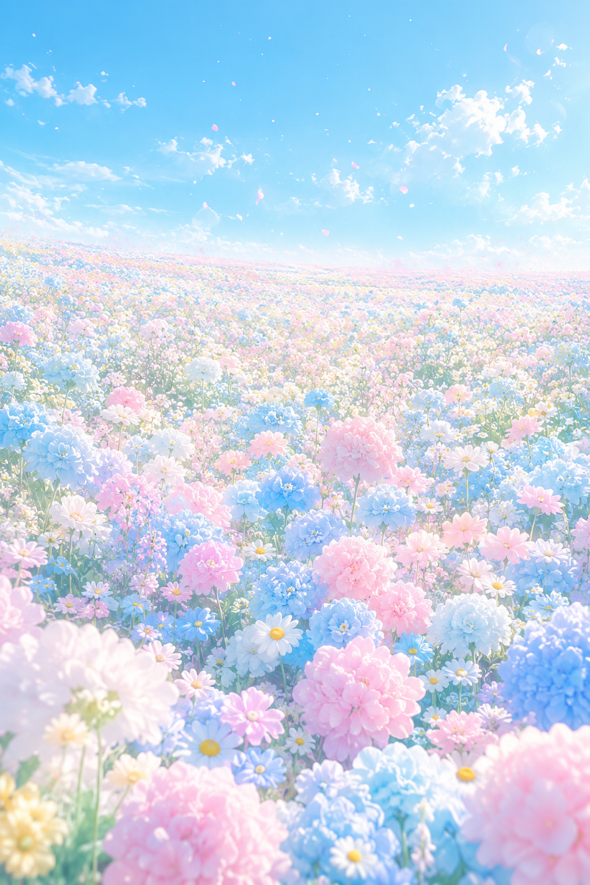
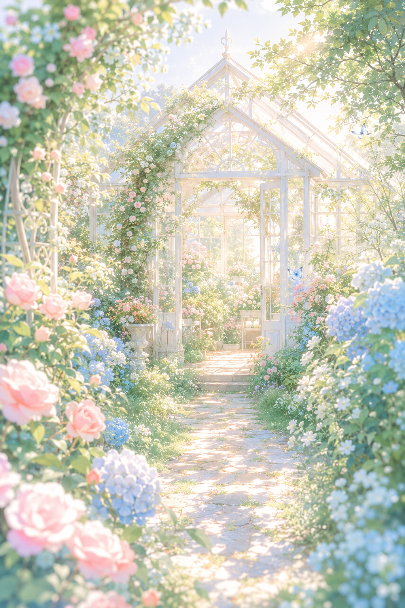
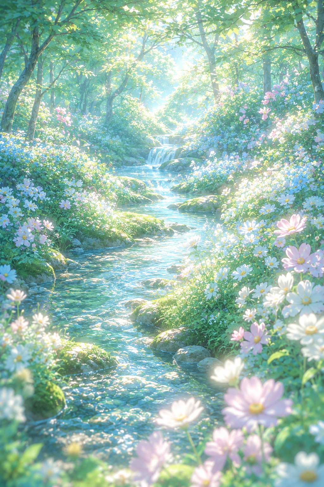
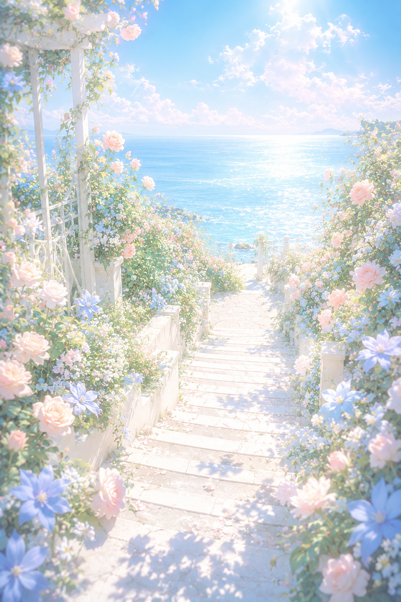
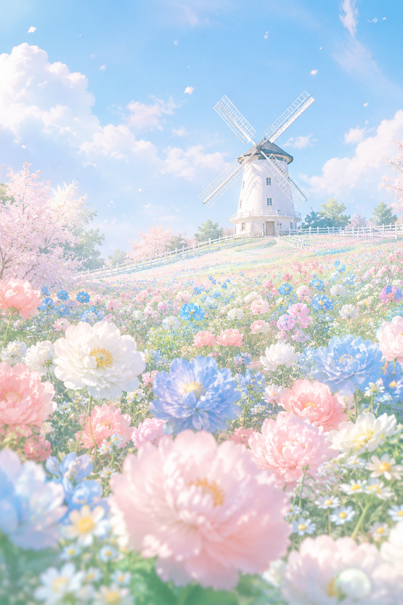

八个花园场景放在一起看，色调其实是同一套：薄荷绿、湖蓝、樱花粉、奶白，反复出现。低对比、高明度、低饱和的粉彩色阶叠加体积光和bloom泛光，是这类图看起来像手绘插画而不是风光照的关键。构图上藤花拱门、石板引导线、溪流走向各自承担了不同的空间纵深任务，主体道具换着来，但光线效果词始终不变。

#GPTImage2 #千问 #生图提示词 #Prompt #花园场景 #治愈系插画

