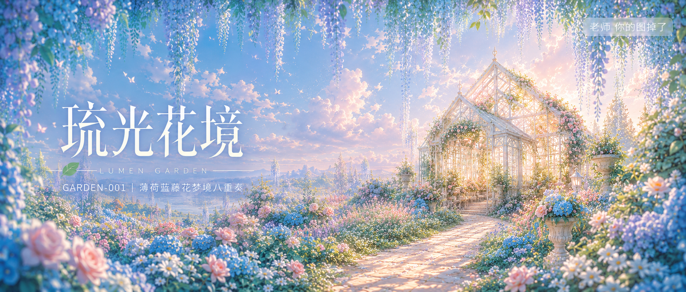

# GARDEN-001-薄荷蓝藤花梦境八重奏 封面

## 封面提示词

概念级视觉大片：一座透明玻璃花房悬浮般矗立在梦幻花海中央，前景是大片虚化的薄荷蓝藤花瀑布从画面顶部垂落形成天然取景框，中景玻璃屋顶折射出柔金色晨光与粉蓝色花瓣光斑，一条奶白色石板小径从画面前景蜿蜒延伸至花房内部，形成强烈空间纵深引导线，花房内隐约透出温暖光晕与朦胧绿意，天空以纯净高明度粉蓝渐变铺满画面上方三分之一，整体色调统一为薄荷绿、湖蓝、樱花粉、奶白、浅金四色体系，冷暖对比精准克制，画面兼具前中后三层景深与虚实对比，电影感体积光、梦幻bloom泛光、空气透视层次丰富，构图黄金比例，色彩层次丰富，视觉冲击力强，画面有张力，前景虚化背景通透，日系幻想插画质感与轻CG渲染结合，2.35:1电影横构图，超高细节，高质量，masterpiece，best quality，无人物，避免杂乱构图，避免阴暗压抑，避免写实摄影噪点。【文字排版-必须完整保留，不得省略或简化任何一项】画面左侧垂直居中偏下叠加文字排版：超大号衬线字体米白色主文案「琉光花境」，主文案正下方一条细横线左端带🌿横线中央有透明英文水印 LUMEN GARDEN，横线下方等宽白色字体副文案「GARDEN-001 ｜ 薄荷蓝藤花梦境八重奏」；右上角浅色半透明圆角底衬配小号文字「老师 你的图掉了」（署名文字，必须出现，不可省略）；无整体蒙层，文字直接压图。【文字排版结束】

## 封面图片

