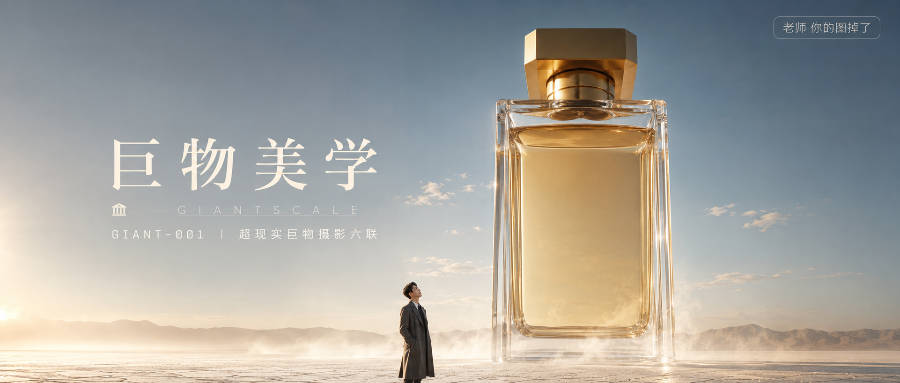

# GIANT-001-超现实巨物摄影六联 封面

## 封面提示词

超现实巨物摄影概念海报，画面主体是一只体量如现代纪念碑与玻璃神殿结合体的巨型香水瓶，垂直矗立在空旷洁净的浅色沙漠盐地中央，厚重高透玻璃边缘折射锐利，内部琥珀金色香水液体纯净通透，瓶盖为极简哑光金属，整体轮廓高级奢华。瓶体四周弥漫薄雾，被清晨侧逆光切开形成柔和光层。画面下方站着一名身形清晰的年轻人物，穿深灰长外套，正脸微微仰头望向瓶身，五官精致自然、面部立体清晰、皮肤光泽细腻、眼神有神灵动，作为尺度参照同时具备可辨认的人物美感。竖版3:4构图，超低机位，24mm广角镜头，中央对称构图，产品占据画面三分之二以上，电影级自然光，透明玻璃、香槟金、雾白、浅沙米色配色，氛围安静神秘、纯净震撼、极具视觉冲击力，构图黄金比例，色调统一精致，画面有张力。超写实摄影与高端CG融合。避免玻璃塑料感、人物面部模糊、背景杂乱、卡通感、HDR过强。2.35:1 电影横构图。

【文字排版-必须完整保留，不得省略或简化任何一项】画面左侧垂直居中偏下叠加文字排版：超大号衬线字体米白色主文案「巨物美学」，主文案正下方一条细横线左端带🏛图标横线中央有透明英文水印 GIANTSCALE，横线下方等宽白色字体副文案「GIANT-001 ｜ 超现实巨物摄影六联」；右上角浅色半透明圆角底衬配小号文字「老师 你的图掉了」（署名文字，必须出现，不可省略）；无整体蒙层，文字直接压图。【文字排版结束】

## 封面图片

