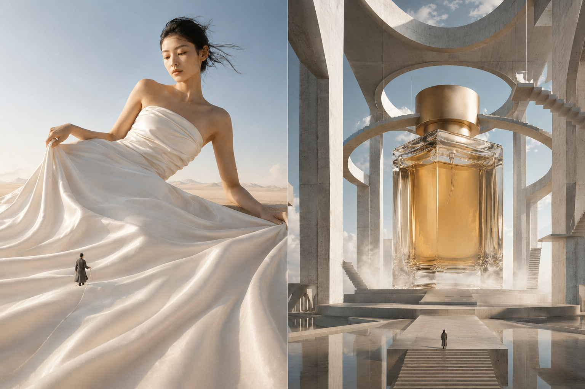
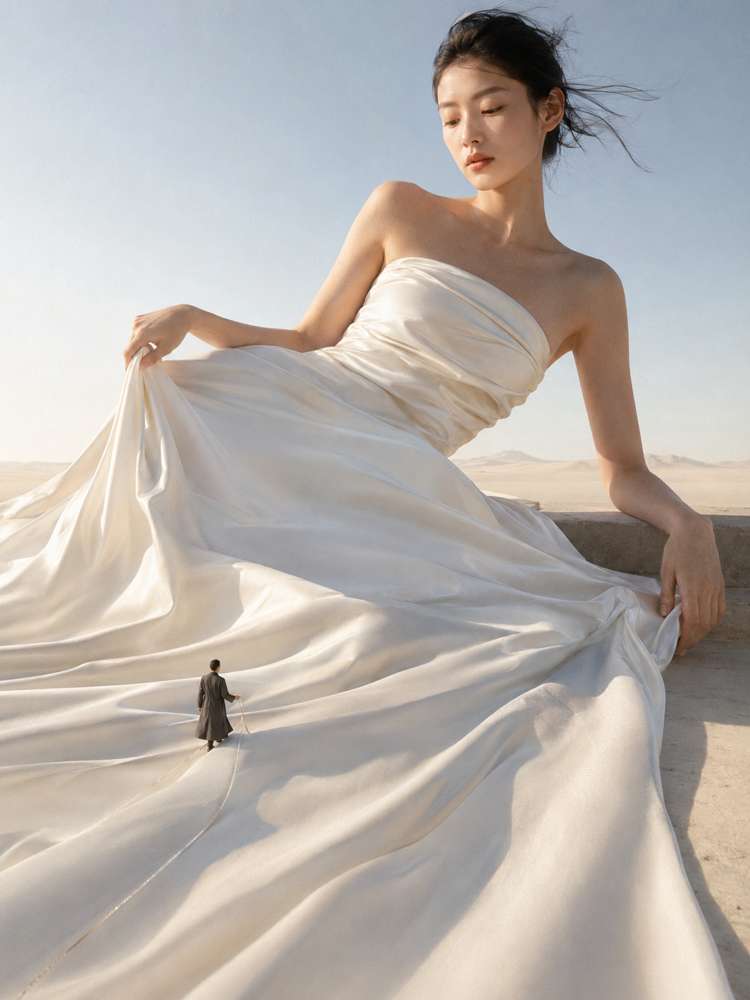
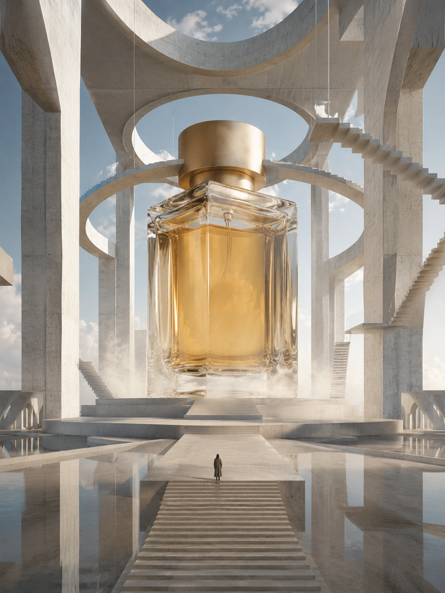
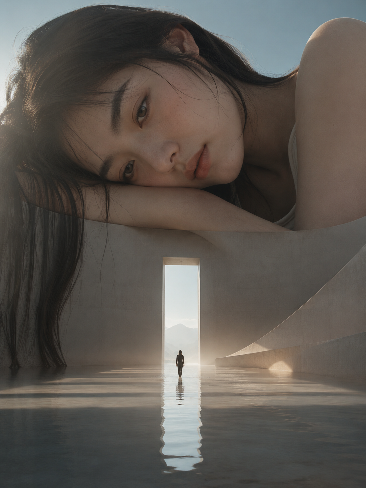
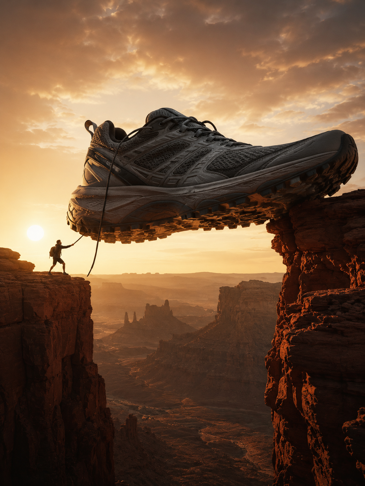
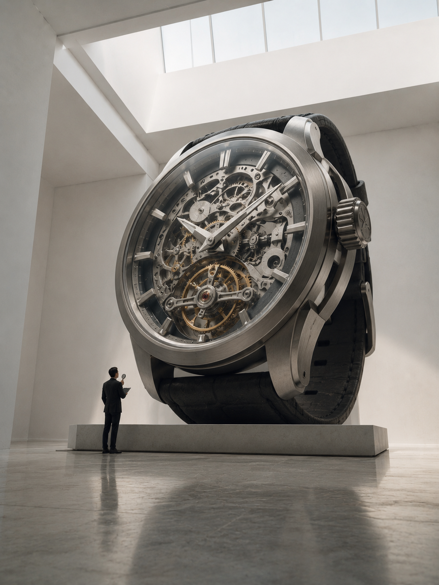
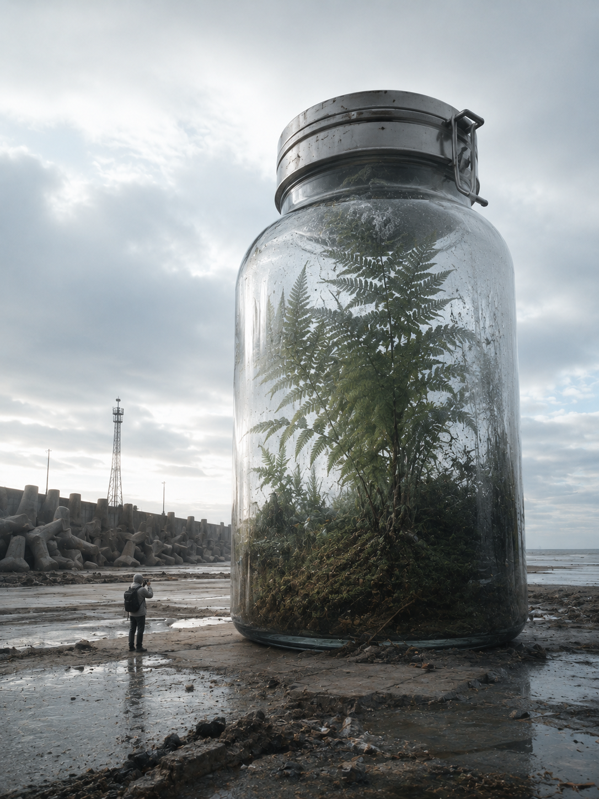

# 这组巨物摄影提示词我改了很多遍，只留下这一份能直接用

前段时间迷上了一种很特别的图——画面里有个体量大到离谱的东西，一件裙子、一只香水瓶、一只跑鞋，旁边站着一个渺小到几乎看不清五官的人。这种"极端尺度反差"的构图，在设计圈叫 巨物摄影（Giant-scale Photography），是这两年国外概念摄影师和商业广告圈很爱用的一种叙事手法。

它好看在哪？不是单纯"P得大"，而是巨物和微人之间会自动生出一个故事：谁在测量这条裙子？这个人为什么要走进这滴生态瓶？观众看一眼就会忍不住脑补前因后果，这是普通写真类提示词很难做到的。

这期我测了 6 个方向，从时尚大片到产品广告，从梦境叙事到未来纪实。最后只留一份完整可直接复制的提示词，剩下五个我讲讲各自的设计思路——想全套照抄的话，把主体和场景换成你想要的东西，结构基本可以复用。

先说这份留下来的：巨型模特与微缩裁缝。

这张图的核心不是"人变大"，而是把人体轮廓当成地貌来写——裙摆是沙丘，锁骨是山脊，这样才会有"超现实"而不是"照片放大"的观感。侧卧的姿态选得也有讲究：站姿的巨物会显得像海报里的怪兽，侧卧反而让画面安静下来，更贴近时尚大片的克制感。

一张超现实巨物摄影作品，极端尺度对比，微缩人类叙事，超写实电影质感，时尚编辑大片风。画面主体是一位体量如山脉般庞大的年轻亚洲女性模特，侧卧在浅色沙地与极简石质平台交界处，穿一袭象牙白丝缎垂坠长裙，布料像沙丘与水流一样铺展开来，肩颈、手臂、锁骨与面部轮廓形成极具雕塑感的巨大地貌；她五官自然清秀，面部干净，健康自然肤色，神情安静克制，眼神低垂而真实，一只手轻轻提起裙摆边缘，另一只手自然垂落，发丝被微风吹起，皮肤与布料细节真实高级。画面下方有一名极其微小的裁缝般人物，穿深灰长外套，手持细长量尺，正沿着巨型裙摆褶皱缓慢行走，像在测量一件不可能完成的高定礼服，用于强化尺度反差与时尚叙事。场景为空旷、极简、干净的沙色空间，远处仅有朦胧低山和大片纯净天空。竖版3:4，超低机位，28mm广角镜头，低地平线，非对称时尚构图，主体面部与上半身占据画面上方，裙摆延展至前景形成引导线。清晨柔和侧逆光勾勒面部、手臂和丝缎高光，整体高调低对比，轻微胶片颗粒。配色以象牙白、沙米色、雾蓝、浅金肤色为主，氛围高级、安静、疏离、梦幻、具有杂志封面感。无文字、无水印、无logo。避免廉价写真感、网红感、过度磨皮、塑料皮肤、暗沉肤色、明显痘印、明显皱纹、斑点、肢体畸形、手指错误、服装结构错误、背景杂乱、构图呆板、面部变形。

拆开看几个关键词："微缩人类叙事"是整个类型的灵魂词，写了它 AI 才会主动去想"要不要放个小人物"；"非对称时尚构图"决定了主体不会傻乎乎地居中摆着，而是像真的杂志封面一样有留白呼吸感；"侧逆光"这个光线词也很关键——巨物摄影最怕平光把体量感拍扁，逆光才能把裙摆和肌肤的层次一根一根勾出来。

这套结构换个主体也能直接用：把"模特+裙摆"换成任何有褶皱、有肌理的东西——一床棉被、一片森林、一头动物毛发，配一个渺小的观察者，基本都成立。

---

再看第二个方向：把商品变成建筑级的展馆主体。

这条思路想解决的是"产品广告图千篇一律"的问题——普通产品图靠棚拍打光，而巨物摄影是把产品当成纪念碑式建筑来构图，用粗野主义混凝土、悬空楼梯、镜面地面把香水瓶围起来，瓶子不再是"被拍摄的对象"，而是整个空间的秩序中心。这种写法特别适合想让产品显得"高端且有故事"的场景，比第一人称摆拍更有画廊感。

---

第三个方向偏叙事诗意：让一张巨大的面孔安静地"躺"在建筑顶部。

这里的设计思路是用巨物制造"被注视感"——门洞里走着一个渺小的人，头顶却是一张巨大而平静的脸，观众会不自觉地觉得这个人正在被某种意识注视，这种悬念感是普通人像很难传达的。写这类图时，"眼神平静而遥远"这句形容词组比"美丽""性感"这种笼统词有用得多，它直接决定了整张脸的表情基调。

---

第四个方向换了个完全不同的调性：把产品做成史诗级广告大片。

这条思路服务的是运动户外类产品——鞋子本身当桥梁，横跨峡谷，前掌上翘制造冲刺感，逆光把鞋体轮廓镀成金色。这里最容易失败的地方是"英雄叙事感"这四个字如果不写，AI 很容易把巨鞋处理成呆呆地立在那里，缺少故事张力——加上"准备借助这双巨鞋跨越峡谷"这句动作描述，画面立刻有了"即将发生什么"的悬念。

---

第五个方向走博物馆展陈路线，主角是一枚机械腕表。

这类图的关键是克制——不用堆砌华丽装饰，反而靠大量留白、纯白展厅、单一光源来凸显"庄严感"。机芯的齿轮、摆轮、桥板这些机械细节要写具体，AI 才会认真处理内部结构，而不是含糊地给一个圆盘表面。这条思路特别适合任何"工艺感"产品——手工制品、乐器、精密仪器都能套用这套构图逻辑。

---

第六个方向最特别，走的是"纪实新闻照"路线，而不是常规商业大片。

这条思路想验证的是：巨物摄影也可以不用对称构图、不用戏剧化打光，照样成立。把镜头语言写成"偏纪实取景"、光线写成"阴天后的自然冷光"，画面立刻会脱离广告感，变得像一张真实被记录下来的档案照片——这也是这六个方向里唯一一个刻意打破对称构图的设计。

---

六个方向串起来看，其实都在回答同一个问题：巨物和微人之间，到底是什么关系——测量、朝拜、凝视、跨越、研究、目击，六种不同的关系词，决定了六张图完全不同的情绪。写这类提示词时，与其纠结"够不够写实"，不如先想清楚这一层叙事关系，剩下的构图和光线词都是为它服务的。

这类提示词在 GPT Image、即梦、Midjourney 上都能用，长句式结构对模型的理解能力要求略高，效果最稳的还是 GPT Image；如果用千问或豆包，建议把长句拆成几个短句分段输入，减少关键词被弱化的概率。

这份提示词存一下，下次想做产品级或艺术级的巨物概念图，直接改主体就能用。你更想看哪种巨物主题？评论区告诉我，下一期安排上。

---

## 往期回顾

- GIANT-001 超现实巨物摄影六联
- OTHER-001 人物微表情控制
- MISC-001 图片风格提取提示词

#GPTImage2 #千问 #豆包 #生图提示词 #Prompt #巨物摄影 #超现实摄影
