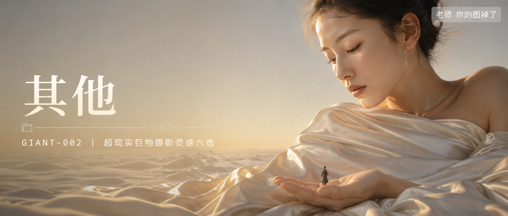

# GIANT-002-超现实巨物摄影灵感六选 封面

## 封面提示词

超现实巨物摄影概念大片：一位体量如山脉般庞大的年轻亚洲女性侧脸与上半身特写，肌肤细腻真实，五官自然精致，眼神低垂宁静，象牙白丝缎垂坠布料如云海般在她身侧铺展，一名极其微小的人物站在她巨大的手掌边缘仰望，形成强烈尺度反差和故事悬念感；超写实电影质感，清晨柔和侧逆光勾勒面部轮廓与丝缎高光，电影感光影，色彩层次丰富，视觉冲击力强，构图黄金比例，前景虚化背景，画面有张力，2.35:1 电影横构图。避免 AI 美女脸、网红感、过度精修、塑料皮肤、暗沉肤色、明显痘印、明显皱纹、斑点、面部变形。

【文字排版-必须完整保留，不得省略或简化任何一项】画面左侧垂直居中偏下叠加文字排版：超大号衬线字体米白色主文案「其他」，主文案正下方一条细横线左端带📁图标横线中央有透明英文水印 MISC，横线下方等宽白色字体副文案「GIANT-002 ｜ 超现实巨物摄影灵感六选」；右上角浅色半透明圆角底衬配小号文字「老师 你的图掉了」（署名文字，必须出现，不可省略）；无整体蒙层，文字直接压图。【文字排版结束】

## 封面图片

