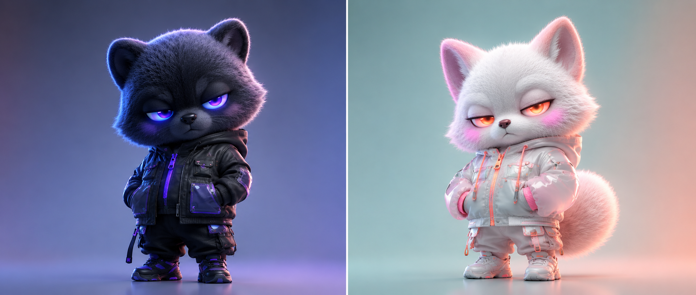
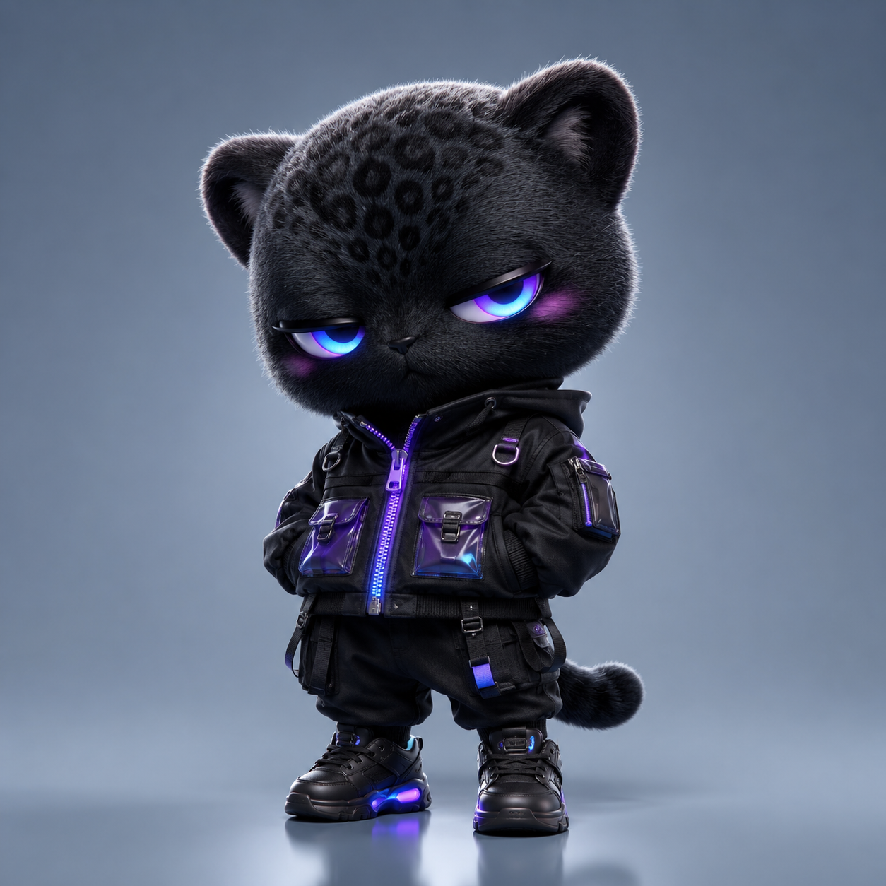
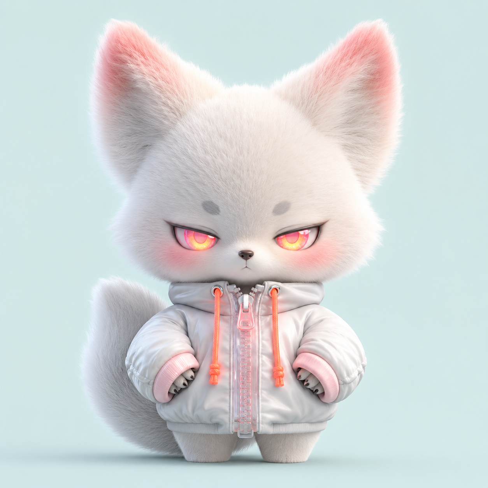
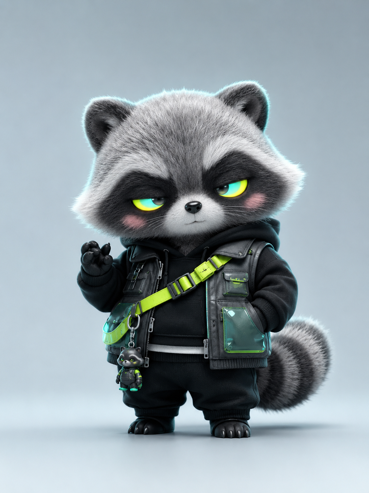
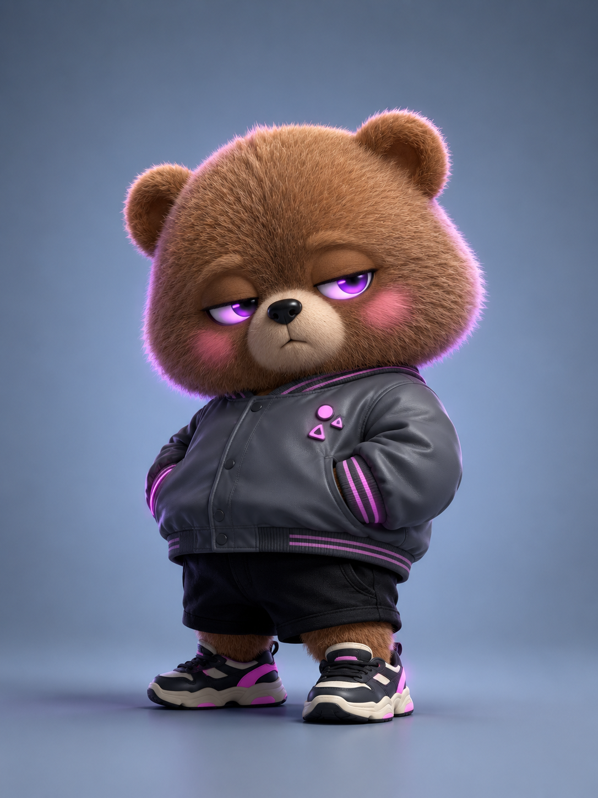
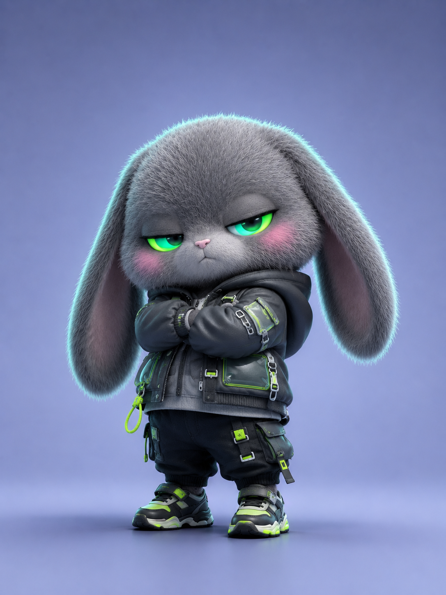
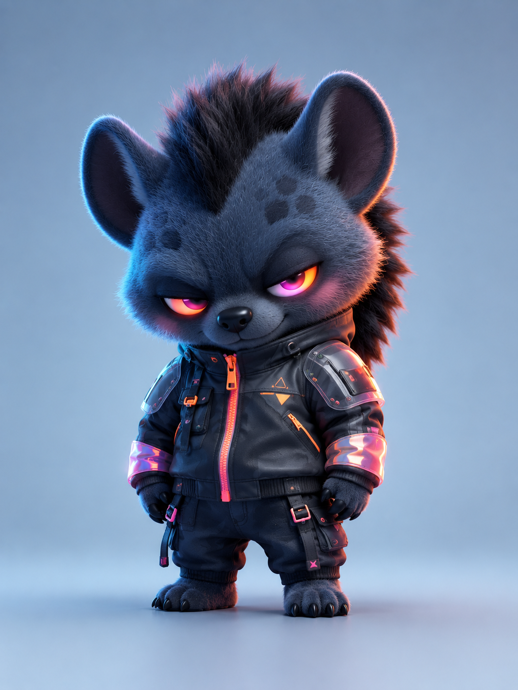

# 为什么你的潮玩角色总像换皮？这套六人格设计法更稳

**这期要解决的问题：** 同样是大头、短身、霓虹眼和街头外套，为什么有的角色一眼就能记住，有的却只像把灰狼换了一层皮？

答案不在“换动物”，而在“换人格”。真正的系列化，是让每个角色都有一条独立的性格证据链：动物轮廓、眼神、站姿、服装结构、局部霓虹色和灯光，必须同时指向同一种气质。

**本期规则：** 六个角色保留统一的收藏级潮玩语言，但每个角色都在“性格、动作、服装结构、霓虹色”中至少改变三项。正文只展示一份完整原版提示词，其余案例集中讲设计思路，避免被六段长文案淹没。

---

**#01 ｜ 夜行人格：霓虹黑豹**

黑豹适合承担整组角色的“主心骨”。设计没有一味增加凶猛属性，而是用半眯眼、歪头、双手插袋把攻击性收成“懒得解释”的酷。紫蓝晶体眼是第一记忆点，TPU 口袋与金属扣是第二记忆点，粉色腮红则负责打破黑灰色的距离感。

**原版提示词：**

3D 超精细潮玩渲染，一只潮酷 Q 版黑豹原创 IP 角色，头大身小的收藏级潮玩比例，圆润饱满轮廓，黑灰色短绒软毛覆盖全身，毛发细腻蓬松、边缘带柔和绒毛高光，耳朵小巧圆润，神情冷淡慵懒，双眼微微半眯，瞳孔呈紫色到电光蓝渐变霓虹效果，眼周带轻微透明荧光晕染，脸颊有淡粉色柔雾腮红，形成反差萌。穿黑色机能感短款街头夹克，宽松廓形，搭配紫蓝渐变荧光拉链、半透明 TPU 口袋与迷你金属扣件，双手插袋，微微歪头站立。极简冰蓝灰色雾面影棚背景，柔和顶部光与双侧轮廓光，地面轻微漫反射，潮流设计师玩具、艺术公仔、盲盒收藏品视觉，高级 3D 毛发材质，Octane Render，Cinema 4D，电影级灯光，超精细细节，居中单角色构图，干净背景，无文字，无 logo，无复杂道具。

> **与 AI 交互的关键：** 先说“冷淡慵懒”，再给出半眯眼、歪头、插袋三个可视化证据。只写“潮酷”是抽象标签，AI 很容易回到千篇一律的酷脸。

---

**#02 ｜ 傲娇人格：奶油雪狐**

雪狐与黑豹的差异不只是从黑变白。它的核心是“看起来很甜，但不急着讨好你”。因此，手被超长袖口藏起来，只露一点爪尖；蜜桃粉到荧光橙的眼睛与奶油色毛发形成小面积高能对比。甜酷不是一半甜、一半酷的平均，而是甜的外形遇上冷的反应。

> **设计结论：** 想突出傲娇，优先控制手势与眼神，不要一味叠加粉色装饰。

---

**#03 ｜ 顽皮人格：银灰浣熊**

浣熊的天然眼罩、环纹大尾巴和短腿圆身，本身就是很强的识别系统。这里没有把它做成普通的“可爱小贼”，而是用低头抬眼、一手插袋、一手轻抬的未完成动作，制造“它刚想出一个点子”的故事感。酸性黄织带与半透明绿色口袋不是装饰堆砌，而是视线的行进路线。

> **设计结论：** 顽皮感需要动作正在发生，完全对称的站姿反而会让角色显得呆板。

---

**#04 ｜ 困倦人格：焦糖棕熊**

棕熊的重量感是设计资产：圆头、粗短四肢、宽松落肩夹克与厚底鞋，共同建立一个“不想动，但穿得很讲究”的形象。身体微微后仰比站得笔直更有性格，嘴角轻微下垂比大幅度哀怨更高级。玫红到紫罗兰的眼睛和袖口条纹做了一次小型色彩回声，不需要再加文字徽章抢戏。

> **与 AI 交互的关键：** “刚睡醒但很酷”之后，立刻补上后仰、插袋、嘴角下垂，才能把文字情绪落到可执行画面。

---

**#05 ｜ 冷脸人格：烟灰垂耳兔**

垂耳兔很容易被固定成软萌角色，所以这一只故意让柔软长耳朵与双臂交叉、略带不耐烦的眼神发生冲突。它的“酸性”不靠高饱和背景，而只放在眼睛、包边与侧逆光三个位置，让视觉仍然干净。高级的霓虹感不是把画面全部染亮，而是把亮色放在最能说明性格的位置。

> **设计结论：** 越是软萌的动物轮廓，越可以用克制、封闭的肢体语言做反差。

---

**#06 ｜ 反派人格：深蓝鬣狗**

最后一只鬣狗负责把整组的戏剧强度拉高。宽圆耳朵、蓬松鬃毛和前倾身体建立压迫感，但圆润脸型、淡粉腮红与“不露尖牙”又把它拉回可收藏的范围。橙红到电光粉的眼睛、橙色贯穿拉链和粉橙袖口形成从脸到身体的垂直能量线，视线不会被烟灰护片带走。

> **设计结论：** 反派感最难的不是“更凶”，而是在危险和可爱之间留出可收藏的边界。

---

**测试结论：先写人格，再写动物**

这六个案例真正共用的，只有收藏级 Q 版比例、高级毛发材质、极简雾面棚拍空间和小面积霓虹点色。其他决定角色的部分，都应该服务于人格。

你可以把这套方法压缩成一个与 AI 沟通的顺序：

1. 先给一个可复述的人格标签，例如“冷淡慵懒”，而不是泛化的“很酷”。
2. 补三个可视化证据：一个眼神、一个动作、一个身体倾向。
3. 从动物特征中选两个最强识别点，不要把所有生物细节平均描述。
4. 服装只选一种结构语言，再用一种半透明或金属材质做记忆点。
5. 霓虹色最多建立一组主渐变，并在眼睛、衣服和轮廓光中有节制地回声。

判断是否跳出“换皮感”有一个简单方法：挡住角色名称，你仍然能从姿势和服装中猜出它的性格。做到这一点，动物只是载体，角色才真正成立。

---

如果这组“霓境兽谱”给了你新灵感，可以先收藏起来，关注后续的材质混合篇。你最想看哪种动物加入下一组？欢迎在评论里留下动物和性格组合。

---

## 往期回顾

- GIANT-002 超现实巨物摄影灵感六选
- GIANT-001 超现实巨物摄影六联
- OTHER-001 人物微表情控制

#GPTImage2 #千问 #豆包 #生图提示词 #Prompt #其他系列 #Q版潮玩 #霓境兽谱
