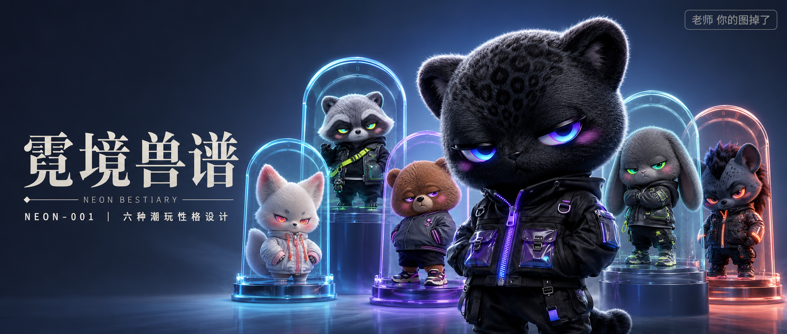

# NEON-001-霓境兽谱六种潮玩性格设计 封面

## 封面提示词

收藏级 3D 潮玩品牌封面大片，右侧前景是一只潮酷 Q 版黑豹原创 IP，头大身小，黑灰短绒软毛质感真实细腻，正面微偏四分之三角度，双眼清晰锐利，紫色到电光蓝渐变晶体霓虹瞳孔，黑色机能短款夹克带紫蓝荧光拉链与半透明 TPU 口袋，主体占画面高度二分之一以上；中景以三层错落半透明霓虹拱形展柜展示奶油雪狐、银灰浣熊、焦糖棕熊、烟灰垂耳兔、深蓝鬣狗的局部轮廓，五个角色有明确前后景与大小层次，不拥挤、不重叠脸部，左侧留出干净深蓝灰文字区，冰蓝、电光紫、酸性绿与荧光橙局部点色，中心发散式光源，电影级冷暖轮廓光，潮流设计师玩具、限量艺术公仔、高端盲盒品牌广告视觉，Octane Render，Cinema 4D，高级毛发与玻璃材质，电影感光影，高清锐利，色彩层次丰富，视觉冲击力强，构图黄金比例，画面有张力，2.35:1 电影横构图，角色造型原创，无 logo，避免低清、材质塑料感、角色粘连、额外肢体、五官崩坏。

【文字排版-必须完整保留，不得省略或简化任何一项】画面左侧垂直居中偏下叠加文字排版：超大号衬线字体米白色主文案「霓境兽谱」，主文案正下方一条细横线左端带几何菱形图标◆，横线中央有透明英文水印 NEON BESTIARY，横线下方等宽白色字体副文案「NEON-001 ｜ 六种潮玩性格设计」；右上角浅色半透明圆角底衬配小号文字「老师 你的图掉了」（署名文字，必须出现，不可省略）；无整体蒙层，文字直接压图。【文字排版结束】

## 封面图片

