今天这组是「人物微表情控制」。适合做人像表情图鉴、头像参考和情绪封面，重点不是写大哭、大笑、震惊，而是把眼周、嘴唇、视线和肌肉松紧写清楚。所有图都统一成浅色背景、单人主体、上半身人物形象图。

提示词：
单人上半身人像，24 岁亚洲女生，浅米色纯色背景，黑色自然中长发，浅蓝色柔软针织衫，肩部到胸口构图，头部微微低下，嘴角想笑但忍住，轻轻咬住下唇，眼睛因为笑意微微弯起，视线略向下，柔和均匀棚拍光，真实皮肤质感，干净自然肤色，参考表情图鉴卡片风格，避免夸张大笑、多人同框、复杂背景、网红感和过度精修。

建议收藏这组 Prompt。核心结构是「上半身人像 + 单人主体 + 浅色背景 + 眼部微动 + 嘴部微动 + 视线方向」，这个框架可以延伸出很多情绪人像和图鉴卡片。
这个系列会持续更新，下一期继续补同类型场景。

#GPTImage2 #豆包 #千问 #生图提示词 #Prompt #其他 #人物微表情控制

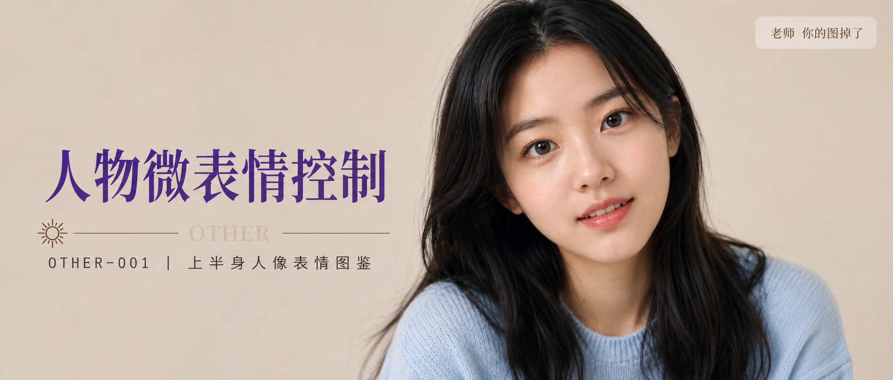
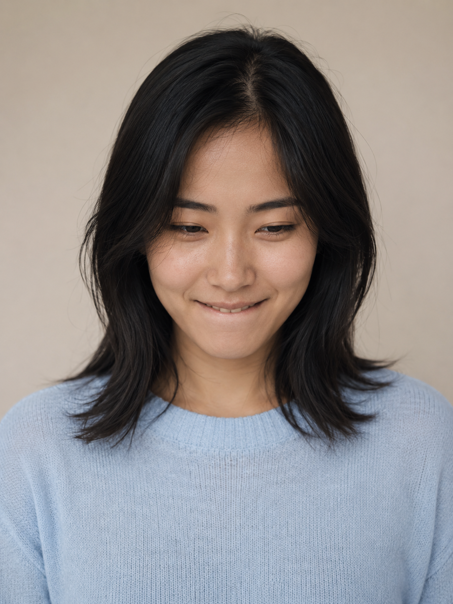
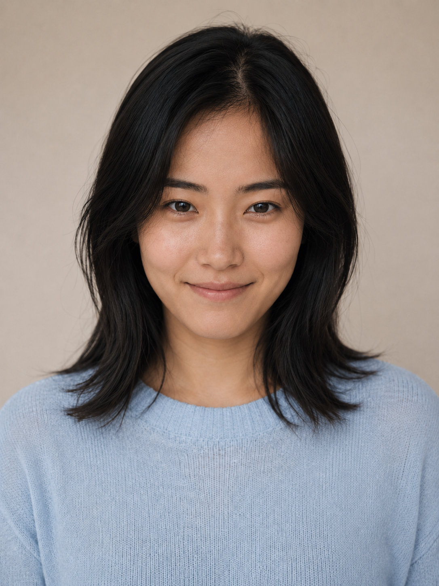
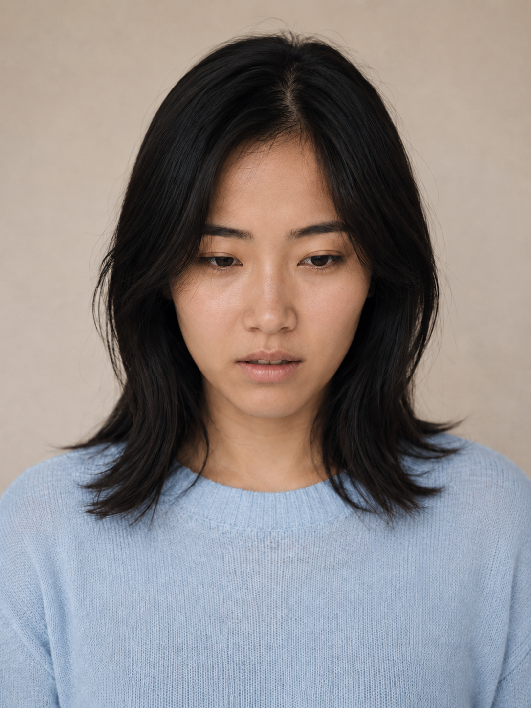
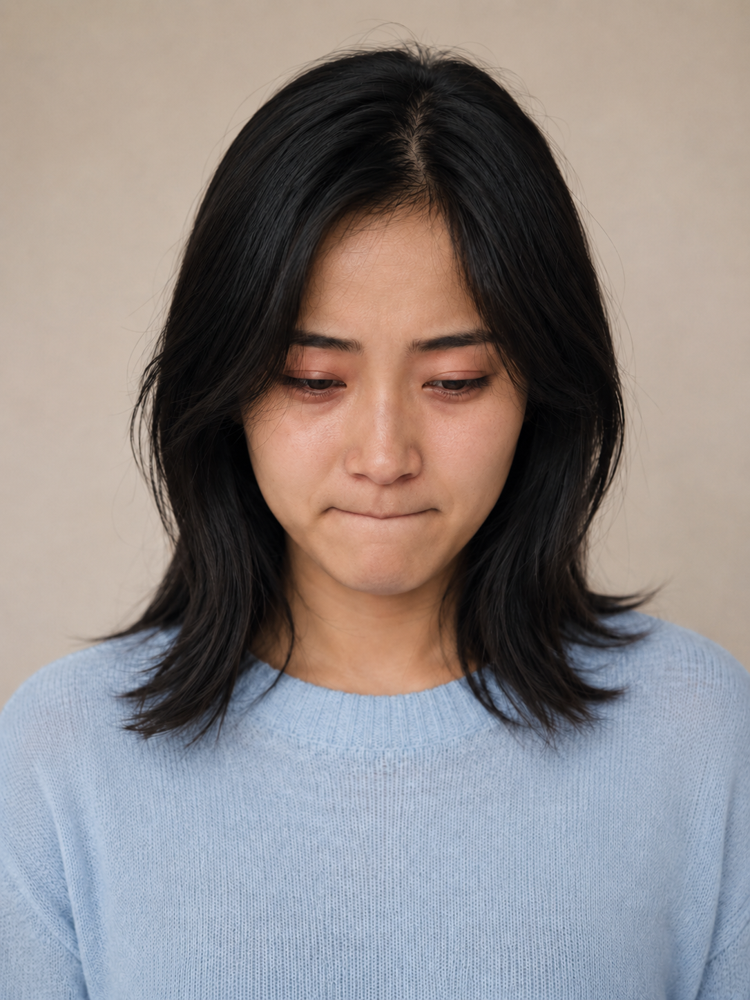
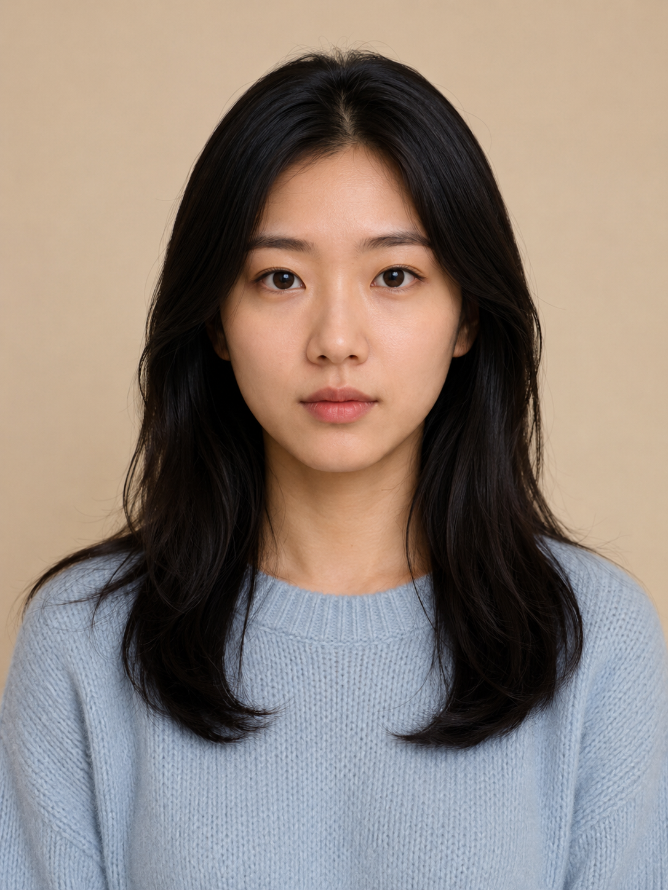
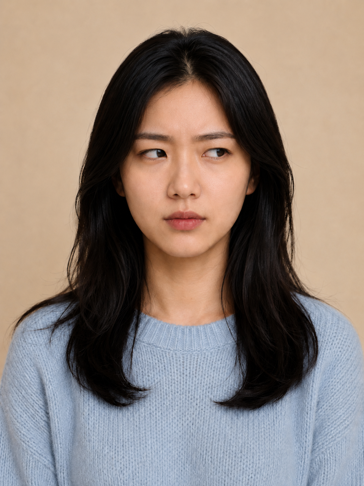
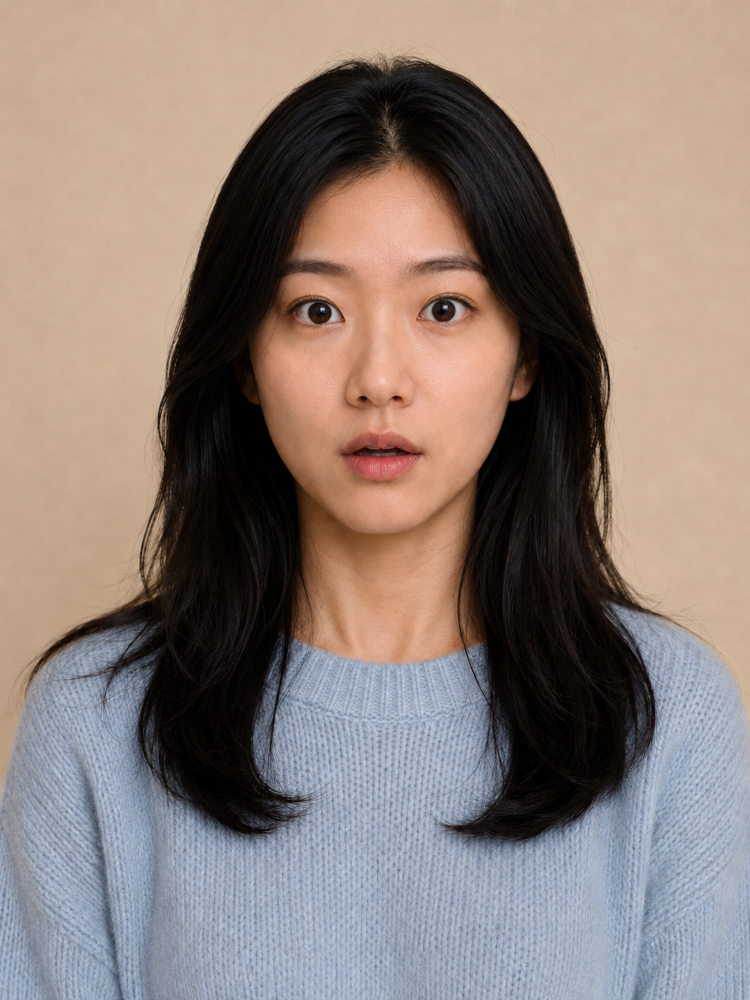
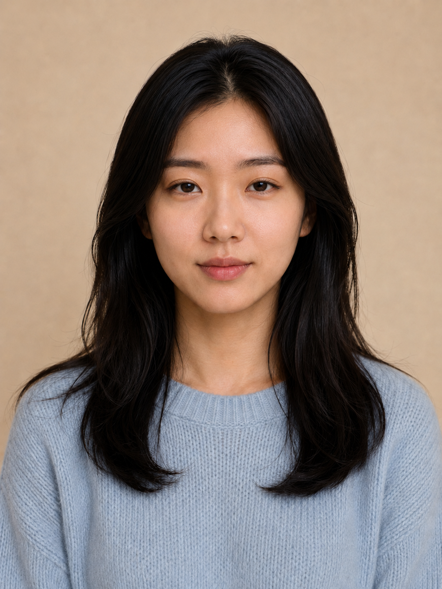
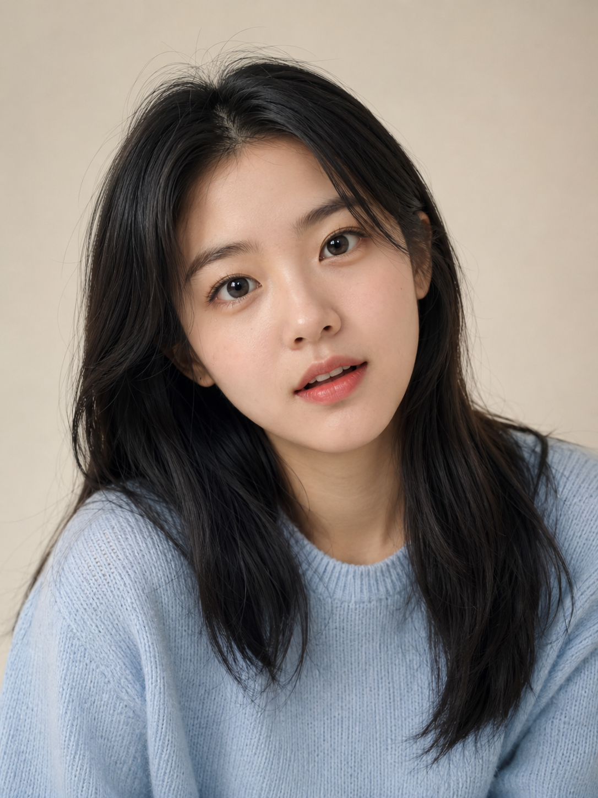
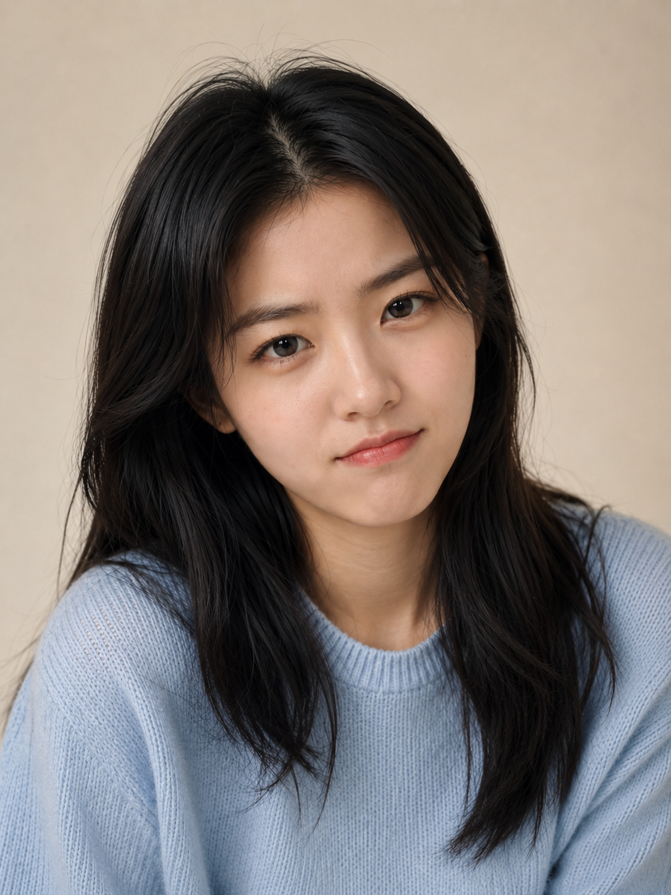
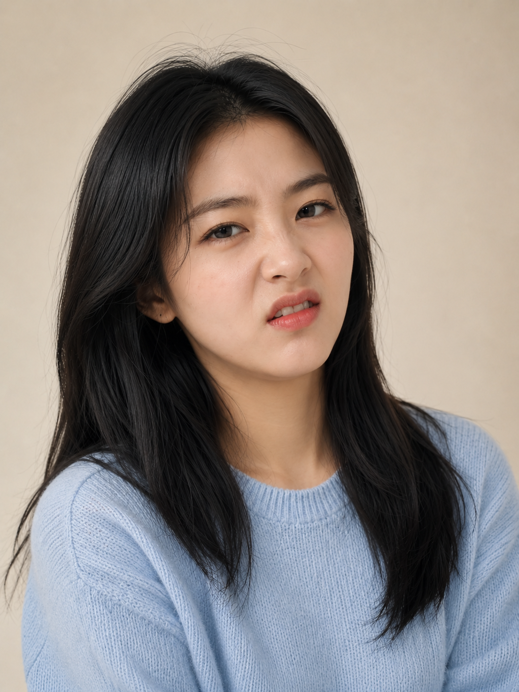
