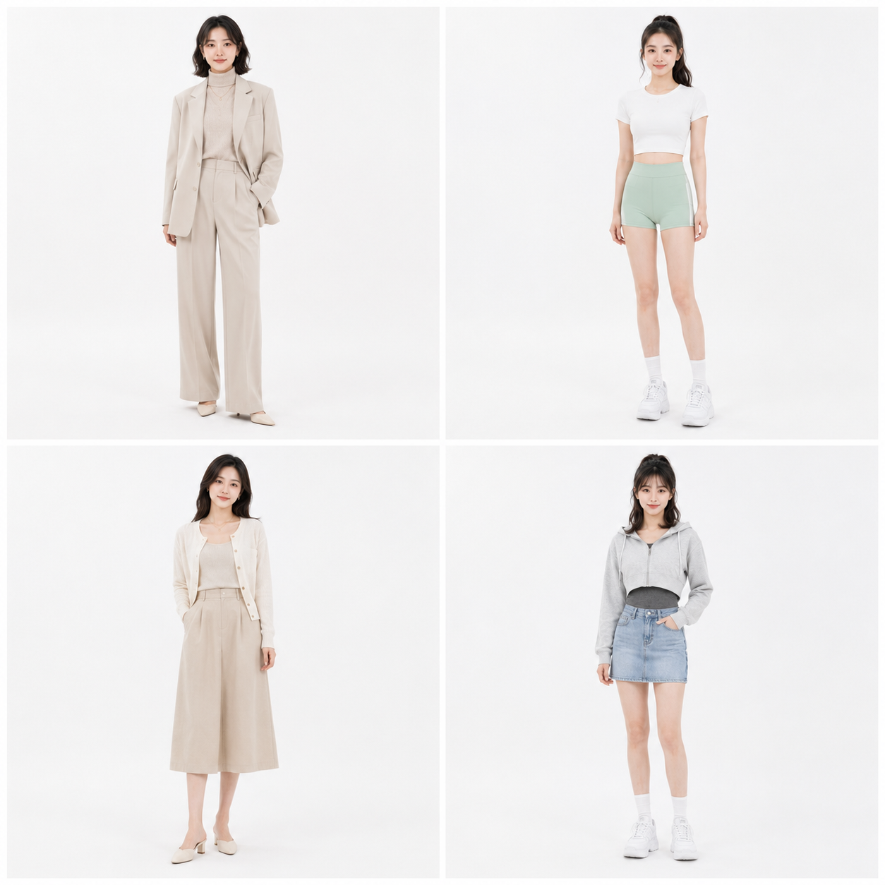
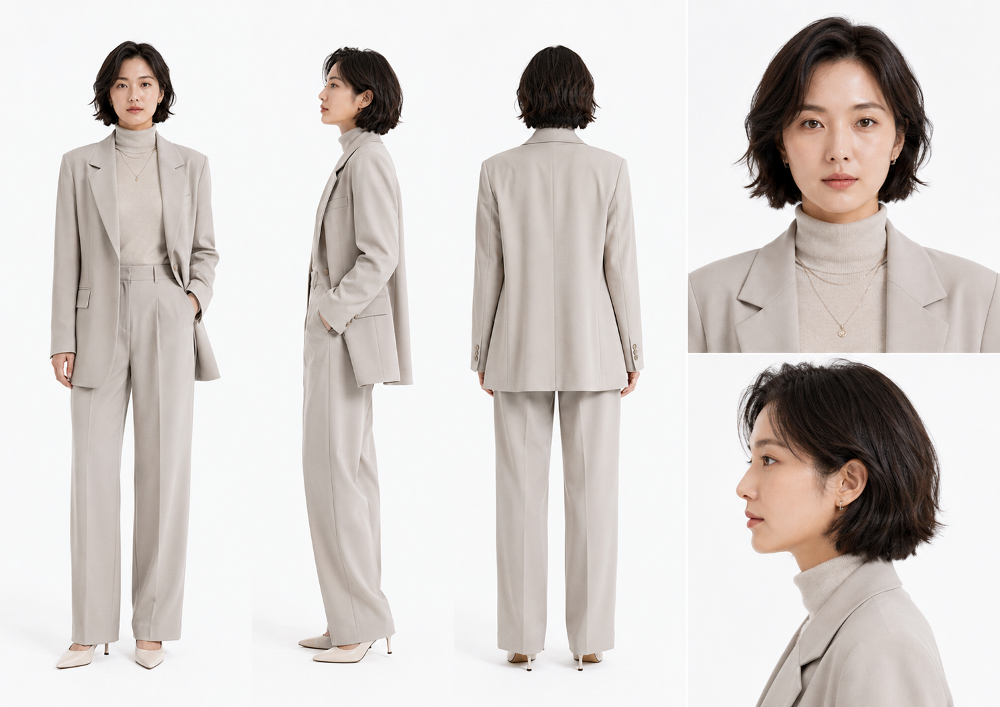
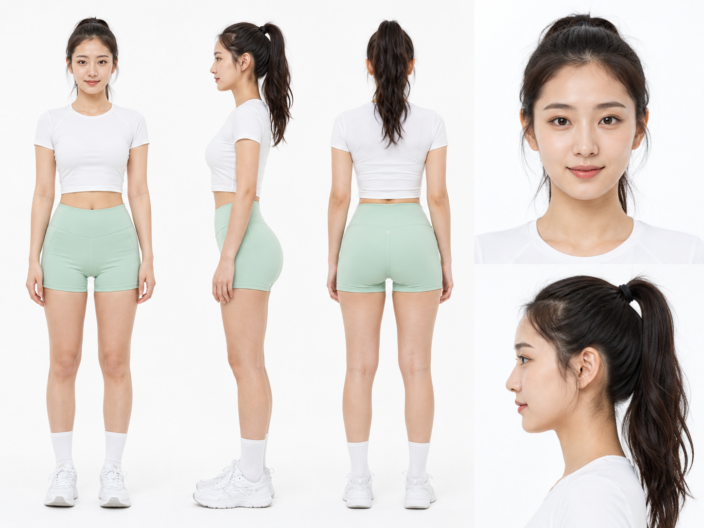
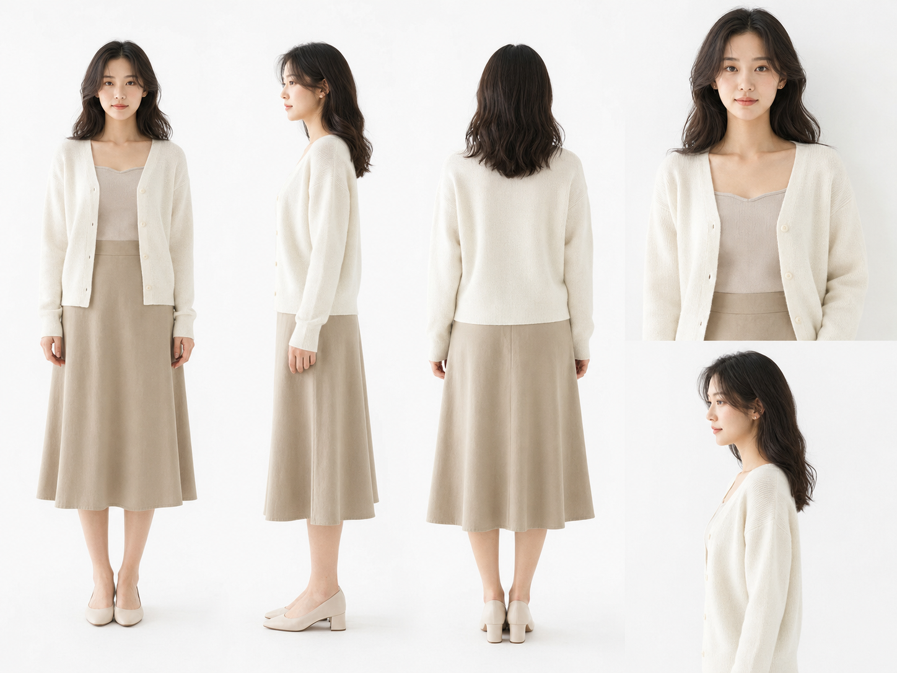
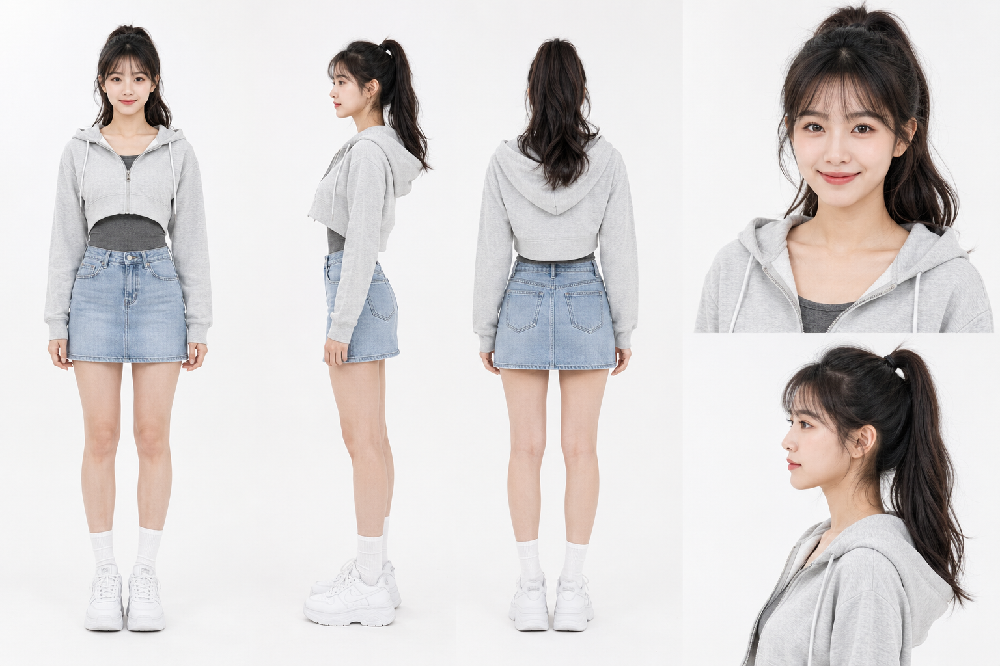
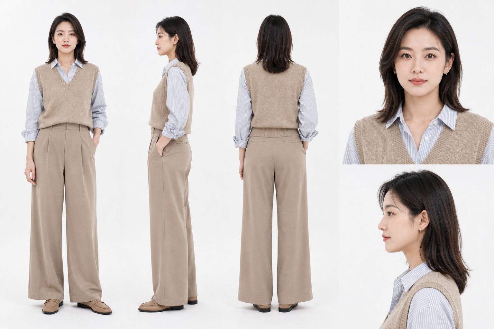
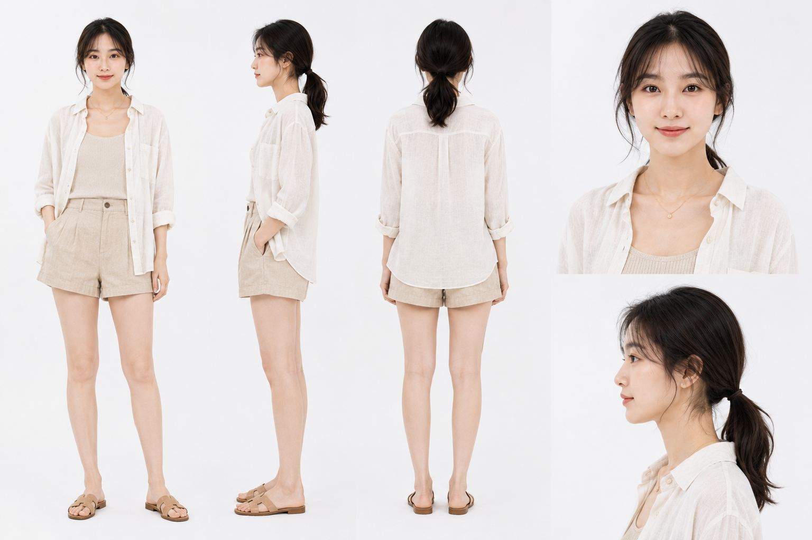
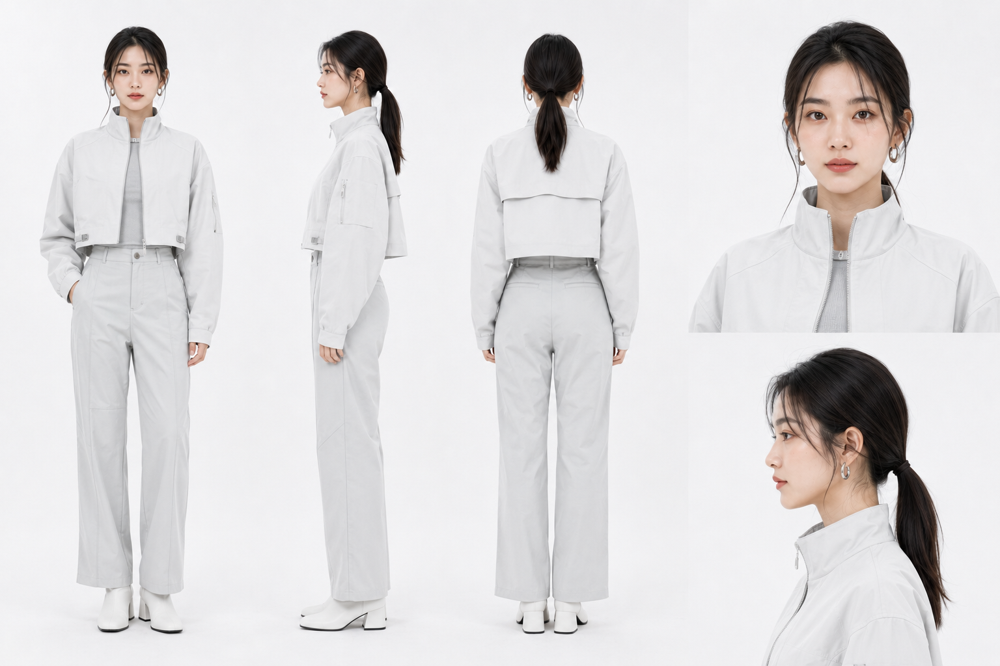
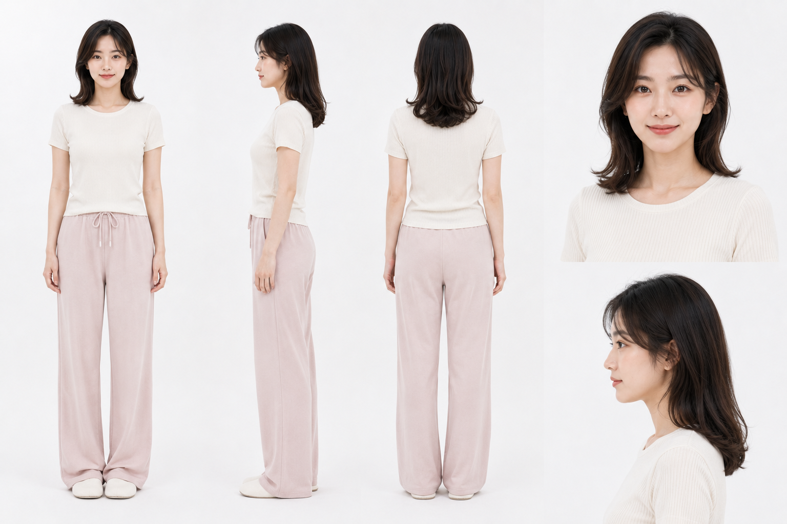

同一张脸、同一发型、同一套服装，从正面到背面全部保持一致——这是服装 lookbook 常见的三视图定妆板版式。这次做了八套完全不同的风格：通勤西装、运动套装、法式针织、韩系卫衣、文艺衬衫、度假亚麻、机能风、居家针织，版式结构不变，只换人物气质和服装描述，用来验证"版式与身份约束分开写"能不能稳住多风格下的角色一致性。

#GPTImage2 #千问 #生图提示词 #Prompt #其他系列 #角色定妆板

