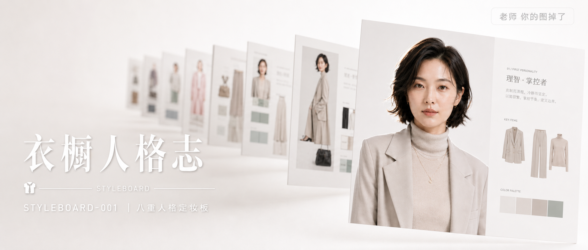

# STYLEBOARD-001-八重人格定妆板 封面

## 封面提示词

概念级封面大片，「衣橱人格志」视觉概念，纯白影棚背景中悬浮排列的八块定妆参考板以对角阶梯式透视构图向画面纵深延伸，近景一块参考板清晰展示一位26岁东亚女性正面半身像，五官精致自然，面部立体清晰，皮肤光泽细腻，眼神有神灵动，妆感干净清透，侧逆光打亮颧骨，其余参考板在中远景虚化为色块与轮廓，形成前景清晰、背景虚化的视觉层次，画面整体高调白净，仅以极少量米灰、薄荷绿、卡其、雾粉色块点缀，营造工业感与时尚感并存的构图黄金比例，电影感光影，色调统一精致，画面有张力，2.35:1 电影横构图。避免 AI 美女脸、网红感、过度精修、塑料皮肤、暗沉肤色、明显痘印、明显皱纹、斑点、面部变形。【文字排版-必须完整保留，不得省略或简化任何一项】画面左侧垂直居中偏下叠加文字排版：超大号衬线字体米白色主文案「衣橱人格志」，主文案正下方一条细横线左端带👔图标横线中央有透明英文水印 STYLEBOARD，横线下方等宽白色字体副文案「STYLEBOARD-001 ｜ 八重人格定妆板」；右上角浅色半透明圆角底衬配小号文字「老师 你的图掉了」（署名文字，必须出现，不可省略）；无整体蒙层，文字直接压图。【文字排版结束】

## 封面图片

