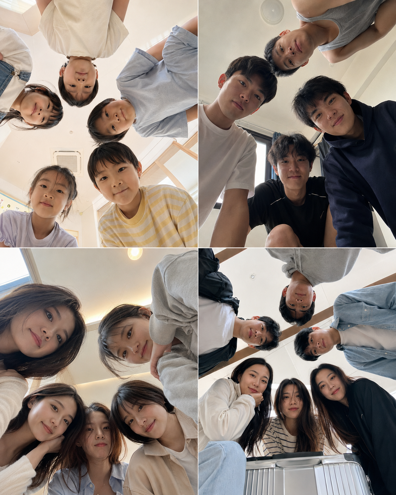
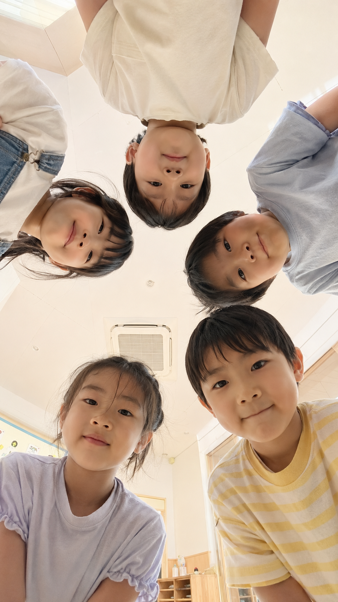
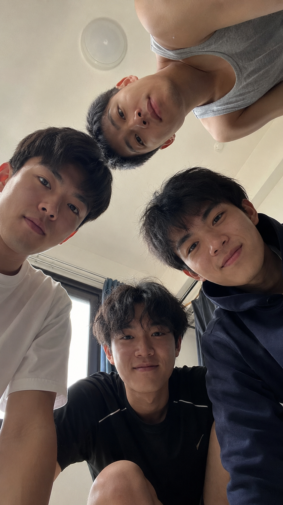
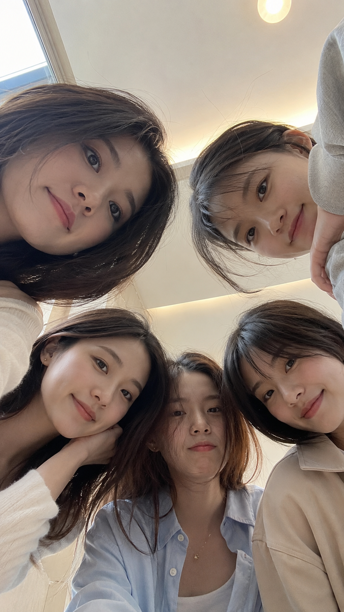
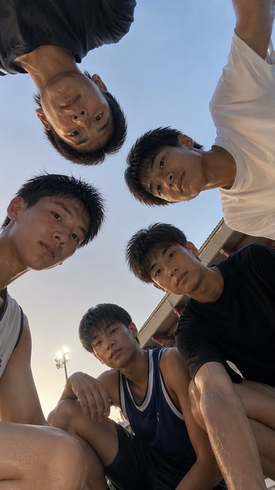
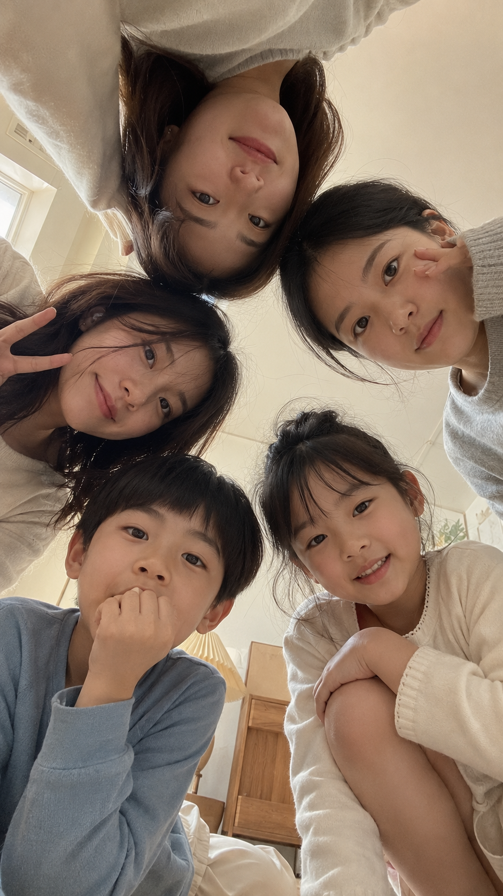
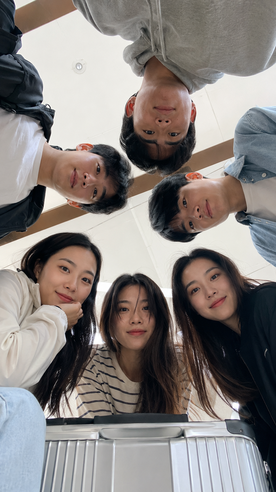

# 同一个低机位围圈构图，换六种生活场景都像手机真实抓拍

把手机放低，让人物从四周探进画面，普通合照立刻多了一种“大家共同发现镜头”的亲密感。这个动作真正好看的关键，是低机位、环形关系、自然裁切同时成立。

幼儿园版本最适合保留不整齐：孩子站位略松、表情各不相同，反而更像午后活动里的偶然一拍。

竖版 9:16，真实生活感儿童合照，5个6到8岁左右的亚洲小朋友在幼儿园活动室里围成一个不规则圆圈，从画面四周自然探头，低头一起看向放在地板中央的手机镜头，形成轻松有趣的环绕式构图。镜头位于下方中央，垂直向上拍摄，手机原相机超广角视角，近距离拍摄，轻微透视拉伸但不过度。孩子们表情天真自然，有的安静看镜头，有的微微抿嘴，有的轻轻笑，状态松弛，不刻意摆拍。穿浅色T恤、背带裤、简单校服或纯色居家服，颜色以米白、浅蓝、浅黄、浅灰为主。背景是明亮干净的室内活动室天花板与柔和墙面，局部可见木地板边缘和柔和日光。整体高亮、低对比、暖白偏奶油色调，皮肤干净自然，保留轻微细节，不要过度磨皮。画面有真实手机抓拍感，青春、童真、亲密、自然。避免成人化妆容，避免夸张表情，避免塑料皮肤，避免人物重复脸，避免肢体错误，避免过强滤镜，避免文字、水印、手机界面。

宿舍场景把人数收至四人，并允许额头、下巴和肩膀被切掉。裁切不是瑕疵，而是手机随手拍的证据；白、灰、藏蓝的穿搭能压住棚拍感。

咖啡馆版本靠头发与肩膀轻微交叠制造亲密感，窗边日光负责提亮面部，吊灯只做虚化背景。跟 AI 沟通时，与其说“拍一张精致闺蜜照”，不如明确五张脸沿画面边缘自然分布。

篮球场版本需要运动后的状态，但不要夸张汗水和大笑。保留轻微呼吸感，再让傍晚天空与球场红色形成冷暖点缀，青春感会更真实。

家庭场景的重点不是人人看起来完美，而是大人与孩子反应不同：有人轻笑，有人好奇。奶油白、浅木色和低对比自然光，会把画面收进温暖生活感。

旅行版本人数最多，所以要先锁定三男三女、松散圆圈、每个人长相不同，再补行李箱、木梁或候车顶棚；先控制人物关系，比堆旅行道具更稳。

这一类构图最容易失败在两处：超广角写得太重会拉坏五官；“整齐围成圆圈”又会像广告摆拍。更有效的沟通顺序是：先定机位，再定人物分布，最后补表情差异。

---

你最想把这种围圈合照用在朋友聚会、家庭记录，还是毕业旅行？欢迎留言说说你的场景。

---

## 往期回顾

- 托腮凝望、回眸浅笑、仰头望窗，超写实提示词，附完整拆解
- 一张脸切换各种高级色域，AI 做出了整套美妆女刊封面
- 今日分享，节日风格海马体艺术写真，出图效果嘎嘎棒

#GPTImage2 #千问 #豆包 #生图提示词 #Prompt #其他系列 #围圈合照
