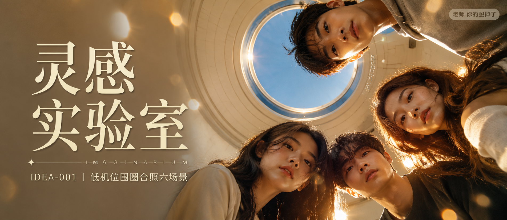

# IDEA-001-低机位围圈合照六场景 封面

## 封面提示词

视觉概念名「穹镜同心」，四位20岁出头、长相各不相同的亚洲年轻好友从画面右侧四周俯身低头看向下方镜头，形成强烈的放射状环形构图，手机超广角近距离仰拍，四张自然清秀的正脸或3/4侧脸清晰可见，面部占据右侧画面主要面积，表情松弛好奇，眼神有神灵动，五官精致自然，面部立体清晰，皮肤光泽细腻，妆感干净清透，轮廓清晰上镜；背景由奶油白穹顶与一圈钴蓝圆形天窗构成，圆形天窗像镜头光圈，夕阳金色侧逆光从人物轮廓间穿入，前景有轻微镜面反射光斑，形成冷暖对比、前中后景和大小层次，画面具有“被朋友围住”的瞬间悬念。真实手机摄影与概念艺术大片融合，电影感光影，高清锐利，色彩层次丰富，视觉冲击力强，构图黄金比例，色调统一精致，商业海报级完成度，2.35:1 电影横构图。避免人物重复脸、畸形五官、错误手指、文字遮挡面部，避免 AI 美女脸、网红感、过度精修、塑料皮肤、暗沉肤色、明显痘印、明显皱纹、斑点、面部变形。

【文字排版-必须完整保留，不得省略或简化任何一项】画面左侧垂直居中偏下叠加文字排版：超大号衬线字体米白色主文案「灵感实验室」，主文案正下方一条细横线左端带✦横线中央有透明英文水印 IMAGINARIUM，横线下方等宽白色字体副文案「IDEA-001 ｜ 低机位围圈合照六场景」；在右侧圆形天窗边缘以极小号精致字体加入次级装饰文字「穹镜同心」，不得替代或挤压固定文字；右上角浅色半透明圆角底衬配小号文字「老师 你的图掉了」（署名文字，必须出现，不可省略）；无整体蒙层，文字直接压图。【文字排版结束】

## 封面图片

