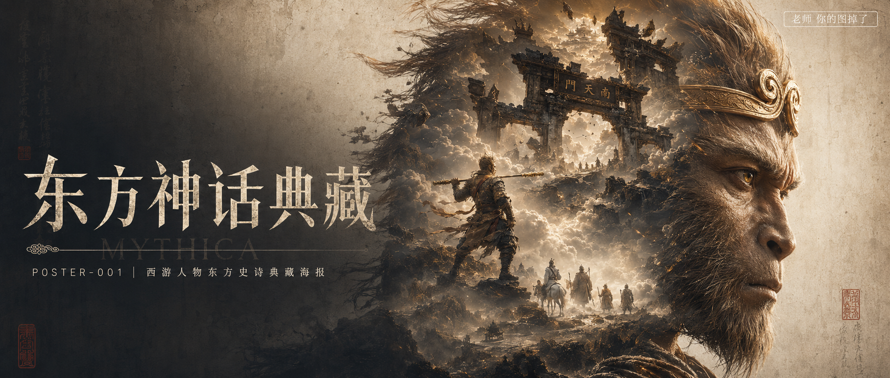

# POSTER-001-西游人物东方史诗典藏海报 封面

## 封面提示词

《西游记》东方神话典藏概念艺术大片：画面右侧以前景巨型孙悟空三分之四侧脸为视觉锚点，五官与猴毛超写实、金箍和眼神被古铜金侧逆光点亮，面部占画面高度三分之二；侧脸轮廓内部双重曝光融入破碎南天门、翻卷云海、微缩持棒悟空与远处西行队伍，左侧保留深墨到宣纸米白的层次留白供标题排版，暗红朱砂与克制金光形成记忆点，尺度反差，单帧叙事，电影感光影，高清锐利，色彩层次丰富，视觉冲击力强，构图黄金比例，色调统一精致，商业海报级完成度，2.35:1 电影横构图。避免现代元素、卡通感、网游感、霓虹色、塑料质感、五官错误、拼贴生硬、背景杂乱、文字乱码。【文字排版-必须完整保留，不得省略或简化任何一项】画面左侧垂直居中偏下叠加文字排版：超大号衬线字体米白色主文案「东方神话典藏」，主文案正下方一条细横线左端带卷轴纹章，横线中央有透明英文水印 MYTHICA，横线下方等宽白色字体副文案「POSTER-001 ｜ 西游人物东方史诗典藏海报」；右上角浅色半透明圆角底衬配小号文字「老师 你的图掉了」（署名文字，必须出现，不可省略）；无整体蒙层，文字直接压图。【文字排版结束】

## 封面图片

