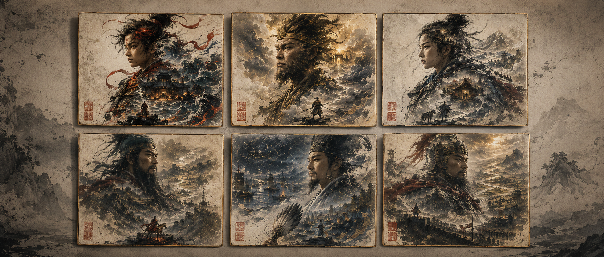
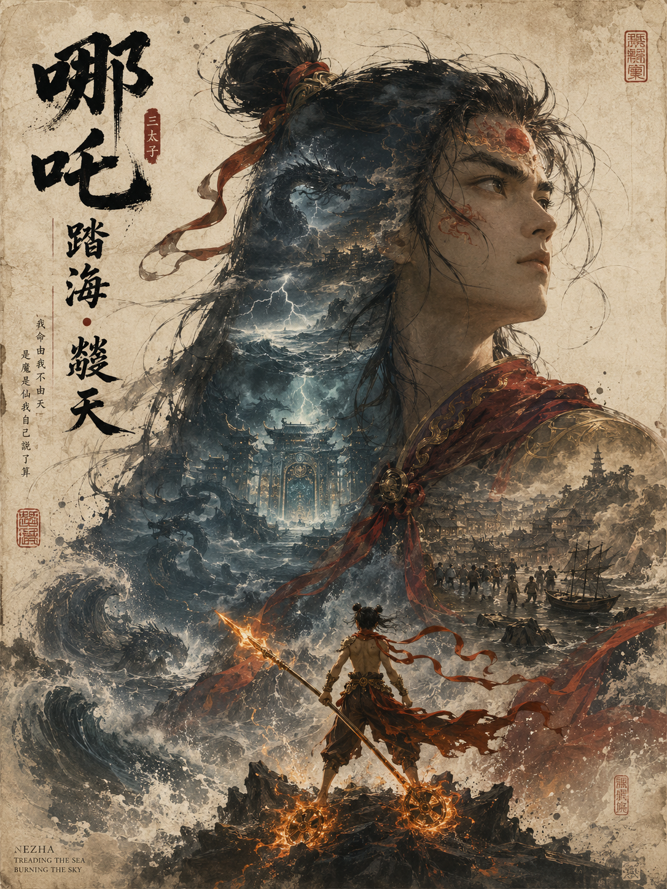
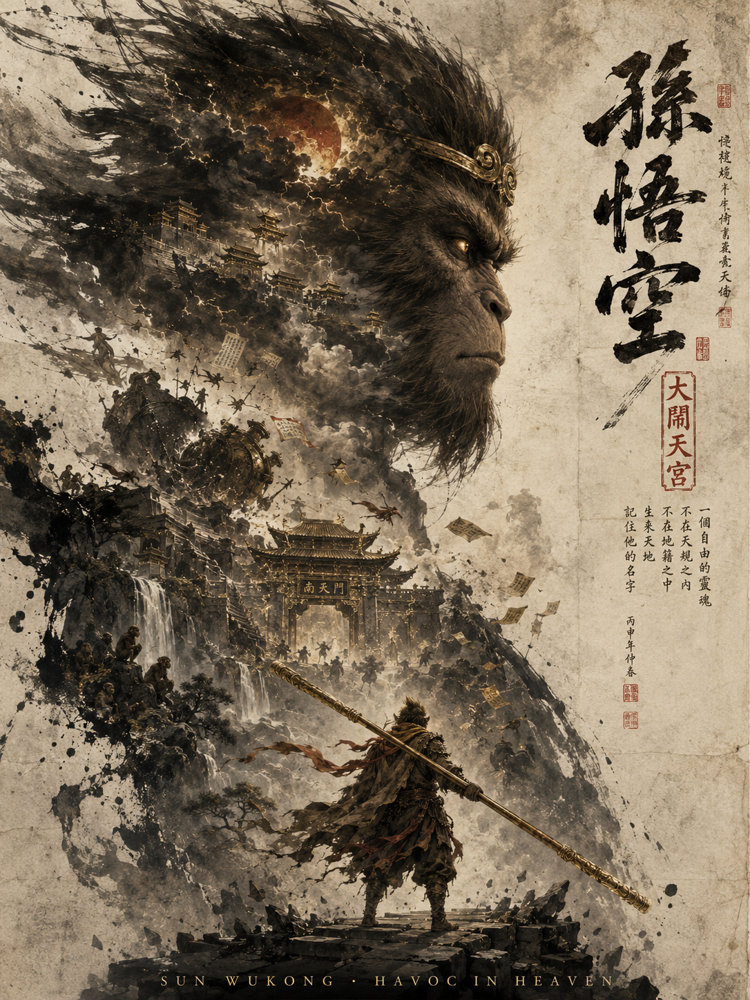
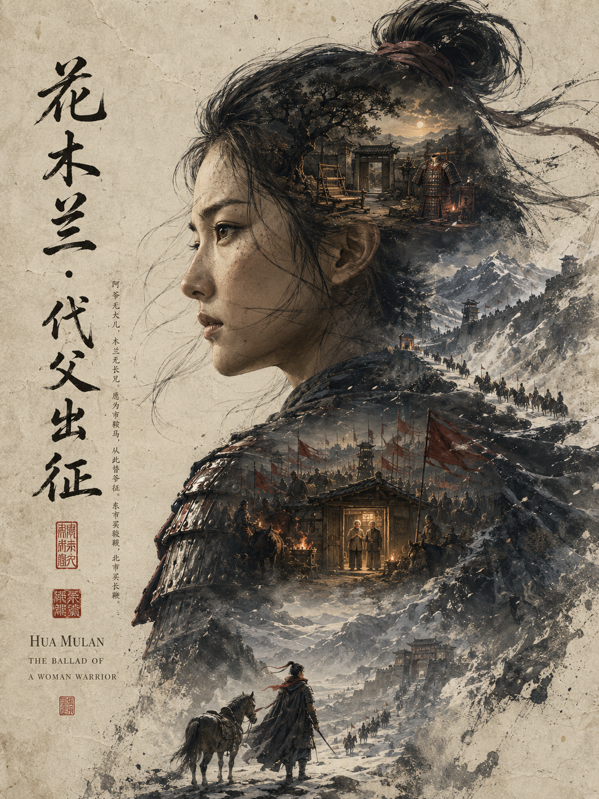
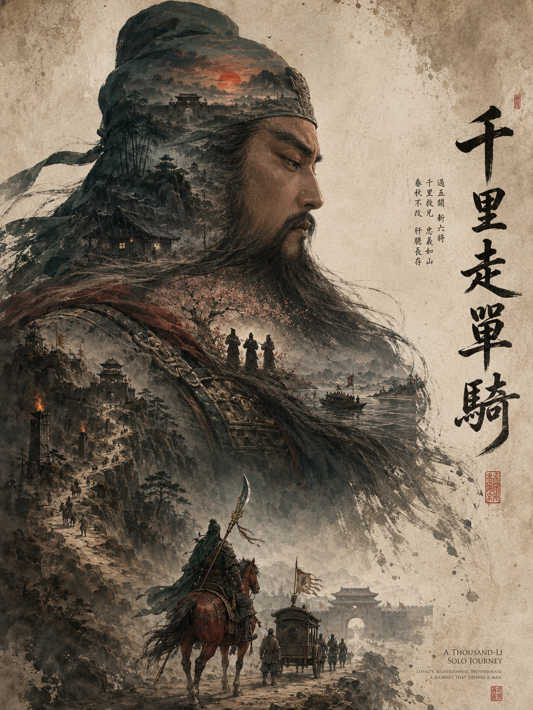
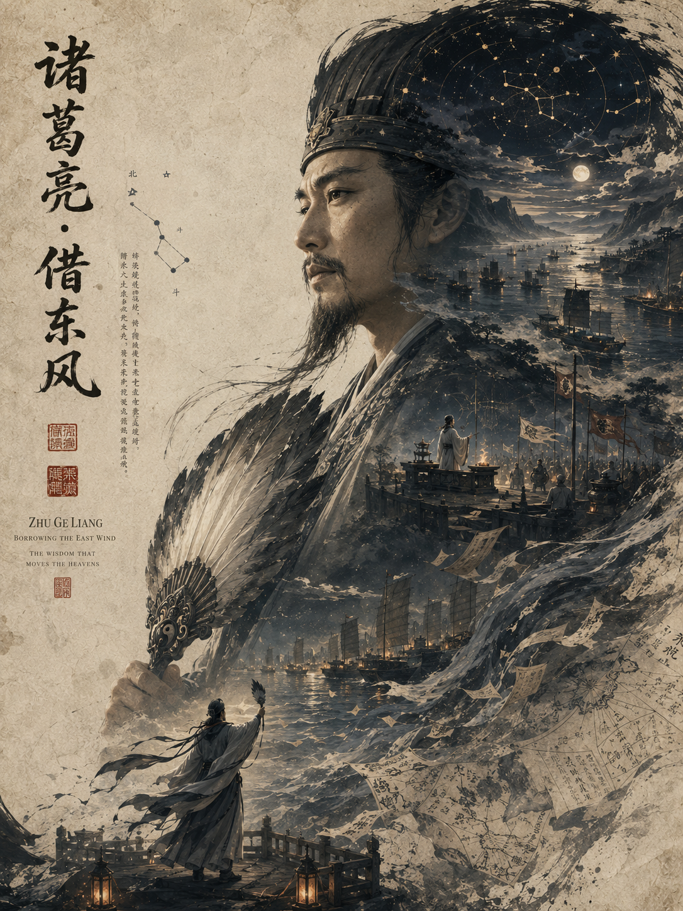
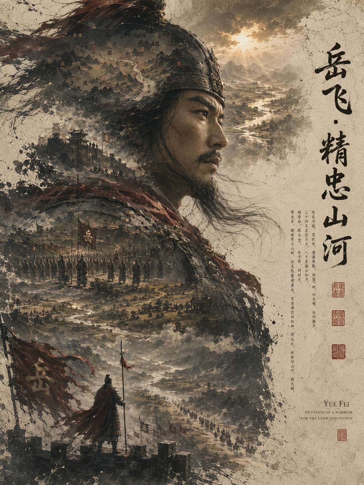

六位东方英雄被放进同一套旧宣纸、水墨双重曝光与电影海报视觉系统。核心写法是巨大人物轮廓、内部叙事山河、底部微小行动者，以及焦墨、深靛、朱砂红的克制配色。

提示词：
竖版3:4，东方英雄水墨双重曝光海报，巨大人物半身轮廓内嵌山河与命运场景，底部微小人物形成尺度反差，旧宣纸大面积留白，焦墨、深靛、暗朱红、旧金，电影级古籍典藏质感。

#GPTImage2 #千问 #生图提示词 #Prompt #典藏海报 #东方英雄

