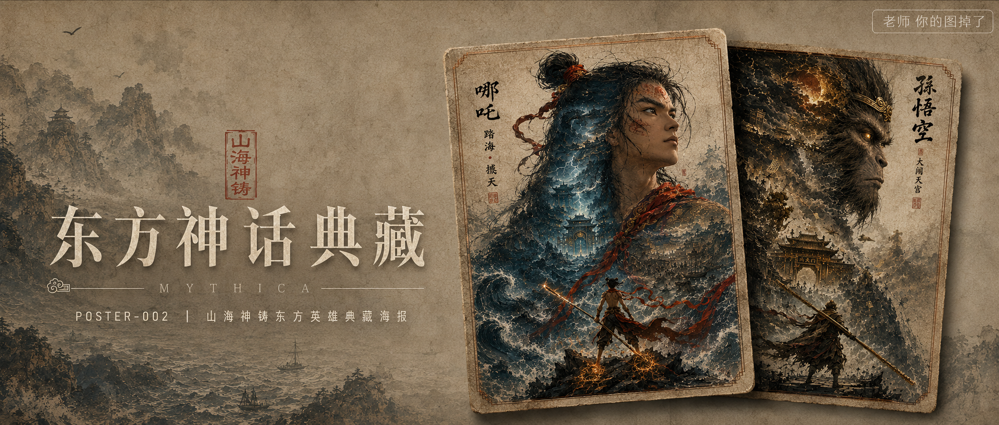

# POSTER-002-山海神铸东方英雄典藏海报 封面

## 封面提示词

中国东方英雄水墨史诗概念封面，2.35:1电影横构图。画面右侧以两张竖版3:4典藏海报卡片前后错位堆叠形成视觉层次：前景卡片是哪吒三分之二正侧面巨像，面容清秀坚定、眼神锐利，发丝与红绫被风掀起，轮廓内部翻涌深靛东海、龙宫、黑色巨浪与橙红火星；后方卡片是孙悟空威严的三分之二正侧面巨像，真实猕猴毛发、暗金金箍、金色瞳光，轮廓内部是南天门、云海与雷霆。两张卡片轻微旋转、边缘带宣纸毛边与旧铜描线，卡片下方投出克制真实的层叠阴影，像博物馆级限量典藏套装。背景为暖灰米白旧宣纸与淡墨山海，左侧保留清晰排版空间，朱砂红只用于红绫、火星和印章，深靛蓝、焦墨黑、赭石金形成强烈冷暖对撞。哪吒面部占前景卡片足够比例，五官精致自然、面部立体清晰、轮廓清晰上镜，柔和侧逆光打亮面部与红绫；孙悟空眼神有神、毛发细节真实。概念艺术大片质感，尺度反差，画面叙事张力，构图震撼，色调精准克制，细节层次丰富，商业海报级完成度，电影感光影，高清锐利，色彩层次丰富，视觉冲击力强，构图黄金比例，画面有张力。避免复刻任何具体影视动画角色，避免卡通Q版、网红脸、塑料皮肤、硬边廉价拼贴、卡片结构变形、文字乱码、logo、二维码、平台水印。

【文字排版-必须完整保留，不得省略或简化任何一项】画面左侧垂直居中偏下叠加文字排版：超大号衬线字体米白色主文案「东方神话典藏」，主文案上方以小号朱砂篆刻感文字点题「山海神铸」，主文案正下方一条细横线左端带📜横线中央有透明英文水印 MYTHICA，横线下方等宽白色字体副文案「POSTER-002 ｜ 山海神铸东方英雄典藏海报」；右上角浅色半透明圆角底衬配小号文字「老师 你的图掉了」（署名文字，必须出现，不可省略）；无整体蒙层，文字直接压图。【文字排版结束】

## 封面图片

