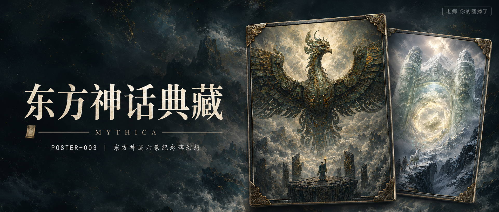

# POSTER-003-东方神迹六景纪念碑幻想 封面

## 封面提示词

东方神话概念级商业海报，2.35:1电影横构图，画面右侧由两张竖版典藏画片错位堆叠形成视觉层次：前景主卡是一只如山峰般巨大的青铜神鸟展开双翼悬停云海，铜绿甲片与琥珀裂光清晰锐利，下方黑色祭坛上只有一位托灯微小人物；后方副卡露出半张昆仑青白玉门与白鹿旅队，卡片边缘带旧金属包角、细腻纸张厚度和柔和投影，两张卡片轻微旋转、前后遮挡，像博物馆级限量艺术典藏，但不做手机样机、不放室内展示台。背景为深靛青到炭黑渐变的广阔云雾与矿物颗粒，左侧保留深色干净排版区，青铜绿、玉石青白、旧金与朱砂形成精准冷暖对比，尺度反差、视觉隐喻、电影静帧故事感，概念艺术大片质感，超现实主义氛围，画面叙事张力，构图震撼，色调精准克制，细节层次丰富，商业海报级完成度，电影感光影，高清锐利，色彩层次丰富，视觉冲击力强，构图黄金比例，画面有张力。避免卡通、塑料质感、廉价游戏海报、现代机械鸟、西方天使、手机与平板样机、室内装裱展示、复杂杂乱背景、除指定排版外的任何多余文字、Logo、水印、签名。

【文字排版-必须完整保留，不得省略或简化任何一项】画面左侧垂直居中偏下叠加文字排版：超大号衬线字体米白色主文案「东方神话典藏」，主文案正下方一条细横线左端带📜横线中央有透明英文水印 MYTHICA，横线下方等宽白色字体副文案「POSTER-003 ｜ 东方神迹六景纪念碑幻想」；右上角浅色半透明圆角底衬配小号文字「老师 你的图掉了」（署名文字，必须出现，不可省略）；无整体蒙层，文字直接压图。【文字排版结束】

## 封面图片

