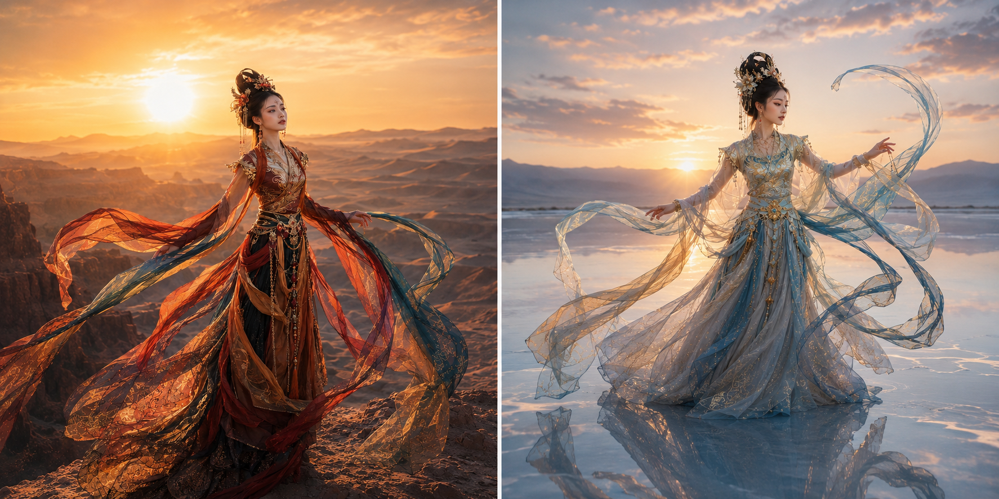
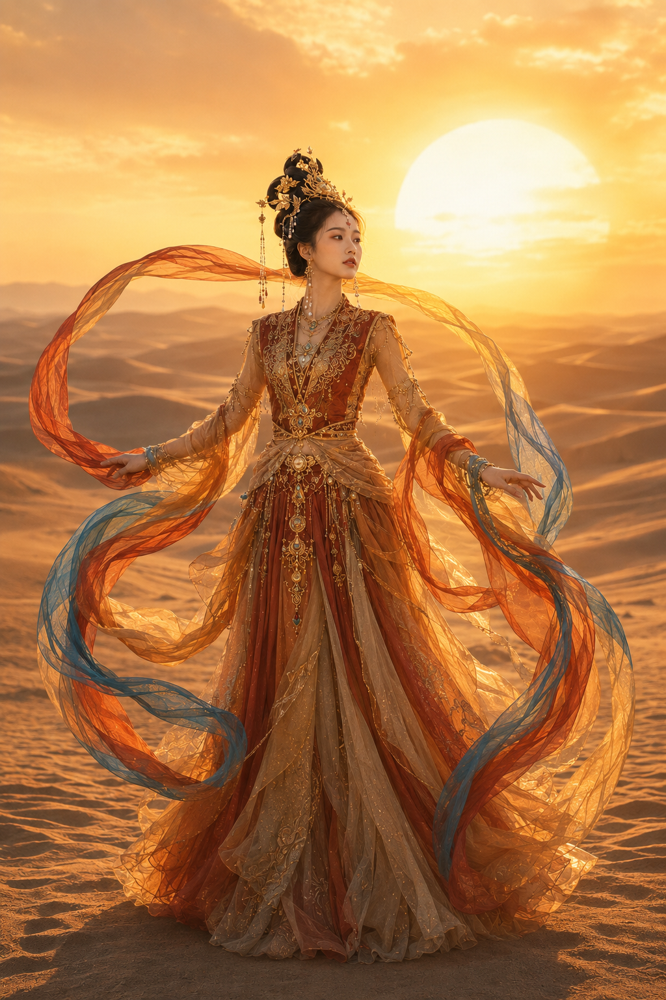
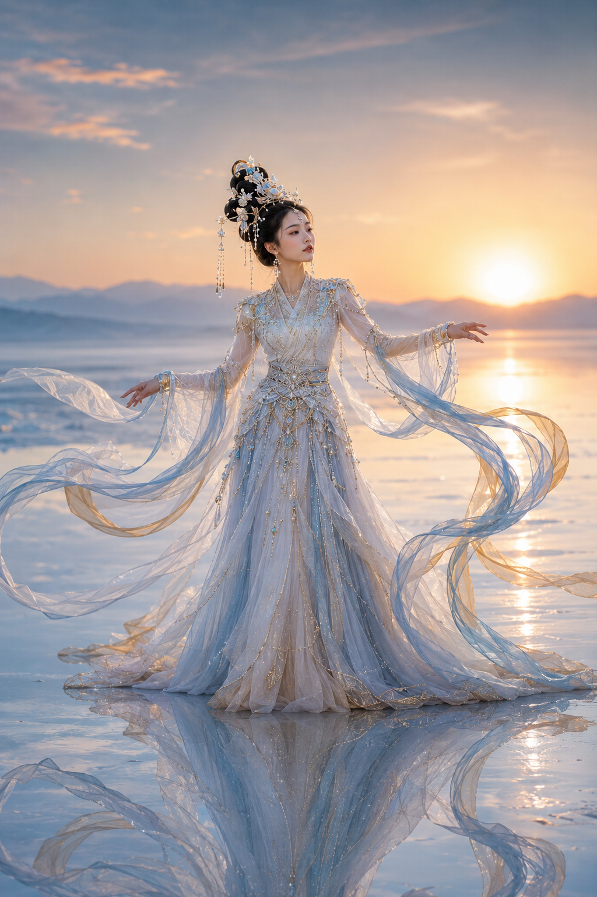
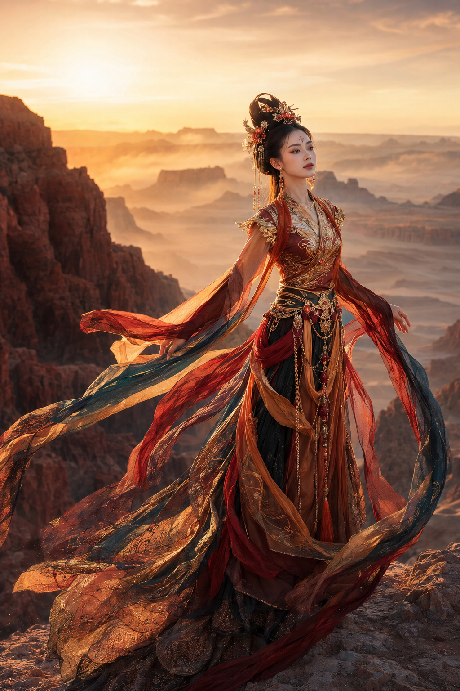
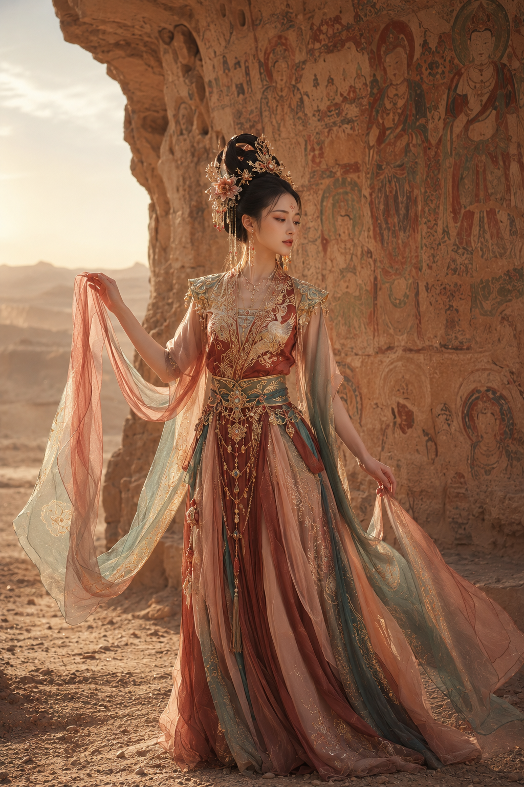
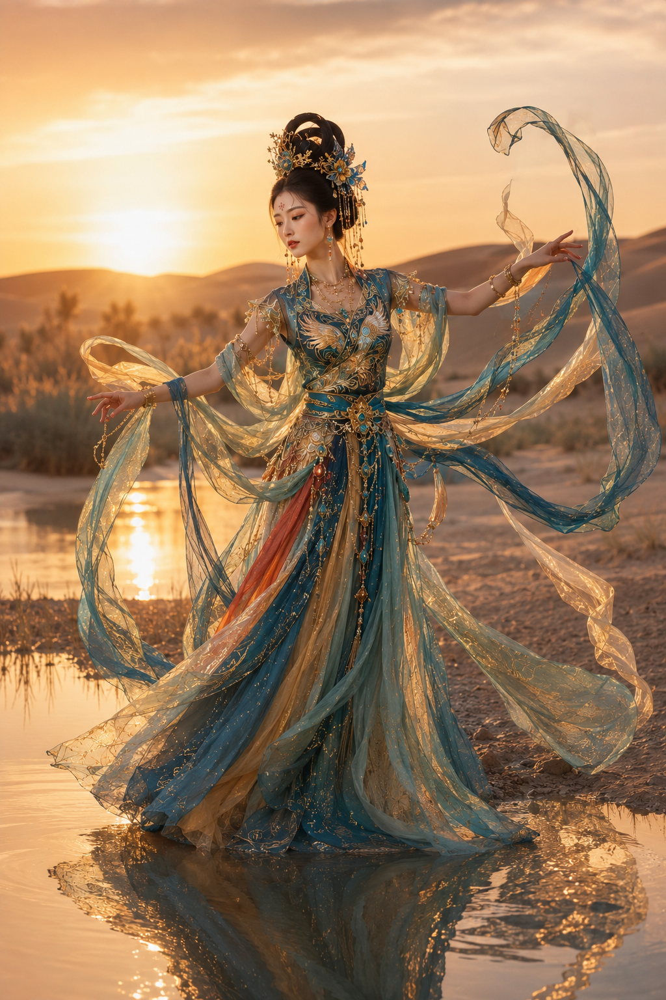
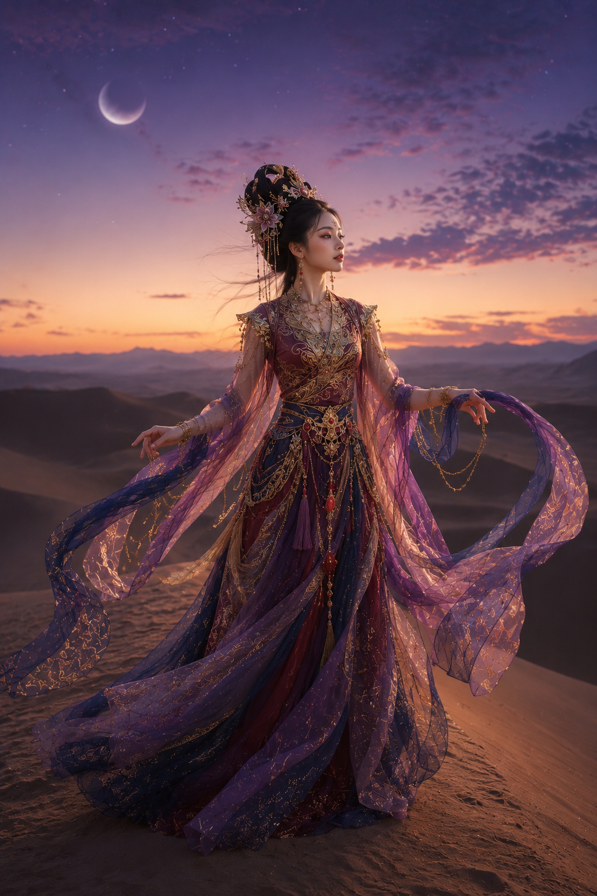

# 我把敦煌飞天放进六种光境，终于拍出了东方神话的电影感

同一个敦煌飞天人物，换一束光、换一片地貌，气质就会完全不同。这次做成「飞天六境」，不是简单换背景，而是用六组冷暖、明暗和材质关系，搭出一套可以连续收藏的东方幻想写真。

先看顶部双宫格：左边用金色沙海定下神圣感，右边用月白盐湖拉开冷暖反差。

---

**本期研究：** 同一套敦煌美学，六种光境怎样各自成立？

**核心变量：** 环境材质、主色、逆光方向、飘带运动轨迹。人物的年龄、气质和审美基准保持统一。

---

**#01 ｜ 沙海金曦：用朝阳制造神性**

这组是整套视觉的基准版。巨大低垂朝阳负责尺度感，人物边缘的金色轮廓光负责“显贵”，湖蓝飘带则用一小块冷色打破满屏金黄。真正决定画面高级感的，不是首饰数量，而是侧逆光与飘带曲线。

可直接复制的完整版本：

竖版 2:3，东方幻想古风人像摄影，敦煌飞天美学，高级商业写真。一位 24 岁年轻亚洲女性站在清晨金色沙海中央，全身构图，身形修长，姿态端庄舒展，微微侧身回望远方。她五官自然清秀，面部干净，皮肤光泽自然并保留真实细腻纹理，眼神真实，神情安静克制。黑色长发盘成高耸典雅的飞天式发髻，佩戴金色枝叶发冠、珍珠流苏、小型花饰与垂坠耳饰，眉心点缀朱砂花钿。她穿赤金、琥珀橙、沙金色敦煌灵感高定舞衣，上身为金线刺绣交领短外衣叠穿端庄内衬，衣面有羽翼状金色纹样与红宝石装饰；下身为层叠轻纱长裙，裙摆带细碎金粉、流光质感与古典纹样，腰间配金属腰饰、链条流苏和宝石坠饰。双臂自然舒展，手臂外侧缠绕半透明长飘带，橙红、暖金与湖蓝色飘带被风吹起，在空中形成流动的 S 形曲线和环绕式构图。场景是广阔纯净的沙漠，前景沙纹清晰，中景沙丘层叠，背景是一轮低垂的巨大金色朝阳，天空呈奶油金、暖米黄、淡杏色渐变。黄金时刻逆光与侧逆光结合，发丝、肩颈、裙摆和飘带边缘有柔和轮廓光，人物面部有清晰柔和补光。85mm 中长焦，眼平机位，全身环境人像，浅景深，背景柔化，电影级暖色调，轻胶片颗粒，画面空灵、神圣、唯美、华丽。无文字，无水印，无 logo。避免现代服装、现代建筑、游客、人群、城市元素、廉价影楼风、过度暴露、AI 美女脸、网红感、过度精修、塑料皮肤、暗沉肤色、明显痘印、明显皱纹、斑点、面部变形、五官错位、手部畸形、多手多指、飘带穿模、服装乱码、首饰悬浮、肢体扭曲、低清晰度、重度 HDR、过曝、文字乱码、水印。

---

**#02 ｜ 月白盐湖：让冷色也有温度**

盐湖不是简单“变蓝”。人物和倒影保持冷白，夕阳与轮廓光保留暖金，冷暖才会互相抬高。大幅弧形飘带把天空、人物和倒影连成一个闭环，画面因此更完整。

---

**#03 ｜ 赤岩天幕：把力量交给地貌**

赤岩本身已经很强，服装不需要继续堆满高饱和红色。用铜金提亮、墨青压住飘带，再让侧逆光扫过岩壁，人物才不会被峡谷吞没。

---

**#04 ｜ 石窟遗梦：让背景退后半步**

壁画最容易抢戏，所以这组把光线做柔，把饱和度压低，让赭红、藕粉和雾青接近矿物颜料。壁画要看得见，但不能比人物更清楚。

---

**#05 ｜ 绿洲祭舞：用水面增加呼吸感**

孔雀蓝与暖金是这组的记忆点。浅水只保留轻微倒影，避免做成过度对称的“镜像特效”；飘带边缘的金光与水面高光彼此呼应，画面会更灵动。

---

**#06 ｜ 暮紫星砂：卡在昼夜交界的一分钟**

暮紫容易变暗，所以人物脸部必须单独补光，月亮和星点只做气氛，不抢主视觉。酒红、旧金与深蓝按明度递进，才能保住夜色里的服装细节。

---

**测试结论：** 六张图要像同一套典藏，最稳的方法是先锁定人物身份与飞天发髻，再只改环境、主色和光线。跟 AI 交互时，可以先说“保持同一人物与服装工艺，只替换为月白盐湖光境”，比每次从头重写更容易得到统一系列。

如果你最想把其中一境做成自己的写真，评论区留下「金曦、月白、赤岩、石窟、绿洲、暮紫」之一；也欢迎收藏这套光境逻辑、关注后续典藏，并告诉我下一期想看哪种东方神话视觉。

---

## 往期回顾

- POSTER-003 东方神迹六景纪念碑幻想
- POSTER-002 山海神铸东方英雄典藏海报
- POSTER-001 西游人物东方史诗典藏海报

#GPTImage2 #千问 #豆包 #生图提示词 #Prompt #典藏海报 #敦煌飞天
