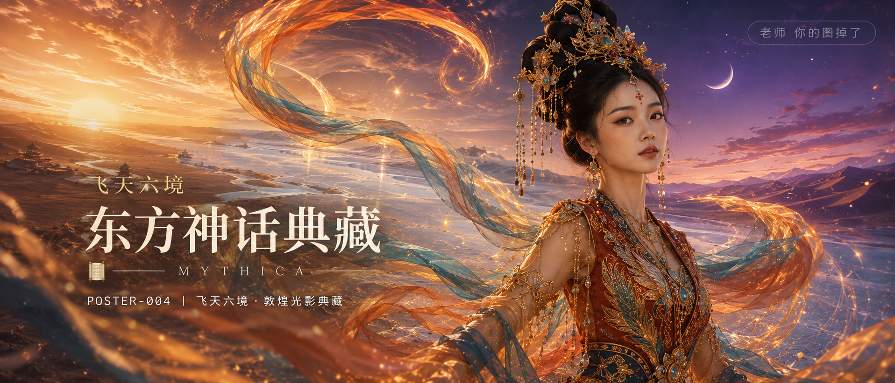

# POSTER-004-飞天六境敦煌光影典藏 封面

## 封面提示词

敦煌飞天风东方神话商业封面，一位 24 岁亚洲女性以正脸偏 3/4 角度居于画面右侧前景，半身构图，面部占画面三分之一以上，五官精致自然、面部立体清晰、皮肤光泽细腻、眼神有神灵动、妆感干净清透、轮廓清晰上镜；高耸飞天发髻、赤金枝叶发冠、珍珠流苏与朱砂花钿，穿赤金与孔雀蓝交织的端庄敦煌高定舞衣，金线羽纹清晰，橙金与湖蓝长飘带在身后形成巨大 S 形光轨。背景将金色沙海、月白盐湖和暮紫星砂以层叠空间融合，巨大朝阳与弯月同时隐约出现，冷暖色对比强烈，侧逆光打亮颧骨，柔光环绕面部，前景有细金沙粒与飘带虚化，概念艺术大片质感，画面叙事张力，商业海报级完成度，电影感光影，高清锐利，色彩层次丰富，视觉冲击力强，构图黄金比例，画面有张力，2.35:1 电影横构图。避免纯侧脸、闭眼、嘴巴微张、人物过小、背景杂乱、现代元素、过度暴露、AI 美女脸、网红感、过度精修、塑料皮肤、暗沉肤色、明显痘印、明显皱纹、斑点、面部变形、手部畸形、飘带穿模、文字乱码、水印、logo。

【文字排版-必须完整保留，不得省略或简化任何一项】画面左侧垂直居中偏下叠加文字排版：超大号衬线字体米白色主文案「东方神话典藏」，主文案上方以较小金色衬线字体增加篇章名「飞天六境」，主文案正下方一条细横线左端带📜横线中央有透明英文水印 MYTHICA，横线下方等宽白色字体副文案「POSTER-004 ｜ 飞天六境·敦煌光影典藏」；右上角浅色半透明圆角底衬配小号文字「老师 你的图掉了」（署名文字，必须出现，不可省略）；无整体蒙层，文字直接压图。【文字排版结束】

## 封面图片

