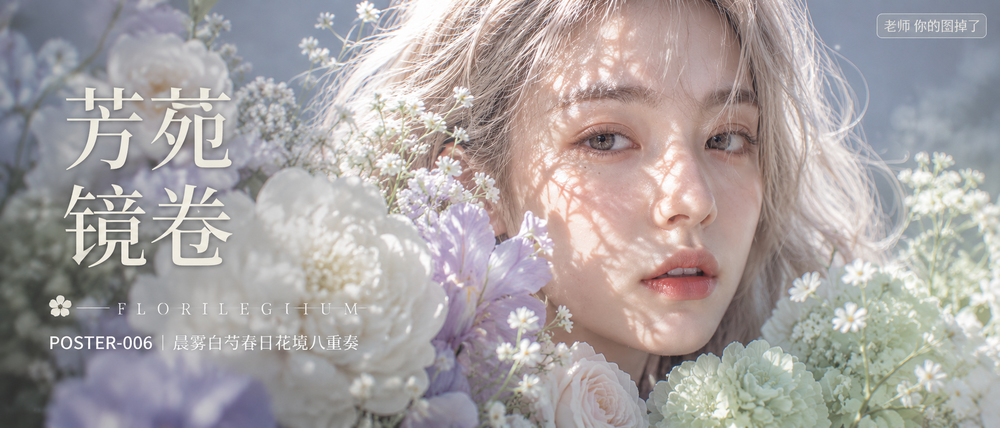

# POSTER-006-晨雾白芍春日花境八重奏 封面

## 封面提示词

竖版3:4，高端时尚花卉杂志典藏封面，真实写实编辑摄影，概念艺术大片质感。画面主体是一位年轻成年女性，正脸略微3/4侧的近距离面部特写，人物位于画面中央偏右，面部占画面三分之一以上，双眼清澈明亮，直视镜头，神情安静克制又有记忆点，五官自然清秀，面部干净，健康自然肤色，皮肤光泽自然，眼神真实、表情松弛。肤色为冷白自然肤色，保留细腻真实皮肤纹理。发色为浅香槟金与月白银米交织，长发松散垂落被侧逆光勾出透明发丝边缘。前景与下半部混合大朵白芍药、雾紫鸢尾、月白玫瑰、浅薄荷绣球共同层叠环绕面颊与下巴，花材前中后景形成明显层次，近处花瓣柔焦虚化，人物眼睛与嘴唇保持清晰锐利，冷暖光影在花瓣与肌肤间形成材质反差。背景为低饱和冰雾蓝灰色渐变，带一点空气透视纵深。主光为右上方斜射的自然光，穿过花枝在额头、眼周、鼻梁投下细碎斑驳光影，构图黄金比例，前景虚化背景，色调统一精致，画面有张力，电影感光影，色彩层次丰富，视觉冲击力强。85mm人像镜头，浅景深，高清锐利，法式浪漫、安静高级、诗意空气感。2.35:1电影横构图。

【文字排版-必须完整保留，不得省略或简化任何一项】画面左侧垂直居中偏下叠加文字排版：超大号衬线字体米白色主文案「芳菀镜卷」，主文案正下方一条细横线左端带🌸图标横线中央有透明英文水印 FLORILEGIUM，横线下方等宽白色字体副文案「POSTER-006 ｜ 晨雾白芍春日花境八重奏」；右上角浅色半透明圆角底衬配小号文字「老师 你的图掉了」（署名文字，必须出现，不可省略）；无整体蒙层，文字直接压图。避免AI美女脸、网红感、过度精修、塑料皮肤、暗沉肤色、明显痘印、明显皱纹、斑点、面部变形、文字乱码、排版错乱、logo、水印、二维码、手部畸形、花朵结构错误、构图拥挤。【文字排版结束】

## 封面图片

