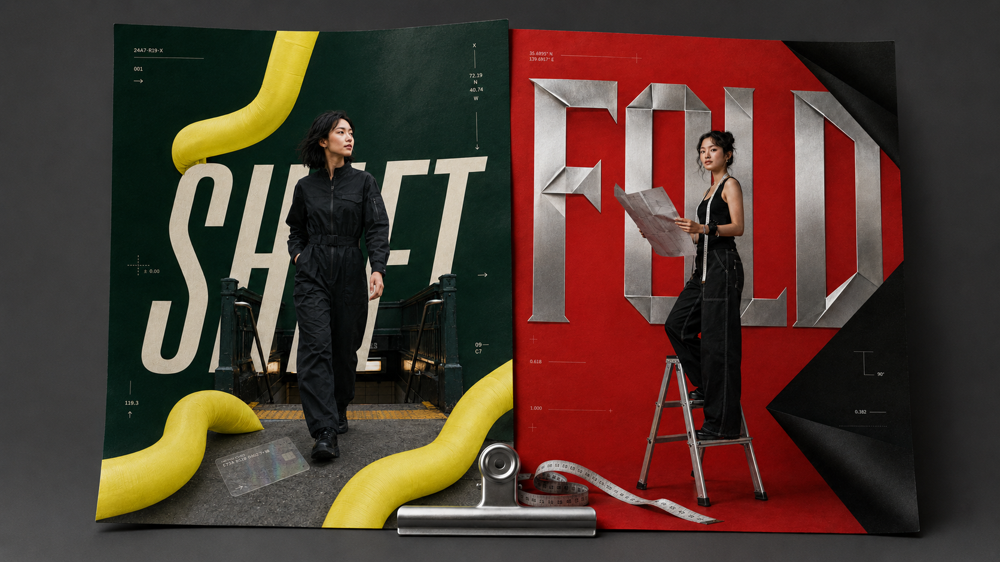
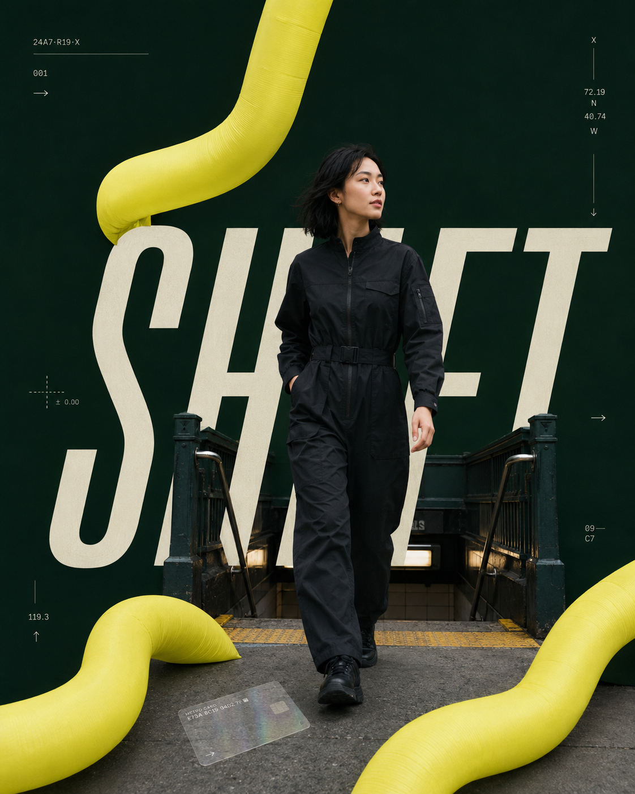
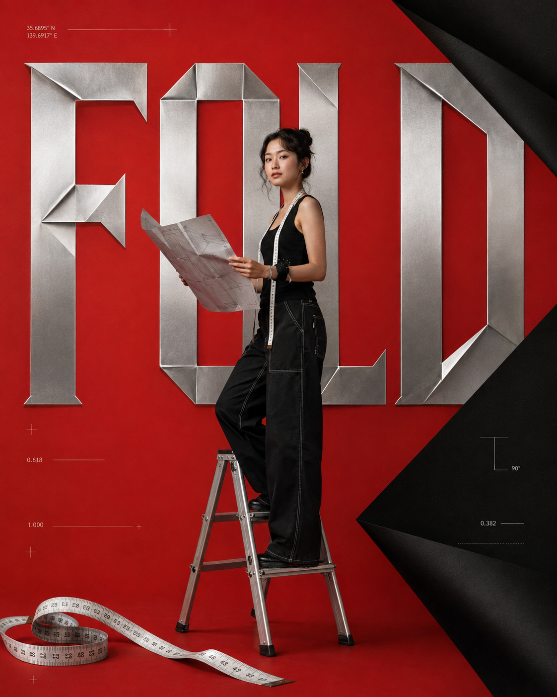
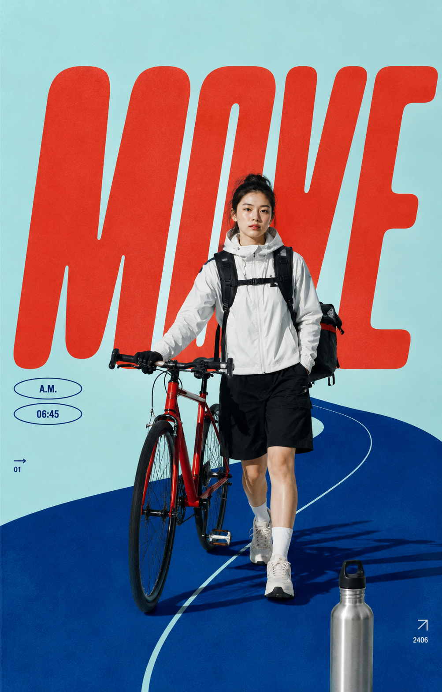
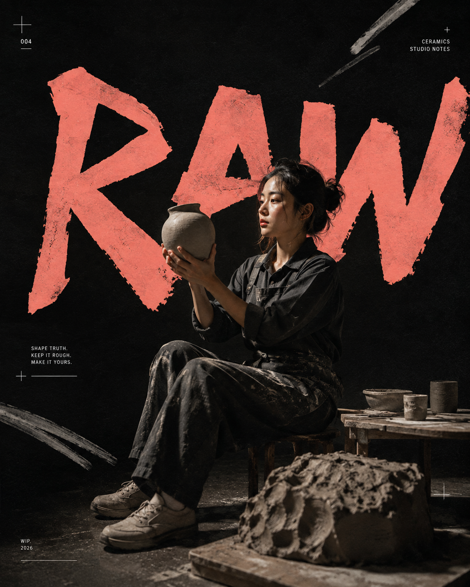
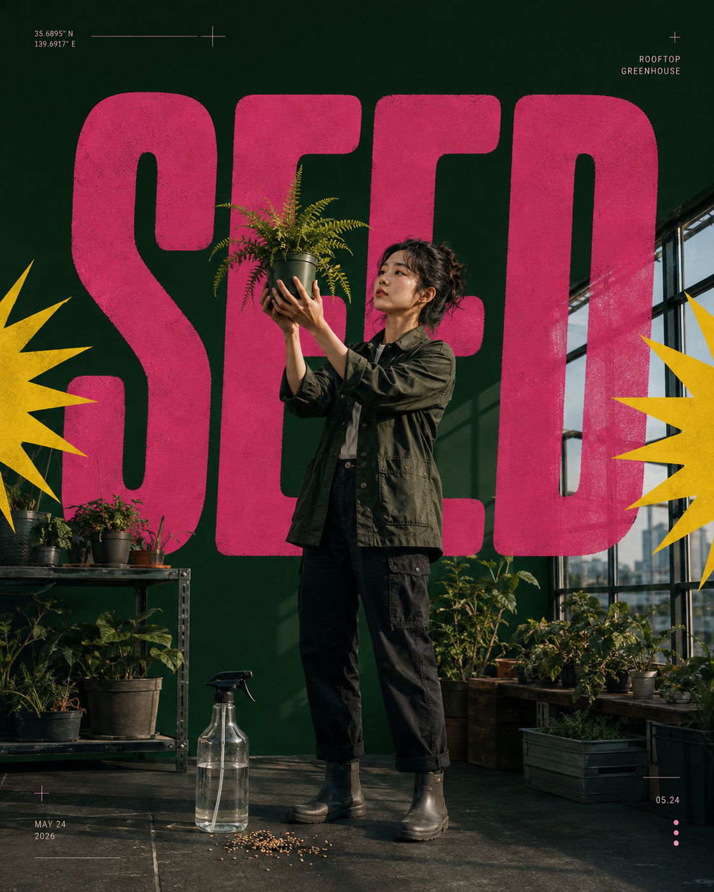
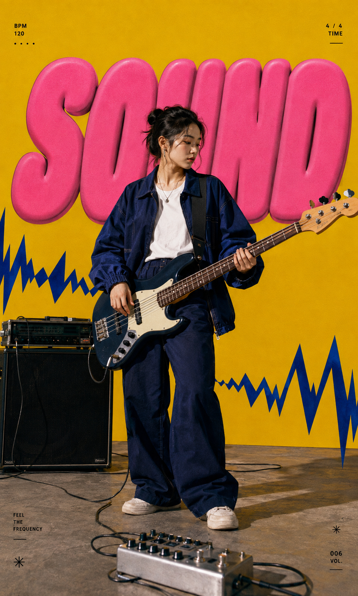

# 六色典藏：六种配色怎样让人物海报同系列却不撞款？

人物海报最容易陷入两种极端：换色后散成六张无关的图，或始终用一套颜色，最后看起来像复制模板。真正该固定的是信息层级，不是主题色。

这次用同一个骨架做六次挑战：人物始终是主角，大字始终负责视觉信号，前景道具始终压住空间；但每张都换掉主色、字体性格和材质语言。色彩不是装饰，而是每张海报的版式。

## #01｜SHIFT：先固定原版结构

这一张把人物放进深墨绿与荧光黄的张力里。大字不必解释信息，只要在人物身后承担节奏；地铁卡压在脚边，画面就有了前中后景。

4:5 竖版人物编辑海报，深墨绿色满版背景，一位 24 岁亚洲女产品设计师从地铁出口迈步而出，黑色挺括连体工装，24mm 广角平视全身拍摄，人物居中偏右；背后是一组巨大暖白色窄体斜体字“SHIFT”，拼写清晰，局部被人物遮挡；荧光黄色柔软充气管线从上下边缘穿入，脚边放一张半透明地铁卡，银色微型编号与细箭头散落在留白处，真实摄影剪影与精致印刷边缘，五官自然清秀、面部干净、健康自然肤色、眼神真实、服装结构合理，画面冷静锋利且层次清楚，避免 AI 美女脸、网红感、过度精修、塑料皮肤、暗沉肤色、明显痘印、明显皱纹、斑点、面部变形、钴蓝橙色波普、渐变、logo、水印。

---

## #02｜FOLD：让材质替你换语气

番茄红没有搭配常见的白字，而是交给钛银和折纸结构。跟 AI 说清“字像折出的金属板”，比只写“高级”更有效。 软尺与梯子把服装打版的身份压进前景。

---

## #03｜MOVE：把色块改成路径

冰青、朱红和深海蓝不再围着人物装饰，而是用跑道和车把引导视线。这个 case 的关键是让道具先进入画面，再让人物与标题完成遮挡关系。

---

## #04｜RAW：删掉光滑感

炭黑与珊瑚粉的组合适合更安静的工艺主题。保留湿陶泥、纸张压纹和粗铅笔笔触，能让画面离开常见的“品牌大图”质感；大字因此更像一块被手工切出的纸板。

---

## #05｜SEED：用一件道具锁住主题

植物不必铺满画面，一盆蕨类和一只喷壶已经足够。每张只留一个前景锚点，画面才不会被素材填平。 松针绿、玫红、酸黄之间的停顿，比增加元素更有记忆点。

---

## #06｜SOUND：让字有声音

最后一张把标题改成膨胀立体字，用锯齿波形回应贝斯的节奏。写给 AI 时，除了颜色还要说清“乐器从底部斜向延伸”，这样前景才会真正制造出冲击。

---

这套方法可以直接迁移到活动嘉宾、品牌主理人或产品海报：固定“人物、标题、前景”的顺序，再为每期单独定义颜色、字形和材质。系列感来自可识别的秩序，不是反复使用同一张色卡。

---

## 往期回顾

- 不用滤镜也有电影感：6幕琥珀光影女友自拍写法
- 奶油白人像怎么不显寡淡？6个草莓场景做出清透层次
- 6个夏日场景互动人像，朋友圈看起来像真实抓拍写真

#GPTImage2 #千问 #豆包 #生图提示词 #Prompt #典藏海报系列 #人物海报
