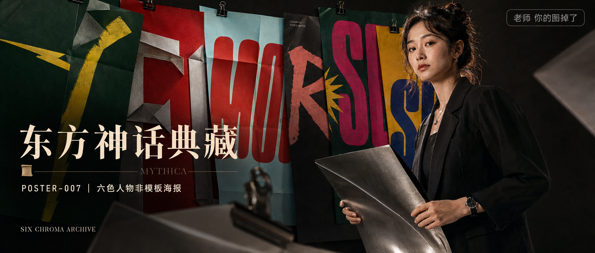

# POSTER-007-六色人物非模板海报 封面

## 封面提示词

2.35:1 电影横构图，视觉概念「六色张力档案」：一位 24 岁亚洲女性创意总监以 3/4 正脸站在巨大的折叠海报墙前，人物半身占画面右侧 45%，黑色结构西装，五官精致自然、面部立体清晰、皮肤光泽细腻、眼神有神灵动、妆感干净清透、轮廓清晰上镜；左侧六张不同配色的海报纸以错位堆叠和轻微透视形成层次，墨绿荧光黄、番茄红钛银、冰青朱红、炭黑珊瑚粉、松针绿玫红、芥末黄靛青，人物手持一张发亮的银色海报纸，前景虚化的纸角和金属夹制造空间深度，电影感光影、高清锐利、色彩层次丰富、视觉冲击力强、构图黄金比例、色调统一精致。避免 AI 美女脸、网红感、过度精修、塑料皮肤、暗沉肤色、明显痘印、明显皱纹、斑点、面部变形、文字乱码、裁切文字、logo、水印。【文字排版-必须完整保留，不得省略或简化任何一项】画面左侧垂直居中偏下叠加文字排版：超大号衬线字体米白色主文案「东方神话典藏」，主文案正下方一条细横线左端带📜横线中央有透明英文水印 MYTHICA，横线下方等宽白色字体副文案「POSTER-007 ｜ 六色人物非模板海报」；左下角以小号英文装饰文字「SIX CHROMA ARCHIVE」；右上角浅色半透明圆角底衬配小号文字「老师 你的图掉了」（署名文字，必须出现，不可省略）；无整体蒙层，文字直接压图。【文字排版结束】

## 封面图片

