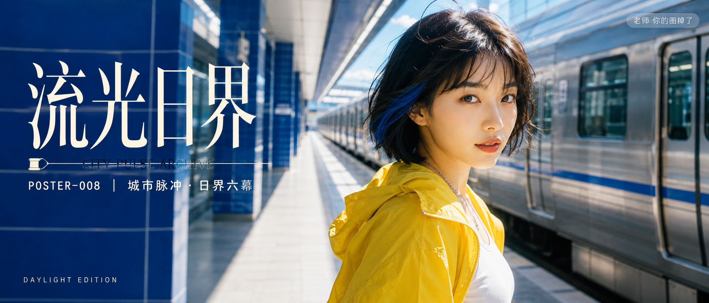

# POSTER-008-城市脉冲·霓虹曜界六幕 封面

## 封面提示词

流光日界概念封面：晴朗早晨的地铁站，乳白站台、钴蓝瓷砖与银色列车构成强透视，26 岁成年中国女性以清晰 3/4 正脸站在画面右侧前景，齐下巴黑色短发带钴蓝挑染，明黄不透明轻机能夹克在明亮蓝白空间中极其醒目，她直视镜头，眼神有神灵动；前景是被阳光照亮的浅灰地面，中景人物，后景列车与透视线，黄蓝冷暖对比，面部占比大、五官自然清秀、面部干净、皮肤光泽自然、轮廓清晰，电影感光影，高清锐利，色彩层次丰富，视觉冲击力强，构图黄金比例，色调统一精致，2.35:1 电影横构图。避免 AI 美女脸、网红感、过度精修、塑料皮肤、暗沉肤色、明显痘印、明显皱纹、斑点、面部变形、品牌 Logo、水印、乱码、文字遮挡面部、错误手部。

【文字排版-必须完整保留，不得省略或简化任何一项】画面左侧垂直居中偏下叠加文字排版：超大号衬线字体米白色主文案「流光日界」，主文案正下方一条细横线左端带📜横线中央有透明英文水印 CITY PULSE ARCHIVE，横线下方等宽白色字体副文案「POSTER-008 ｜ 城市脉冲·日界六幕」；右上角浅色半透明圆角底衬配小号文字「老师 你的图掉了」（署名文字，必须出现，不可省略）；无整体蒙层，文字直接压图；左下以低调装饰文字标注「DAYLIGHT EDITION」。【文字排版结束】

## 封面图片

