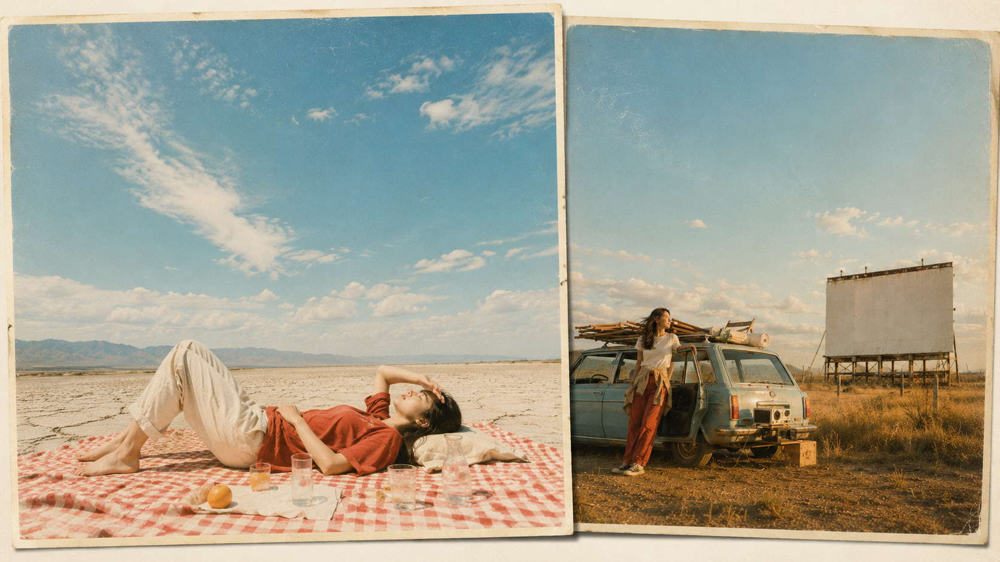
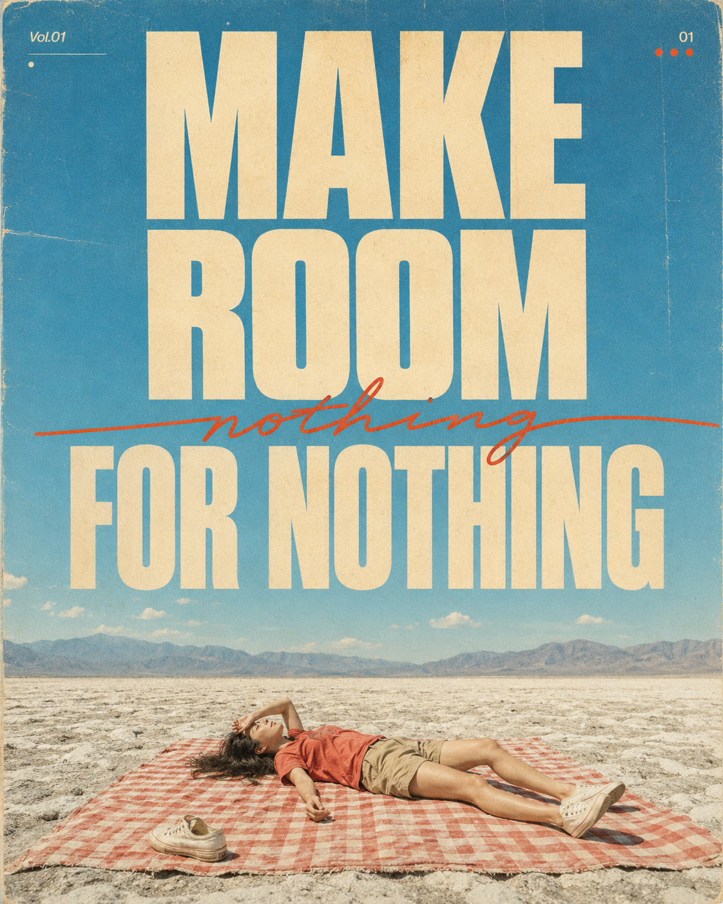
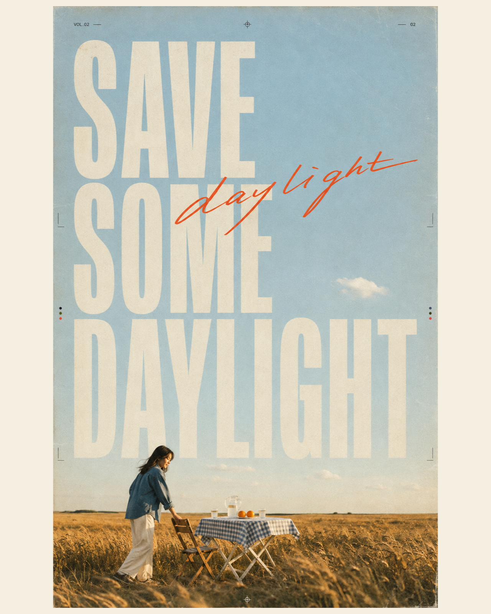
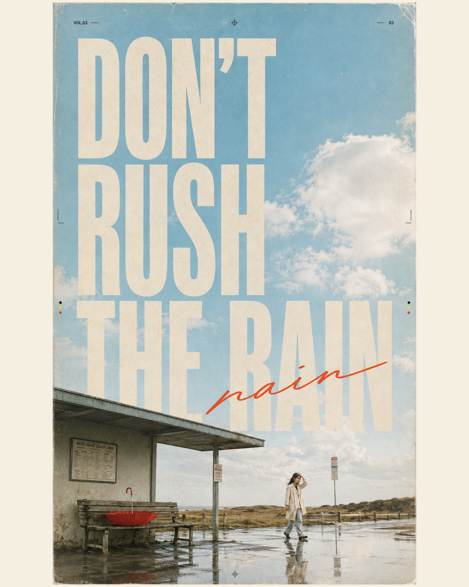
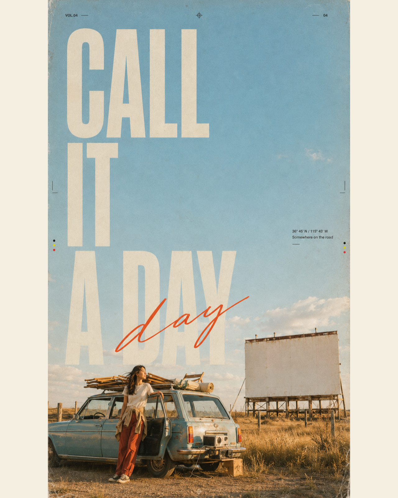
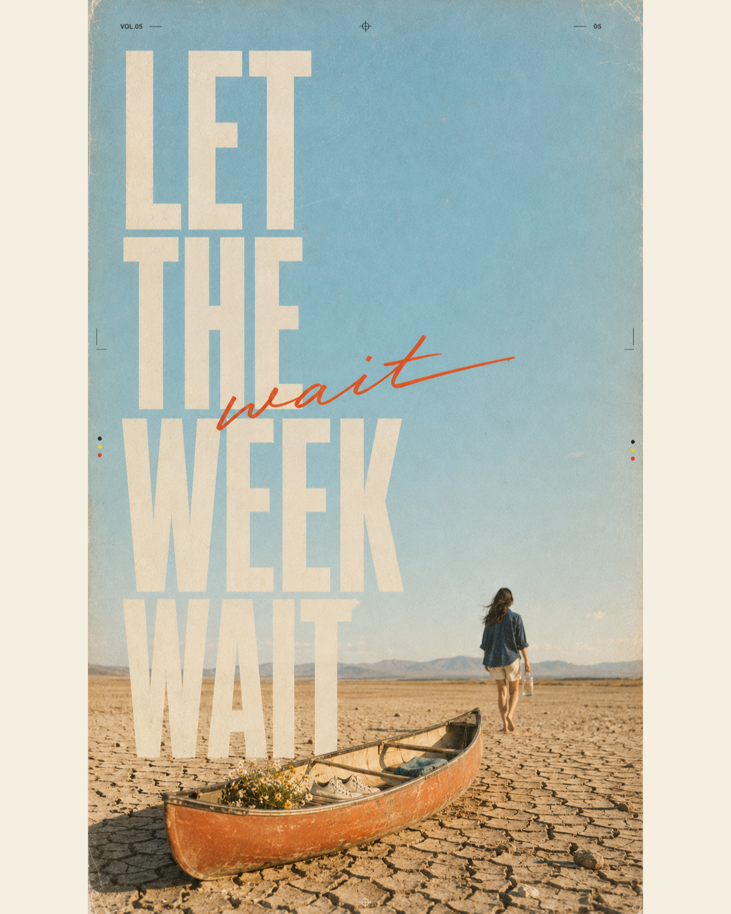
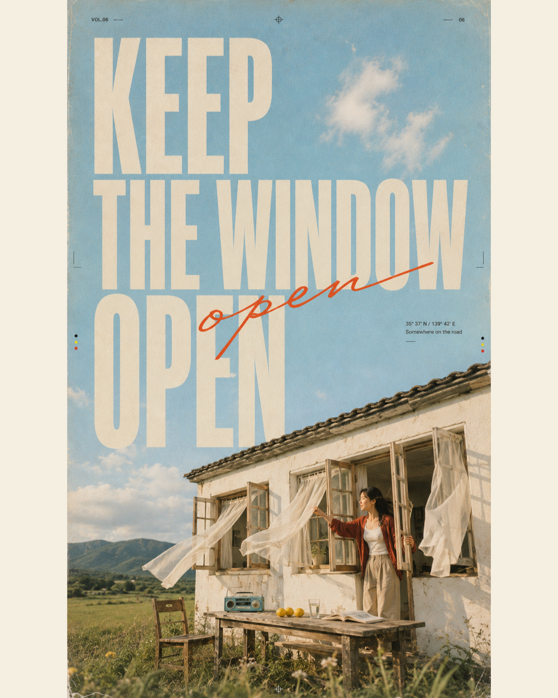

# 日光留白：六段盛夏风景如何做出旧旅行刊海报的松弛感

**Q：为什么同样写“复古旅行海报”，常常会生成现代广告感？**

问题通常不在滤镜，而是天空、文字、人物和地景没有共用一套版面规则。统一用62% 留白天空 + 38% 环境叙事，再用一个物件压住下半部。

---

### ✅ Vol.01｜让留白真的成为主角

这张保留完整原版。人物压到约一成，格纹野餐布承担唯一高纯度色块。标题留出安全边距，天空才有留白。

《晒进风景里的生活主张》Vol.01｜MAKE ROOM FOR NOTHING。4:5 竖版，极其好看的 1970 年代独立旅行杂志编辑海报，带真实旧刊印刷气息，不是现代商业广告，不是人物写真封面。整体采用“巨大天空 + 巨型排版 + 清晰可辨的人物与地景”构图，画面严格分为上下两区。上方约 62% 是辽阔、干净、略微泛白的盛夏青蓝天空，带少量自然曝光过度和极轻胶片颗粒。天空区域从左至右排布三行巨大、厚重、极窄、略带老杂志印刷感的暖象牙白大写英文无衬线字，文字必须逐字正确、完整清晰、不得裁切、不得变形：MAKE ROOM FOR NOTHING。主标题几乎填满天空宽度，但四周保留克制安全边距。第二行与第三行之间横向穿过一个细长、松弛、略带速度感的橙红色手写英文“nothing”，像真实油性马克笔直接写在旧杂志页面上。巨型标题附近仅允许出现极少量低调微型英文、页码、小圆点或细线装饰，不出现其他醒目可读文字。下方约 38% 为低机位 35mm 模拟胶片旅行摄影：盛夏正午，一片辽阔的浅灰白盐碱河床向远方延伸，远处是空气透视明显的蓝灰色山脉。画面中央偏下铺着一块尺寸夸张的褪色番茄红与奶油白格纹野餐布，像一块鲜明色块落在大地上。一位 24–27 岁成年东亚女性独自仰躺在野餐布中央，人物在整张海报中清晰可辨，约占整体画面的 9%–11%，不是微小到看不清。她黑棕色自然长发松散铺开，五官自然清秀、健康自然肤色、真实皮肤纹理；穿褪色番茄红宽松短袖 T 恤、卡其色及膝短裤与白色帆布鞋，一只鞋随意脱在野餐布边缘。一只手搭在额头遮光，另一只手自然摊开，姿态完全放松。脸部和肢体动作要清楚，但不能抢走天空和标题的主导地位。地平线压得很低，天空形成强烈留白与尺度感。整体色板为青蓝天空、浅灰盐地、番茄红、卡其、暖象牙白。真实 35mm 胶片颗粒、轻微曝光溢出、克制高光晕染、边缘轻柔失焦、纸张纤维、微弱套色偏移、印刷网点、折痕与细小磨损，像保存了几十年的 1970 年代旅行杂志页面。整体气质明亮、松弛、自由、诗意，第一眼有强点击欲。避免：人物近景写真、时尚大片摆拍、AI 美女脸、网红感、过度精修、塑料皮肤、错误手脚、阴郁末日感、赛博朋克、霓虹灯、现代极简品牌广告、真实品牌 Logo、二维码、水印、中文乱码、英文拼写错误、标题裁切。

---

### ✅ Vol.02｜把“多留一点傍晚”落成可见动作

拖椅子比端着杯子更像生活。麦田、玻璃壶和低地平线都指向人物，侧逆光只描边，不制造戏剧。

---

### ✅ Vol.03｜雨后的重点不是雨，而是反射

红伞留在空长椅，人物从远处走来，画面就有停顿感。与 AI 沟通先锁定湿站台反射、空长椅、唯一红色，雨天才不脏。

---

### ✅ Vol.04｜用空白银幕给故事留一个出口

露天汽车电影院容易变车广告，所以明确银幕空白，让车与人服从天空。湖蓝车、砖红裤和浅金草地是三点配色，鲜明却不抢标题。

---

### ✅ Vol.05｜荒凉感要轻，别写成灾难感

独木舟、野花和帆布鞋留下“有人刚离开”的线索；远处人物只需认出动作。给 AI 的关键是日晒褪色与明亮空气感，别反复强调干涸。

---

### ✅ Vol.06｜风要有方向，画面才会呼吸

窗帘、发丝和草尖同时朝一个方向，画面才会呼吸。湖蓝收音机与柠檬只做小面积跳色，让旧刊保有层次。

---

## 往期回顾

- 六个城市白昼场景，拍出一组有连续叙事的杂志海报
- 六色典藏：六种配色怎样让人物海报同系列却不撞款？
- 不用滤镜也有电影感：6幕琥珀光影女友自拍写法

#GPTImage2 #千问 #豆包 #生图提示词 #Prompt #典藏海报系列 #旅行刊海报
