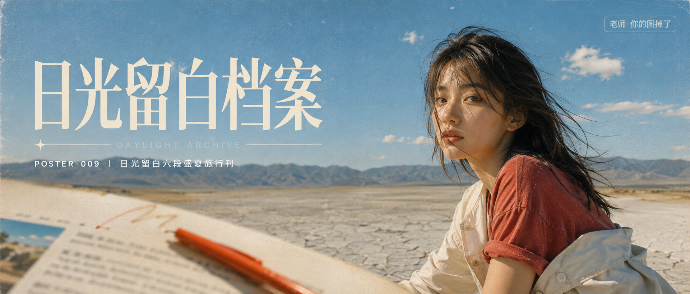

# POSTER-009-日光留白六段盛夏旅行刊 封面

## 封面提示词

2.35:1 电影横构图，概念名“晴昼版记”，一位 25 岁成年东亚女性的清晰 3/4 侧脸与半身置于画面右侧前景，五官自然清秀、面部立体清晰、皮肤光泽细腻、眼神有神灵动，穿褪色番茄红短袖与奶油白衬衫，盛夏青蓝天空占画面上半部，后景是浅灰盐地与低矮蓝灰群山；人物左侧前景有微微失焦的象牙白杂志页和一笔橙红色马克笔线，形成冷暖对比、前中后景和材质反差。真实 35mm 胶片旅行刊质感，纸张纤维、细密印刷网点、克制高光晕染、电影感光影、高清锐利、色彩层次丰富、构图黄金比例、视觉冲击力强、画面有张力，明亮通透，不是现代广告。避免 AI 美女脸、网红感、过度精修、塑料皮肤、暗沉肤色、明显痘印、明显皱纹、斑点、面部变形、错误手指、品牌 Logo、二维码、水印、乱码。

【文字排版-必须完整保留，不得省略或简化任何一项】画面左侧垂直居中偏下叠加文字排版：超大号衬线字体米白色主文案「日光留白档案」，主文案正下方一条细横线左端带✦横线中央有透明英文水印 DAYLIGHT ARCHIVE，横线下方等宽白色字体副文案「POSTER-009 ｜ 日光留白六段盛夏旅行刊」；右上角浅色半透明圆角底衬配小号文字「老师 你的图掉了」（署名文字，必须出现，不可省略）；无整体蒙层，文字直接压图。【文字排版结束】

## 封面图片

