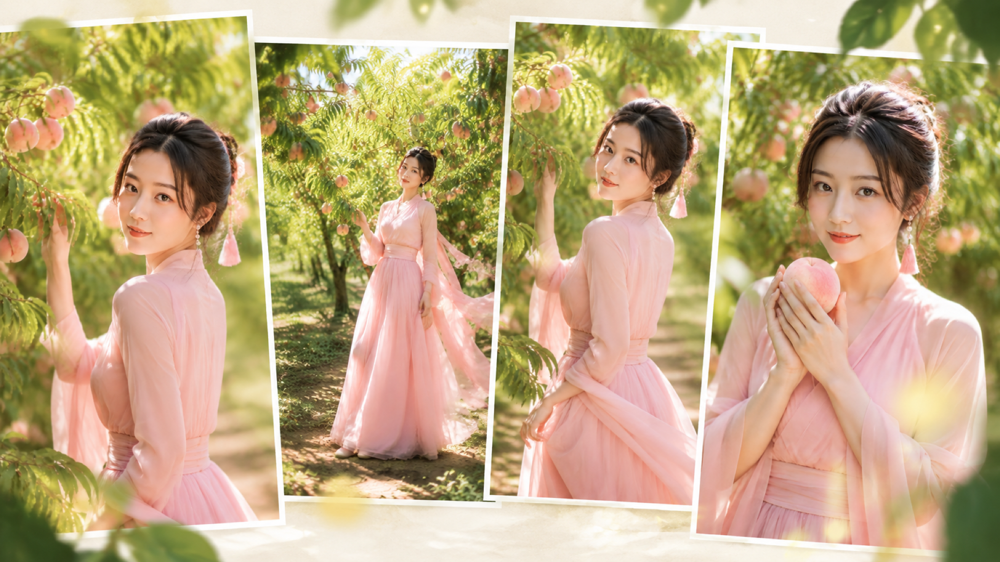
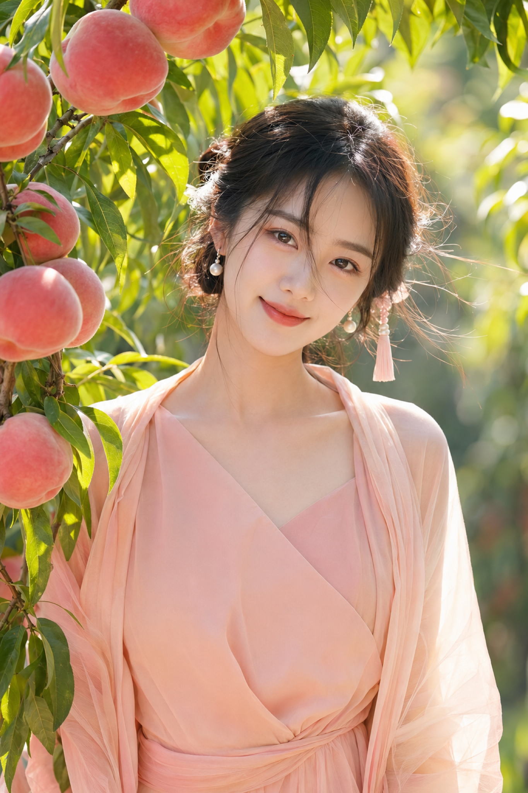
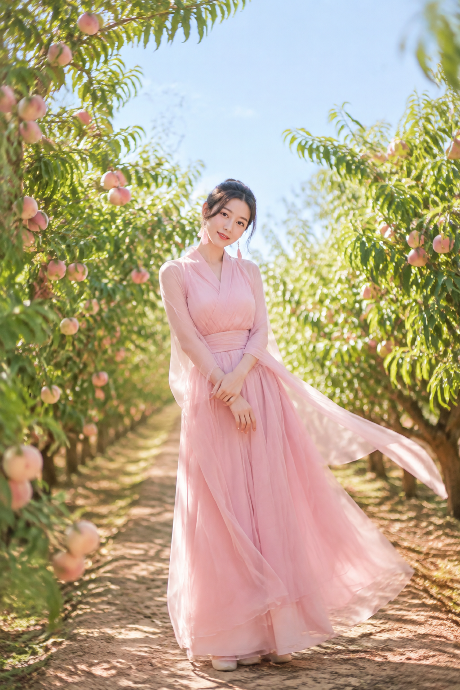
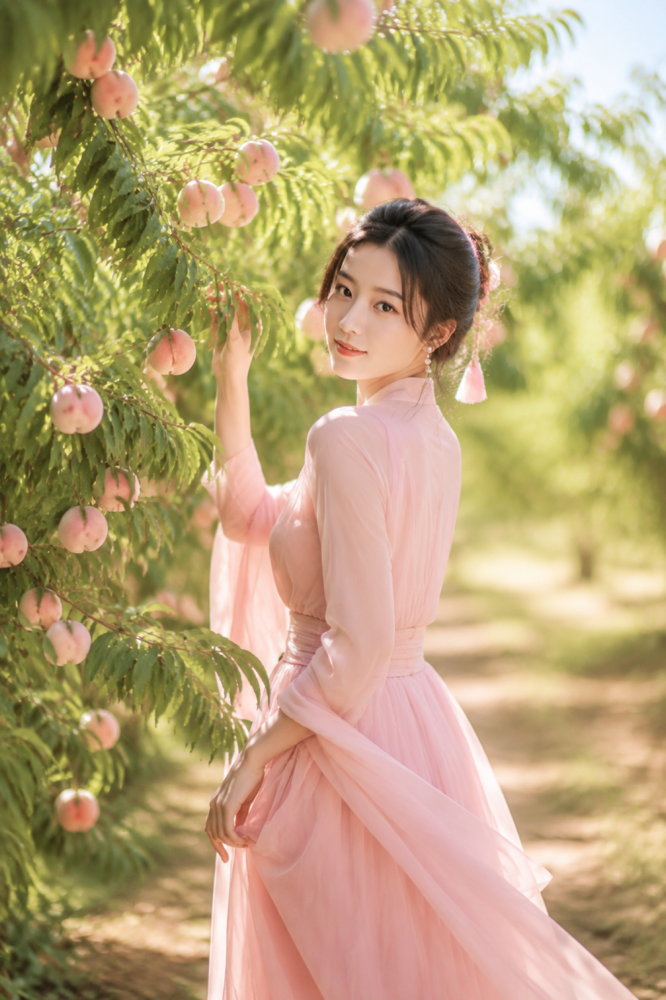
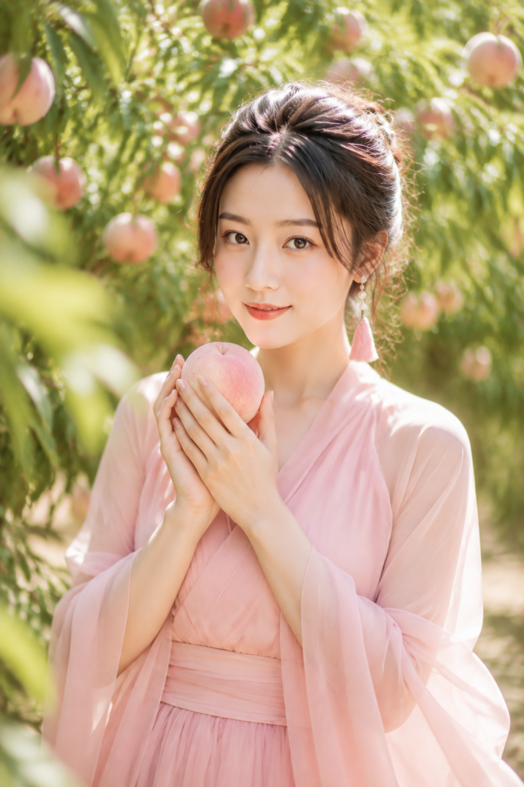
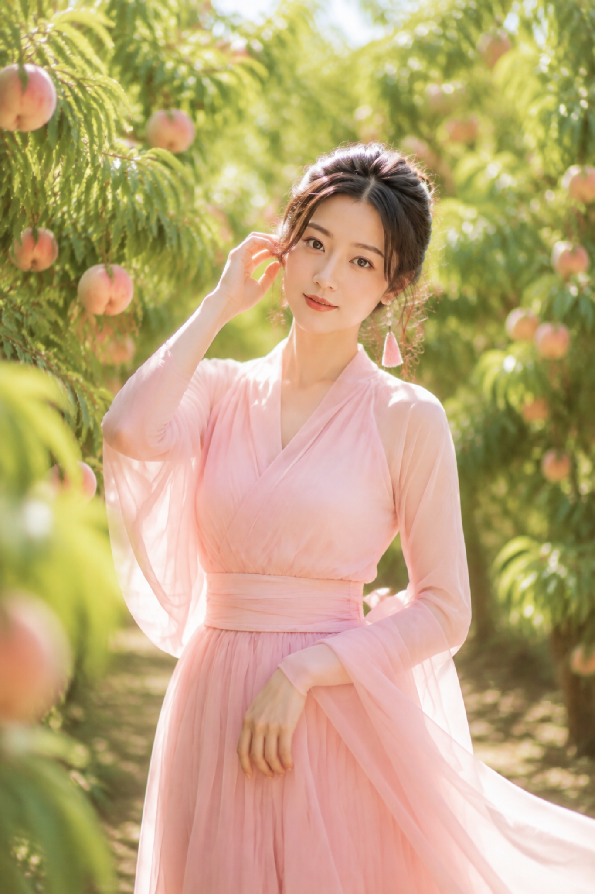
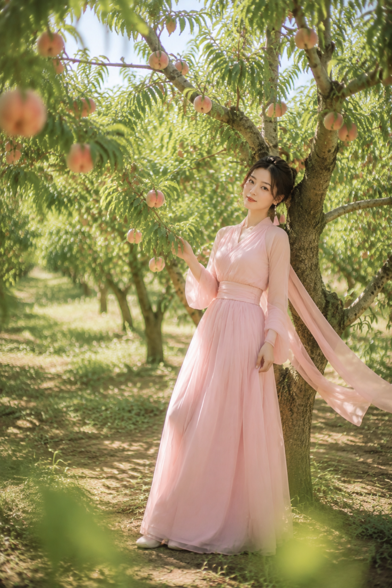

# 桃园绮梦六景：一套明亮自然光写法拍出仙气古风人像

这组六景抓住明亮自然光、真实肤质和可读动作，让古风负责气质。

## 先解决一个问题：怎样写出“仙气”而不失真？

交代时间、光线、镜头、材质和动作即可。服装完整端庄，披帛负责风向，桃枝负责框景。先写镜头能记录的事实，再写情绪。

## 01｜桃枝近景

桃枝做框景，85mm 浅景深聚焦面部。完整原版如下：

竖版 2:3，高端写实自然光人像摄影，盛夏晴日上午的蟠桃果园，一位约 24 岁的成年东亚女性站在挂满成熟粉红蟠桃的桃树枝下，近距离半身特写，人物正面看向镜头，头部微微偏向一侧，嘴角带轻柔含笑，眼神温柔灵动，气质松弛治愈。她有黑棕色慵懒低盘发，额前与脸侧有被微风吹起的碎发，佩戴珍珠耳饰与一侧浅粉流苏发饰。穿低饱和蜜桃粉轻纱长裙，端庄交叠领口，完整内衬，露出自然肩颈和锁骨上方线条，外搭同色轻盈纱质披帛，材质层次细腻且不透肤。画面左侧与上方有近距离桃枝和成熟桃子形成天然框景，桃子粉白渐变，叶片透光鲜绿，背景是被阳光柔化的果园散景。上午 9 点左右自然侧逆光，发丝边缘有细腻轮廓光，面部处于明亮柔和反射光中，健康自然肤色，保留真实皮肤纹理与细小毛孔。色调以蜜桃粉、嫩叶绿、象牙白、暖阳金为主，低饱和、高明度、空气通透、轻电影感。85mm 人像镜头，F1.8-F2.2，眼睛精准对焦，睫毛、发丝、桃子绒毛、纱裙纹理清晰可见。五官自然清秀，面部干净，干净自然肤质，表情松弛，眼神真实，气质清爽亲和。增加光线采样数，充分收敛噪点，减少随机颗粒、亮点噪声与暗部噪声，最大程度保留人物皮肤质感、发丝、叶片脉络、桃子绒毛和纱料细节，同时去除噪点拟合，提升照片清晰度与纯净度。2K 超高清，至少 2048 像素长边，真实写实，避免 AI 美女脸、网红感、过度精修、塑料皮肤、暗沉肤色、明显痘印、明显皱纹、斑点、面部变形、错误手部、文字水印、logo。

---

## 02｜小径纵深

桃树夹道和小径消失点建立纵深；人物中央偏下、头顶留天空，画面更透气。

---

## 03｜回眸与桃枝

回眸给出视线方向，扶枝提供手部支点；斜向桃枝把视线引到眼睛和果实。

---

## 04｜手捧蜜桃

只保留一颗桃，让手、脸、果实形成三角关系；明确绒毛、毛孔和纱料褶皱，真实感更稳。

---

## 05｜整理发丝

整理碎发要写清“一手靠近耳侧、另一手自然放下”，再指定 50mm。先拆手位，再交给情绪。

---

## 06｜树下轻倚

保留树干、草地、斑驳光影和远处果园，人物置于一侧，古典画意与空间感同时成立。

---

## 一套写法的核心

和 AI 沟通固定按：人物 → 动作 → 景别 → 光线 → 镜头 → 材质 → 降噪。换场景只替换场景词，保留高明度侧逆光、真实肤质和完整服装结构。

你最喜欢哪一个瞬间？

---

## 往期回顾

- 云崖听风：高山云海女友感自拍，一套写法拍出清透仙气
- 银雾花房：6张逆光人像拍出清透高级女友感的一套写法
- 同一台旋转木马，我拍出了 8 种不一样的甜

#GPTImage2 #千问 #豆包 #生图提示词 #Prompt #古风系列 #桃园人像
