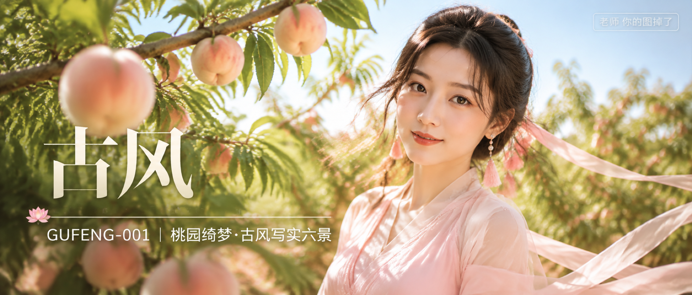

# GUFENG-001-桃园绮梦·古风写实六景 封面

## 封面提示词

桃园深处的明亮古风写实人像海报，一位约 24 岁的成年东亚女性正脸或三分之四侧脸近景，面部占画面三分之一以上，人物位于画面右侧，黑棕色低盘发、珍珠耳饰、浅粉流苏发饰，穿粉白色端庄古典轻纱长裙与不透肤披帛，完整内衬，肩颈线条自然，正面看向镜头，表情安静明亮，眼神清澈有神。前景是几颗放大的粉白蟠桃与透光桃叶，中景是人物，远景是高明度果园和淡蓝天空，桃枝形成斜向框景，暖金侧逆光打亮发丝与颧骨，粉色果实、嫩绿叶片、象牙白服装形成清爽冷暖层次。视觉概念名为“桃霞清影”，概念艺术大片质感，电影感光影，高清锐利，色彩层次丰富，视觉冲击力强，构图黄金比例，前景虚化背景，色调统一精致，画面有张力，商业海报级完成度，2.35:1 电影横构图，2K 超高清，至少 2048 像素长边。避免 AI 美女脸、网红感、过度精修、塑料皮肤、暗沉肤色、明显痘印、明显皱纹、斑点、面部变形、眼睛半闭、嘴巴微张、手部错误、暗黑色调、脏背景、文字乱码、文字裁切、文字遮挡面部、水印错位。

【文字排版-必须完整保留，不得省略或简化任何一项】画面左侧垂直居中偏下叠加文字排版：超大号衬线字体米白色主文案「古风」，主文案正下方一条细横线左端带🪷横线中央有透明英文水印 GU FENG，横线下方等宽白色字体副文案「GUFENG-001 ｜ 桃园绮梦·古风写实六景」；右上角浅色半透明圆角底衬配小号文字「老师 你的图掉了」（署名文字，必须出现，不可省略）；无整体蒙层，文字直接压图。【文字排版结束】

## 封面图片

