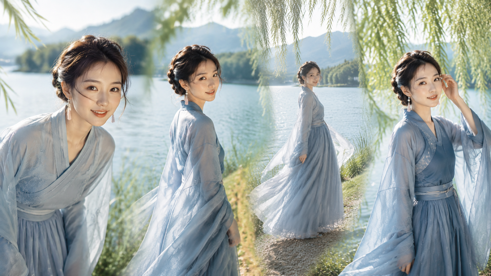
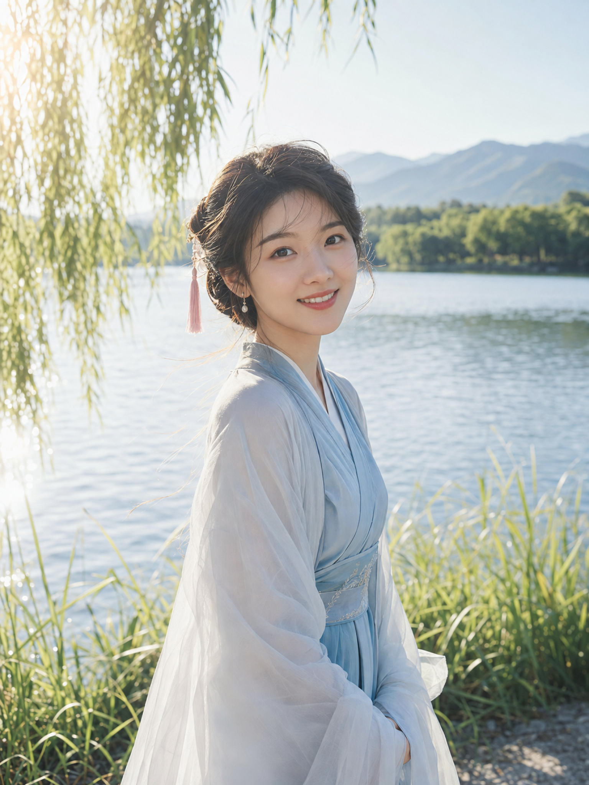
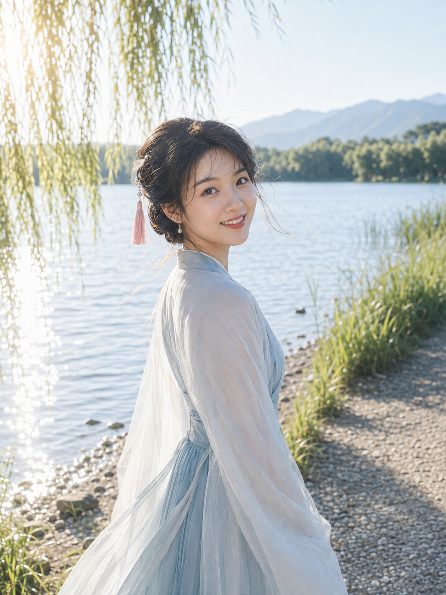
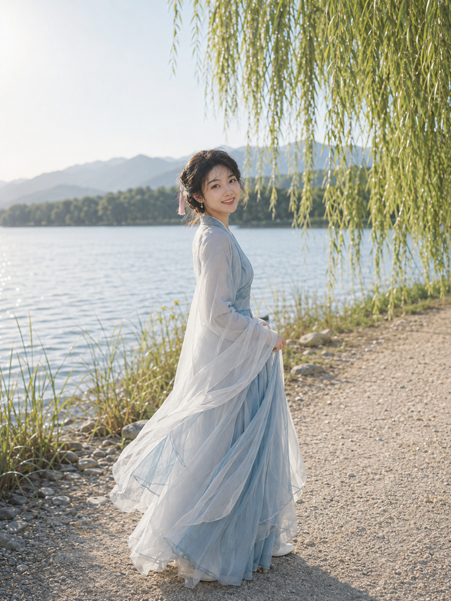
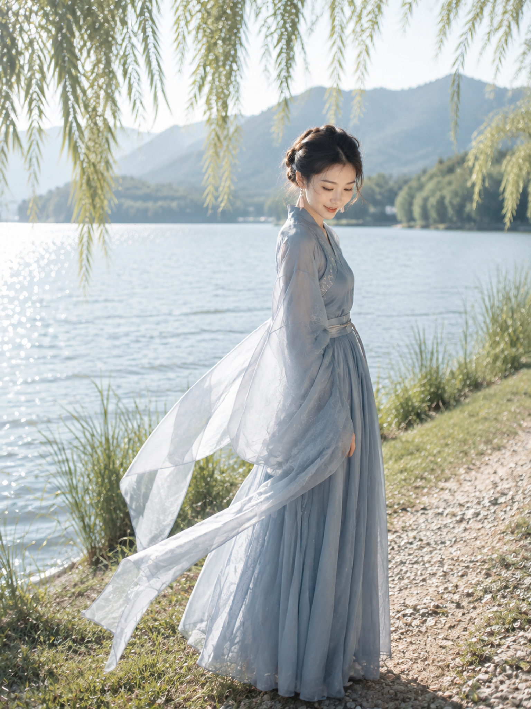

# 柳岸清晖六景：古风人像如何用6个动作拍出真实感

湖岸古风人像要有真实感，关键不在堆砌仙气词，而在让动作像被风和光线自然带出来。柳岸澄光用同一套人物、服装和景色，拆成六个松弛的瞬间。

第一景把视线留给镜头，微侧头和柳叶前景能让近景既有亲和力，也保留真实抓拍感。

竖版3:4，超写实古风自然光人像，盛夏晴朗湖畔，一位约24岁的成年东亚女性站在安静柳岸，正面偏3/4面向镜头，头部微侧，露出自然温柔的微笑；黑棕色慵懒低盘发，少量碎发被湖风轻轻吹起，佩戴小颗珍珠耳饰与淡粉流苏发饰，穿雾蓝色交领改良汉服长裙与轻盈纱质披帛，服装端庄得体、身形比例协调、姿态优雅。背景为清澈湖水、远山、夏季树林、垂落柳枝与少量芦苇前景，朋友视角的生活感抓拍，85mm人像镜头、大光圈浅景深，人物面部和发丝清晰，背景柔和虚化；左后上方阳光穿过柳叶形成细腻金色轮廓光，环境漫射光均匀照亮面部，高明度低饱和，湖蓝、青绿、冷白为主，五官自然清秀、面部干净、健康自然肤色、自然皮肤纹理、眼神真实、气质清爽亲和，不要文字水印。2K高分辨率成像，长边不少于2048像素，增加光线采样并充分收敛噪点，减少随机颗粒、亮点、暗部噪声和彩色噪点，最大程度保留皮肤、发丝、纱质衣料、柳叶、湖面波纹和远山层次，自然去噪、高清锐利。避免AI美女脸、网红感、过度精修、塑料皮肤、暗沉肤色、明显痘印、明显皱纹、斑点、面部变形、错误手部、多余人物、游客杂物

侧身再回望时，人物和湖面会形成一前一后的层次；中景留出水面，画面就不显得刻意摆拍。

浅滩漫步把镜头后退到全身，轻提裙摆只负责带动衣料的流向。动作越轻，长裙和风景越像同一段呼吸。

临水的半身机位，把微微前倾控制在自然交谈的幅度，重点仍是眼神和湖面反光，而不是夸张姿势。

柳影下整理碎发，手部有了明确任务，画面更不容易僵。让人物置于偏右位置，也能给湖面留下安静的留白。

最后用低头后抬眼的节奏收尾。与 AI 沟通时，先固定同一人、同一套服装、同一片湖岸，再只调整动作、机位和焦段，多图才会有连续的叙事感。

---

## 往期回顾

- 桃园绮梦六景：一套明亮自然光写法拍出仙气古风人像
- 云崖听风：高山云海女友感自拍，一套写法拍出清透仙气
- 银雾花房：6张逆光人像拍出清透高级女友感的一套写法

#GPTImage2 #千问 #豆包 #生图提示词 #Prompt #古风系列 #柳岸清晖
