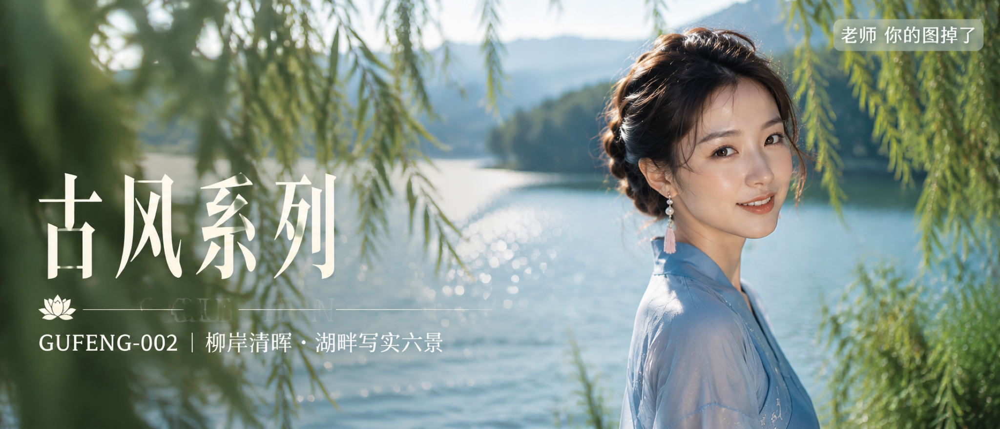

# GUFENG-002-柳岸清晖·湖畔写实六景 封面

## 封面提示词

视觉概念「柳岸澄光」：超写实东方古风人物电影海报，盛夏清亮湖岸，一位约24岁的成年东亚女性位于画面右侧，正面偏3/4侧脸看向镜头，面部占画面三分之一以上，黑棕色低盘发与珍珠流苏耳饰，穿雾蓝色交领改良汉服长裙和雅致披帛，五官精致自然、面部立体清晰、皮肤光泽细腻、眼神灵动、轮廓清晰上镜，姿态自然松弛，身形比例优越。青绿柳叶形成前景虚化，湖水和远山形成明亮纵深，侧逆光打亮颧骨与发丝，冷白湖光和浅金日光形成层次，画面高明度、色彩层次丰富、电影感光影、构图黄金比例、视觉冲击力强、色调统一精致、高清锐利，2.35:1电影横构图。2K高分辨率成像，长边不少于2048像素，增加光线采样、充分收敛噪点，减少随机颗粒、亮点、暗部噪声和彩色噪点，保留皮肤、发丝、衣料、柳叶和湖面细节，自然去噪。避免AI美女脸、网红感、过度精修、塑料皮肤、暗沉肤色、明显痘印、明显皱纹、斑点、面部变形、错误手部、多余人物、文字乱码、文字水印。

【文字排版-必须完整保留，不得省略或简化任何一项】画面左侧垂直居中偏下叠加文字排版：超大号衬线字体米白色主文案「古风系列」，主文案正下方一条细横线左端带🪷横线中央有透明英文水印 GU FENG，横线下方等宽白色字体副文案「GUFENG-002 ｜ 柳岸清晖·湖畔写实六景」；右上角浅色半透明圆角底衬配小号文字「老师 你的图掉了」（署名文字，必须出现，不可省略）；无整体蒙层，文字直接压图。【文字排版结束】

## 封面图片

