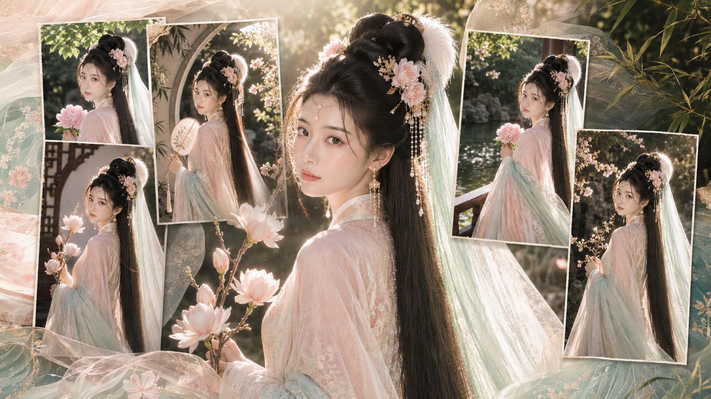
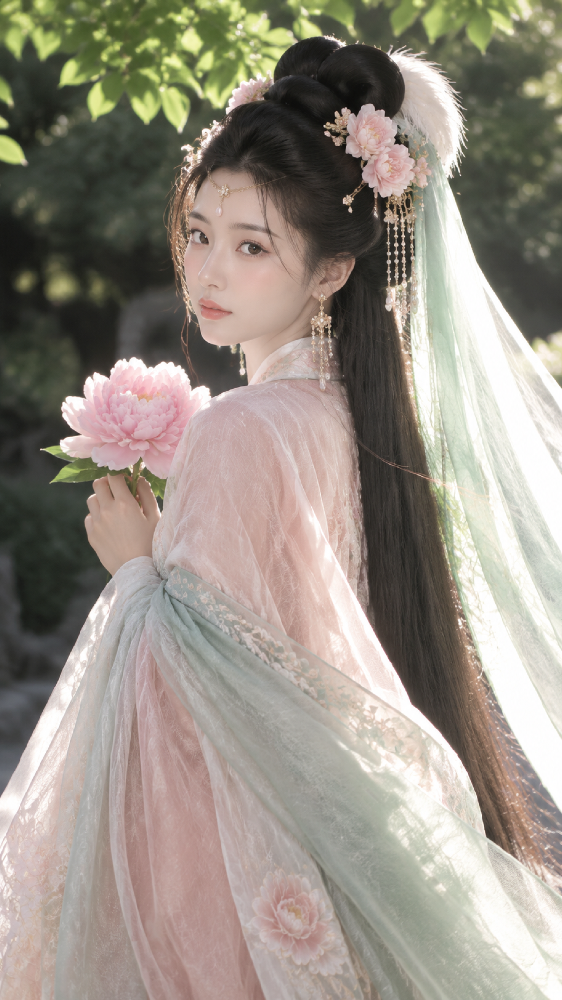
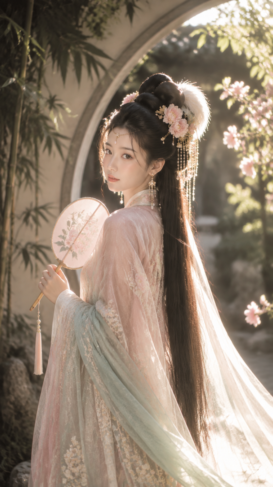
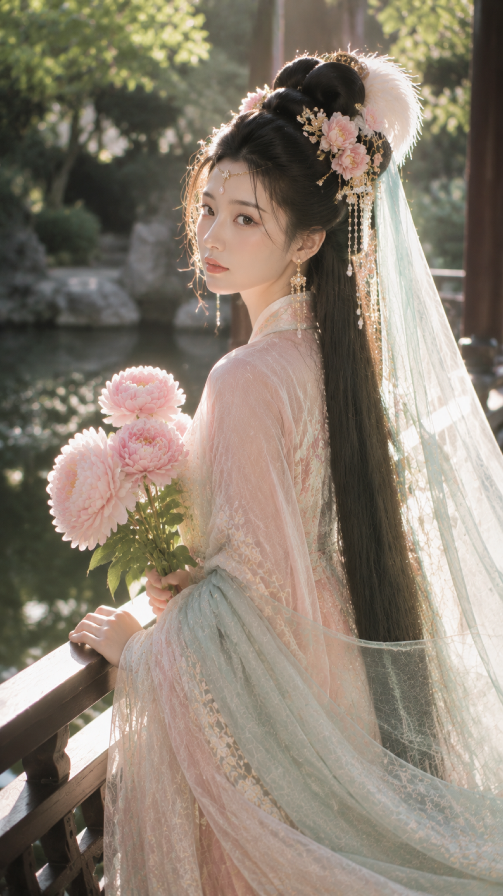
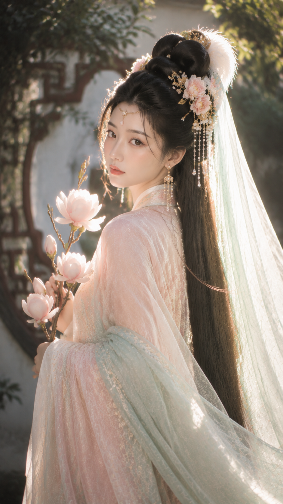
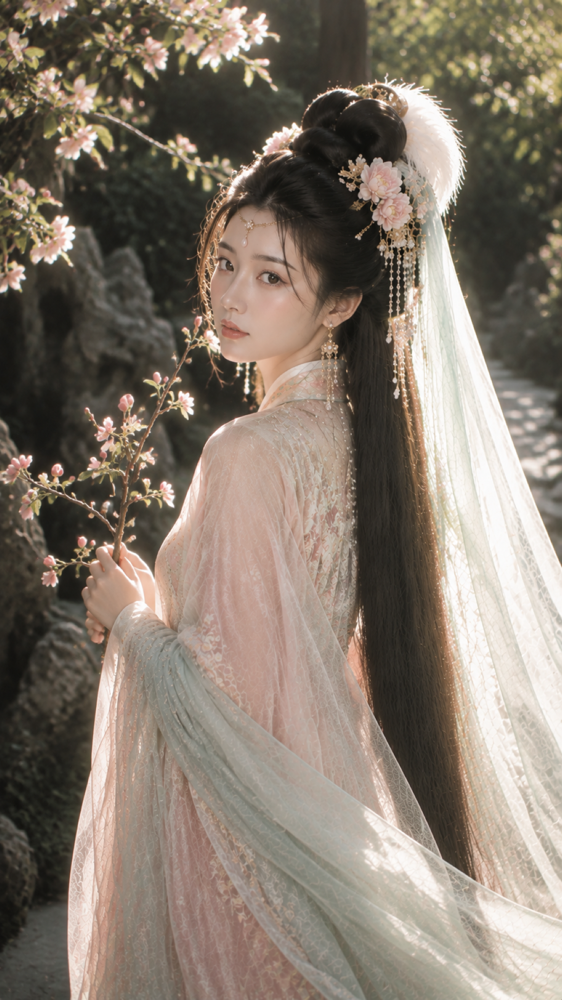
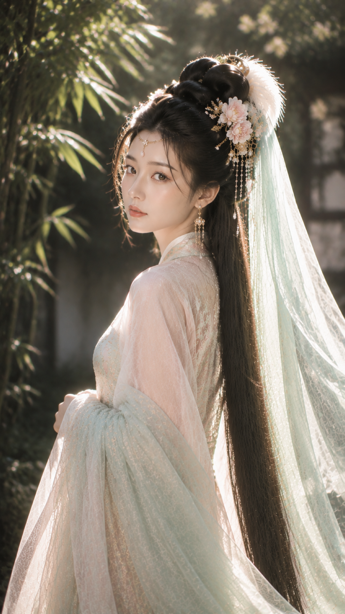

# 绮光入梦：盛唐逆光轻纱六景，仙气人像这样写更稳妥

**今天的挑战：** 锁定盛唐美人、粉绿衣饰和侧逆光，测试六个园林瞬间。亮色、真实、非透肤是底线。

**限制条件：** 成年女性、动作自然、主体明亮；保留发丝花瓣织物细节，收敛颗粒与暗部噪声。

---

**#01 ｜ 园林树荫回眸·粉牡丹**

原版用“肩部轻转＋花朵靠近身前”引导视线，再以右后方逆光勾出披帛。跟 AI 沟通时先写人物、动作、材质和光线，最后补清晰度。

竖版9:16，2K超高清古风人像摄影，盛唐美人题材，真实摄影质感，春日中式园林树荫下，一位24岁成年东亚女性半身至大半身入镜，身体微微背向镜头，肩部轻转，回眸看向镜头，神情安静温柔、清冷含蓄；黑色超长直发搭配高耸饱满的唐代云髻，发间点缀浅粉花簪、白色羽饰、金色步摇、珍珠流苏，额间细金链与小水滴额饰，耳边长款珍珠金饰耳坠；服装为淡藕粉与浅薄荷绿色叠穿的唐风汉服，层叠轻纱与真丝绡包裹肩臂，服装端庄不透肤，一条浅青绿色披帛从发顶斜斜披下，被右后方强烈阳光照亮，纱面发光、边缘泛白；双手轻捧一朵盛开的浅粉牡丹，花朵靠近身前成为视觉焦点；背景是深墨绿色树影与虚化园林石径，背景压暗但整体曝光明亮，人物被逆光勾勒出清晰轮廓；色彩为墨绿、冰青薄荷绿、藕粉、象牙白、少量香槟金，低饱和而明亮高级；85mm中长焦，f1.8大光圈浅景深，面部与花朵清晰，背景柔化，柔焦高光、自然bloom、轻雾感、电影感；五官自然清秀，面部干净，健康自然肤色，眼神真实，皮肤光泽自然；2K细节，光线采样64次，收敛噪点，减少随机颗粒、亮部噪声与暗部噪声，保留发丝、花瓣、织物纹理，清晰但不锐化过度；无文字，无水印，无logo；避免AI美女脸、网红感、过度精修、塑料皮肤、暗沉肤色、明显痘印、明显皱纹、斑点、面部变形、服装透肤、肢体畸形

---

**#02 ｜ 月洞门花影回望·团扇**

月洞门提供框景，团扇降低手部复杂度。50mm 更像真实摄影，花影只做虚化前景。

> 测试结论：框景＋小道具，最适合做安静、端雅的第一眼。

---

**#03 ｜ 临水长廊微风侧身·芍药**

“扶栏＋抱花”形成斜线，水面和栏杆拉出纵深；侧后光亮披帛，面部需柔和补光。

---

**#04 ｜ 花窗前柔光凝望·玉兰**

白墙花窗只露轮廓，玉兰靠近肩前更轻；关键是让建筑退后，花瓣和眼神做焦点。

---

**#05 ｜ 湖石小径驻足·海棠**

海棠枝条做引导线，湖石压暗部；回头角度保留三分之四脸，缩略图也能认出表情。

---

**#06 ｜ 竹影庭院低首回眸·空灵**

最后删去道具，只让双手收拢披帛，测试材质能否独立成立。竹影要有层次，曝光不能压黑；画面脏时追加“干净明亮空气感”。

---

**结论：** 六景共享人物、衣饰和逆光，变化放在框景、花材、动作与焦段。先锁身份与光线，再换道具，更稳。

这套思路可套用庭院、花园、湖畔；觉得有用可收藏并关注，留言告诉我想换哪种花材。

---

## 往期回顾

- 青瓷窗影六境：六个窗边瞬间写出清透新中式女友感自拍
- 蓝白直闪六景实验：用旧相册质感拍出更自然的女友感自拍
- 盛夏树影自拍怎么拍得清透？六个角度写出自然女友感

#GPTImage2 #千问 #豆包 #生图提示词 #Prompt #古风系列 #盛唐美人 #逆光人像
