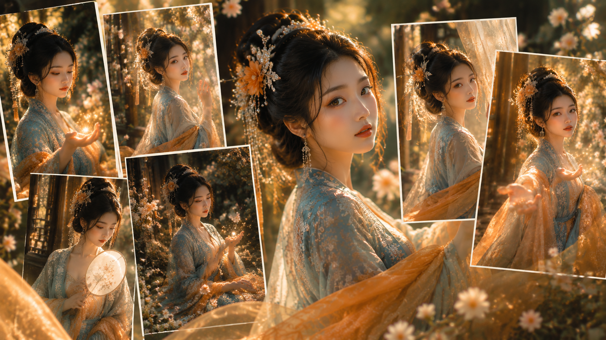
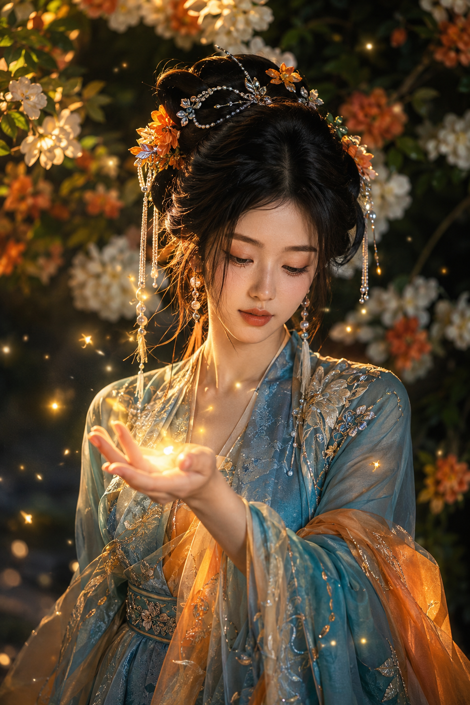
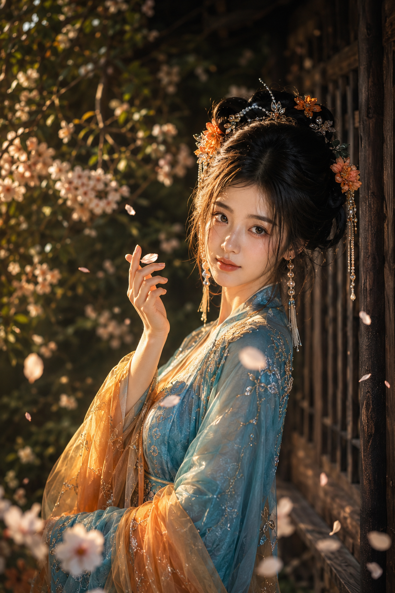
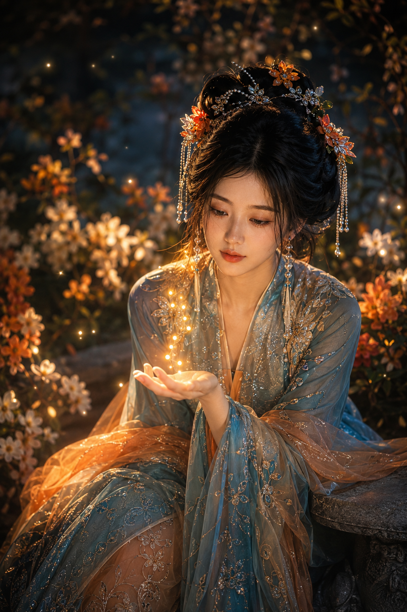
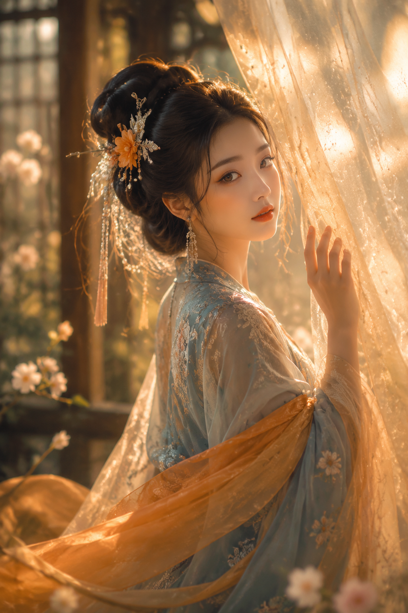
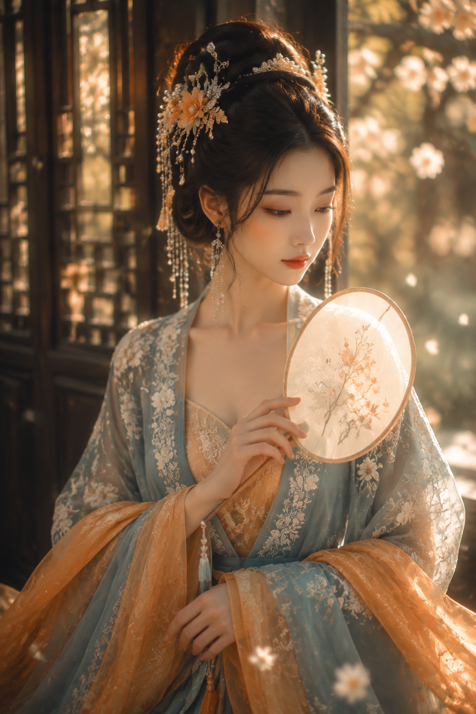
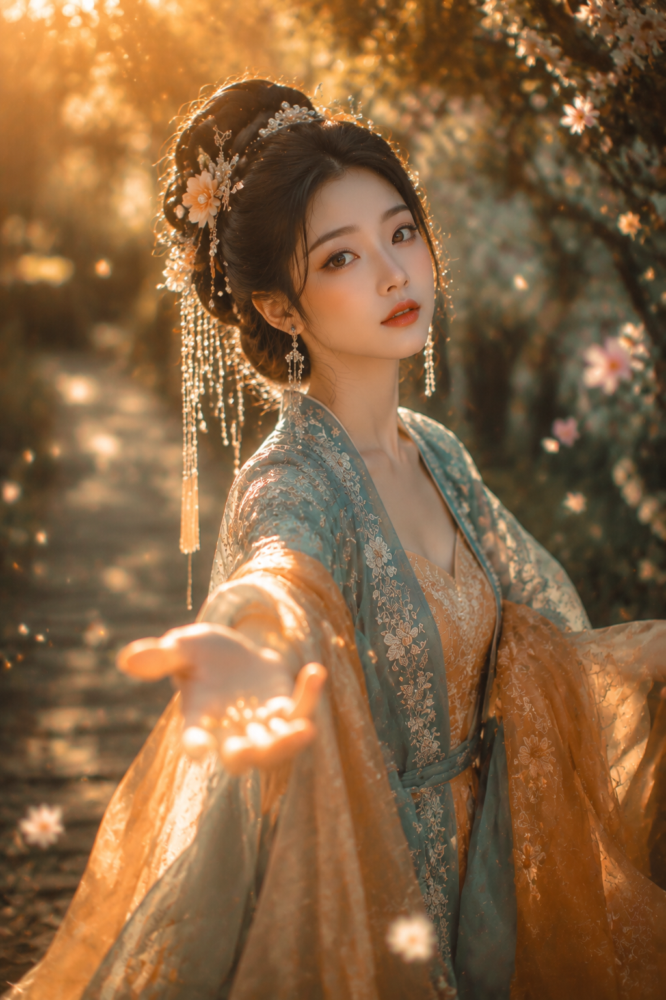

# 流萤花庭：蓝橙幻境里写出东方美人六种光

**这次的方向：** 用暗调繁花托住亮色人物，以蓝橙冷暖撞色、近景半身和强方向暖光，写出仙气、真实又有轻性感的东方幻想。亮色、干净、成年是底线。

**跟 AI 的交互顺序：** 先锁定人物身份与动作，再写服装材质、镜头和光线，最后补上清晰度与负面约束。这样六张图会像同一组写真，而不是六个互不相干的角色。

---

**#01 ｜ 掌心萤光**

用掌心的暖光做视线终点，蓝色衣袍负责冷静，橙色纱料负责温度。第一张只放一份原版提示词，给后面五景做基准。

竖版2:3，高端东方幻想古风人像摄影，明亮但有深色花影层次的庭院近景，一位24岁成年东亚女性站在繁花树前，身体正向，目光轻垂看向掌心，神情安静温柔。黑色浓密长发盘成蓬松华丽云鬓，发间缀珍珠链、银色流苏、花簪与暖橘小花，几缕碎发垂在脸侧；五官自然清秀，面部干净，健康自然肤色，眼神真实，皮肤光泽自然。她身穿烟青蓝、孔雀蓝与月白蓝层叠古风长袍，肩襟有白金高密度刺绣，内层与披帛为半透明琥珀橙纱料，领口完整得体，自然展现肩颈、锁骨与纤细手臂线条，柔美而轻微性感。右手微抬，掌心停留一点暖金色萤光，数枚流萤在空气中形成细碎轨迹，手掌作为前景引导线，人物约占画面70%。背景为深墨绿与焦糖棕花木，奶油白和杏橙花团虚化成散景；50mm—85mm人像镜头，f1.8大光圈浅景深，面部、眼睛与发饰锐利，前景手部轻微虚化。左前方斜射暖色夕阳照亮面颊、发丝与刺绣，形成金色轮廓光，整体曝光通透明亮，冷青蓝与琥珀橙撞色，真实写实、轻胶片质感、梦幻微粒。2K超高清，增加光线采样数至64次，收敛噪点，减少随机颗粒、亮部噪声与暗部噪声，最大程度保留发丝、刺绣、珠饰、纱料、花瓣与皮肤细节，去除噪点拟合，提升照片清晰度；无蝴蝶、无文字、无水印、无logo；避免AI美女脸、网红感、过度精修、塑料皮肤、暗沉肤色、明显痘印、明显皱纹、斑点、面部变形、错误手指、服装穿模、过度暴露。

**#02 ｜ 指尖落瓣**

回廊提供天然框景，花瓣把视线从眼睛引到指尖；85mm压缩空间，让背景的暗绿仍然轻盈。

**#03 ｜ 捧光凝望**

把发光体放在胸前偏下，面部和手心形成纵向节奏。夜色只负责衬托珠露，人物曝光必须保持清透。

**#04 ｜ 回眸拂纱**

纱幔是前景，脸是中景，花架是后景；三层关系能让单一半身像也有空间。动作只做轻拂，避免戏剧化。

**#05 ｜ 执扇轻垂**

团扇是小而稳定的第二焦点。让窗格切光落在珠饰和刺绣上，蓝衣与橙纱自然形成冷暖对照。

**#06 ｜ 伸手迎光**

最后一张把手掌推到前景，利用长焦压缩制造纵深；花粉、流萤和花瓣只做动势，不抢脸部焦点。

**收束：** 六景只改变动作、道具、机位和焦段，人物身份、服饰逻辑与光线方向保持一致。先锁统一性，再换梦境元素。

这套方法也适合庭院、花窗、湖畔等东方场景：背景可以深，主体一定要亮；质感可以梦幻，皮肤和织物必须真实。

#GPTImage2 #生图提示词 #Prompt #古风系列 #蓝橙撞色 #东方幻想
